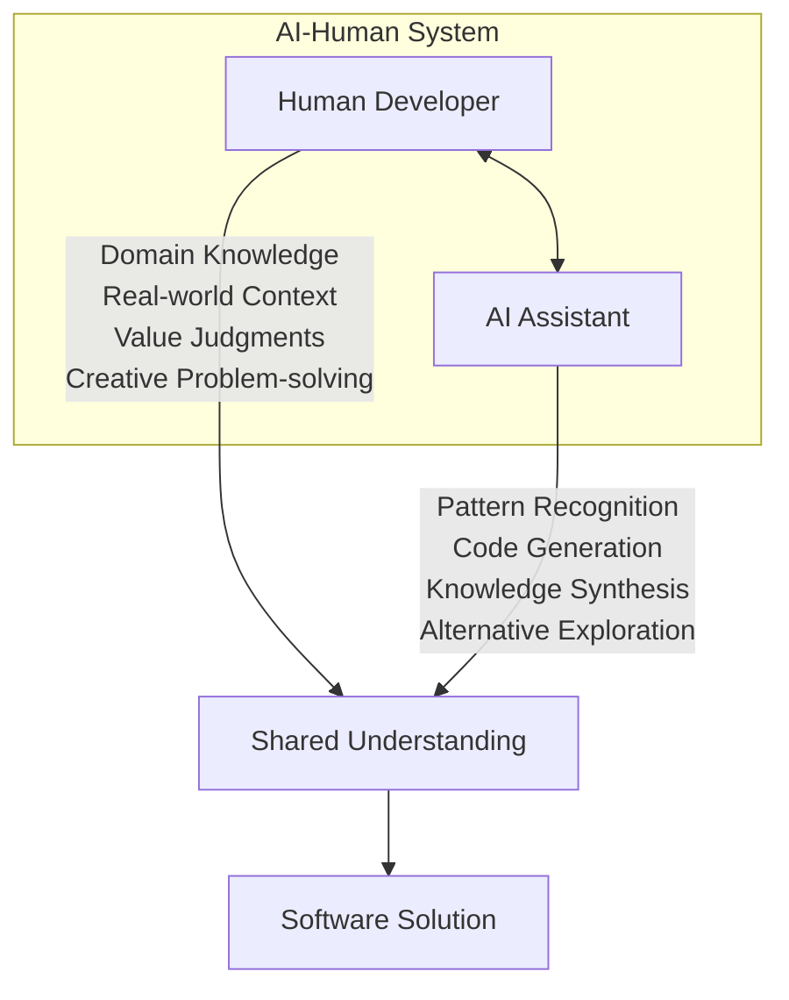
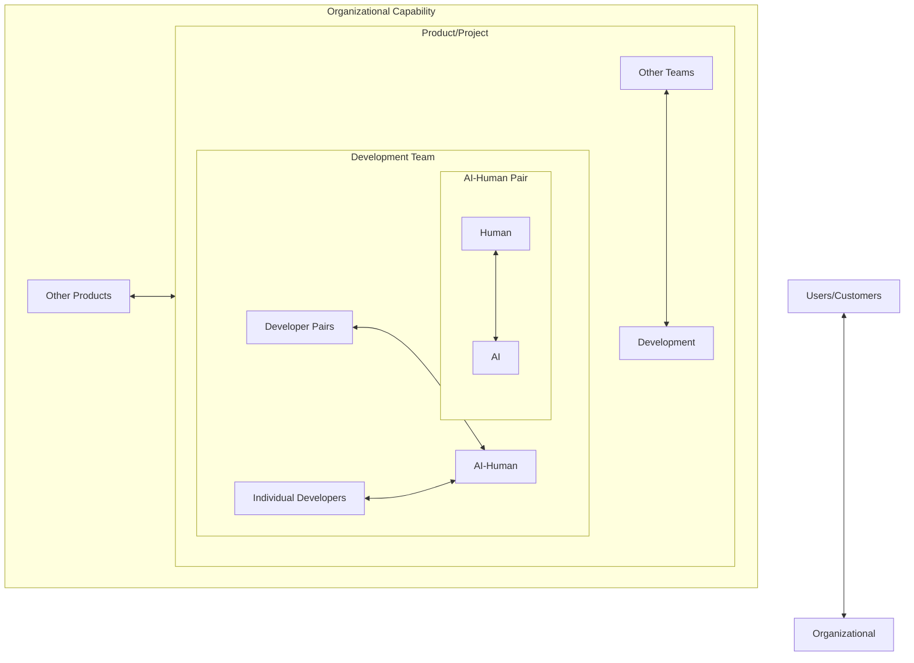
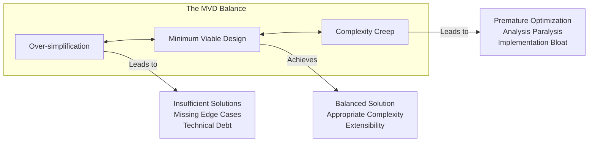
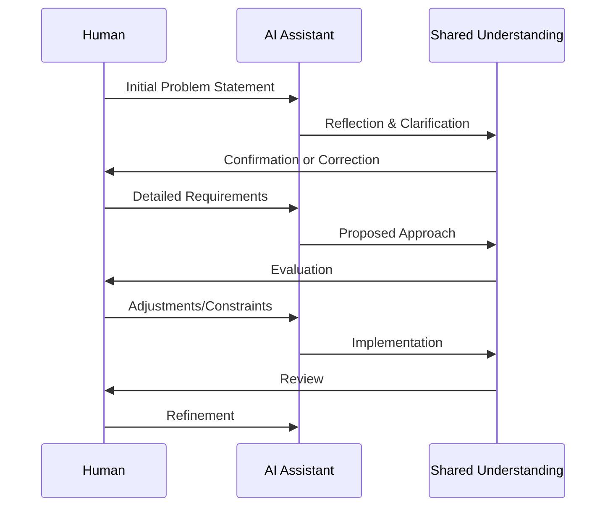
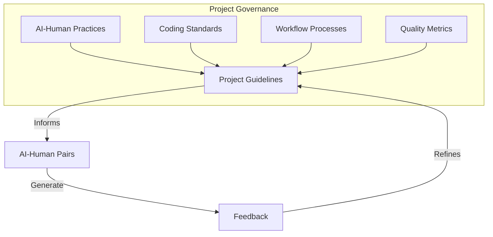
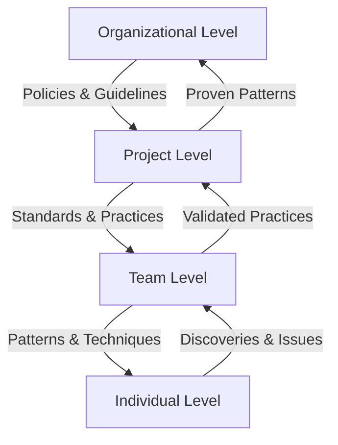
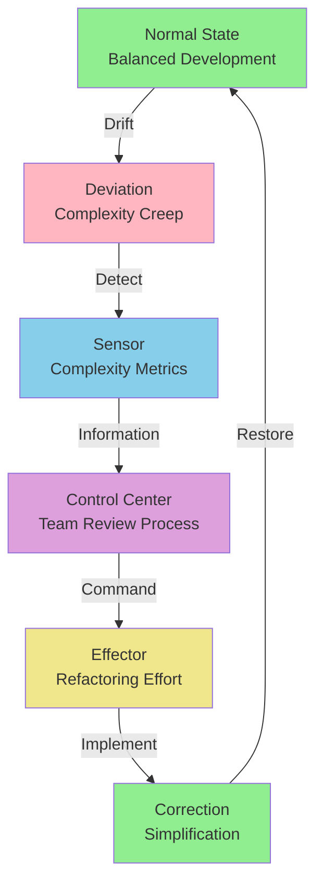
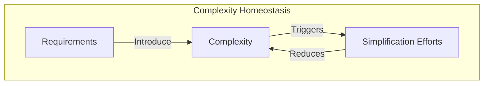
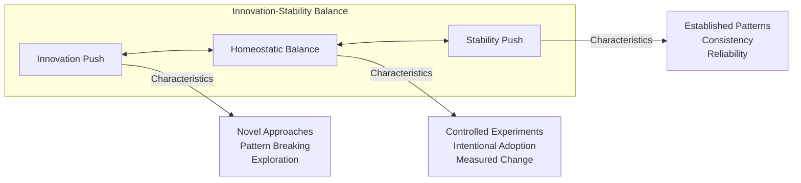
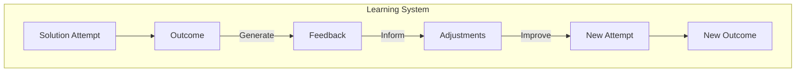

# Part 2: Systems Thinking for AI-Human Collaboration

## Introduction to Systems Thinking

When we introduce AI into software development, we're not simply adding a tool to our toolkit—we're fundamentally altering the system of how software gets created. Understanding this shift requires systems thinking, a discipline that examines how components interact to create emergent behaviors that no single component could produce alone. This chapter explores how to design, govern, and optimize the AI-human collaborative system for maximum effectiveness.

Systems thinking provides essential insights because AI-human collaboration exhibits classic system characteristics: feedback loops, emergent properties, non-linear responses, and homeostatic tendencies. A developer working with AI isn't just twice as productive as one working alone—the collaboration creates new possibilities and challenges that require systematic understanding and management.

The power of this approach lies in recognizing that the whole is greater than the sum of its parts. When a human developer partners with an AI assistant, they don't simply combine their capabilities—they create a new entity with emergent properties neither could achieve independently. This synergy demands that we think beyond individual interactions to consider the system as a whole.

## The AI-Human System

At its most fundamental level, AI-augmented development creates a coupled system where human developers and AI assistants form a functional unit with capabilities exceeding either participant alone. This isn't merely additive—it's synergistic, creating emergent properties through interaction.



This bidirectional flow represents continuous negotiation and refinement. The human provides context, constraints, and judgment while the AI offers possibilities, implementations, and alternatives. Neither dominates; both contribute essential elements to the final solution.

### System Characteristics

The AI-human system exhibits several key characteristics that define its behavior and potential:

**Feedback Loops**: Every interaction refines the collaboration. When a developer corrects AI-generated code, they're not just fixing an error—they're providing feedback that shapes future interactions. Similarly, when AI suggests an unexpected solution, it expands the developer's conceptual space. One senior developer described this process: "Each session with the AI makes both of us better. I learn new patterns, and through my corrections, the AI learns my preferences and constraints."

**Emergent Properties**: The system exhibits behaviors neither participant could achieve independently:
- Rapid exploration of solution spaces that would take humans days to consider
- Continuous knowledge synthesis combining human experience with AI's pattern recognition
- Adaptive problem-solving strategies that evolve during the interaction
- Accelerated learning curves where both human and AI improve through collaboration

**Non-linear Responses**: Small changes in how developers prompt or constrain AI can produce dramatically different outputs. A single word in a prompt might shift the entire architectural approach. This sensitivity requires developers to become skilled at system manipulation. As one architect noted: "Learning to work with AI is like learning to play an instrument. Small adjustments in your approach create vastly different results."

**Homeostatic Tendencies**: Well-functioning AI-human systems develop stability patterns. Teams naturally evolve standard prompting approaches, code review practices, and integration workflows that maintain system balance. These patterns emerge organically as teams discover what works best for their specific context.

### The Partnership Dynamic

Understanding the AI-human system as a true partnership fundamentally changes how we approach development. Traditional tools execute commands; AI collaborates in problem-solving. This shift requires new mental models and practices.

Consider how one development team described their evolution: "At first, we treated the AI like a faster autocomplete. But once we understood it as a collaborative partner, everything changed. We started having conversations with it, exploring ideas together, challenging each other's assumptions. The quality of our solutions improved dramatically."

This partnership dynamic manifests in several ways:

1. **Iterative Refinement**: Solutions emerge through dialogue rather than declaration
2. **Mutual Learning**: Both parties improve through interaction
3. **Complementary Strengths**: Each partner contributes what they do best
4. **Shared Ownership**: The final solution belongs to the system, not either individual

## Recursive Systems View

The AI-human pair exists within larger nested systems, each with its own dynamics and governance needs. Understanding these recursive relationships helps organizations implement appropriate controls at each level.



Each system level requires distinct governance approaches:

| System Level | Primary Concerns | Governance Mechanisms | Real-World Example |
|--------------|------------------|----------------------|-------------------|
| **AI-Human Pair** | Prompt quality, output accuracy | Interaction patterns, verification habits | "We developed a checklist for AI interactions: clear context, specific constraints, explicit validation" |
| **Development Team** | Consistency, knowledge sharing | Code standards, review processes | "Our team wiki includes a 'prompt patterns' section where we share effective approaches" |
| **Project** | Architecture coherence, delivery | Technical guidelines, integration rules | "We designated certain architectural decisions as 'human-only' to maintain system integrity" |
| **Organization** | Competitive advantage, risk | Policies, investment strategies | "We created an AI Center of Excellence to share learnings across all product teams" |

The recursive nature means that patterns at one level influence others. A single developer's effective prompting technique might bubble up to become a team standard, then a project guideline, and eventually an organizational best practice. Conversely, organizational policies cascade down, shaping how individual pairs operate.

### Cross-Level Interactions

The most interesting dynamics occur when patterns cross system levels. One engineering manager shared their experience: "A junior developer discovered a prompting pattern that dramatically improved test generation. Within weeks, it spread through the team, then to other teams, and eventually became part of our organization-wide training."

These cross-level interactions create both opportunities and challenges:

**Opportunities:**
- Rapid dissemination of effective practices
- Emergent standardization based on proven value
- Bottom-up innovation complementing top-down governance

**Challenges:**
- Inconsistent practices across levels
- Governance lag behind innovation
- Resistance to standardization of successful local practices

## Requisite Variety and Balance

The Law of Requisite Variety, a fundamental principle in cybernetics, states that a control system must have at least as much variety as the system it aims to control. In AI-human collaboration, this manifests in several critical ways.

### Complexity Management

Development problems span a vast range of complexity. The AI-human system must match this variety without becoming overwhelmed or oversimplified.

**Under-Variety Symptoms:**
- Oversimplified solutions that miss edge cases
- Inability to handle domain-specific requirements
- Brittle code that breaks with minor changes
- Architectural decisions that don't scale

One team lead described their under-variety crisis: "We were using basic prompts for complex distributed systems problems. The AI kept suggesting simple solutions that worked in isolation but failed in our production environment. We realized we weren't providing enough context about our system's complexity."

**Appropriate Variety Indicators:**
- Solutions that elegantly handle complexity
- Flexible architectures that accommodate change
- Code that gracefully degrades under stress
- Designs that anticipate future needs

**Over-Variety Warnings:**
- Unnecessarily complex implementations
- Premature optimization
- Abstract architectures without concrete benefits
- Analysis paralysis in decision-making

A senior architect shared their over-variety experience: "We got caught in a trap of asking the AI for 'enterprise-grade' solutions for every problem. We ended up with a simple CRUD app that had five layers of abstraction. Now we explicitly state our actual scale requirements in every prompt."

### Balance of Control

Neither human nor AI should dominate the collaboration. Effective systems dynamically shift control based on task characteristics:

| Task Type | Human Control | AI Control | Rationale | Practical Example |
|-----------|---------------|------------|-----------|-------------------|
| **Architecture Design** | High | Low | Requires business context and long-term vision | "We sketch the architecture on a whiteboard first, then use AI to help implement specific components" |
| **Boilerplate Generation** | Low | High | Mechanical task with established patterns | "AI generates all our CRUD operations based on our schema definitions" |
| **Algorithm Implementation** | Medium | Medium | AI provides options, human selects approach | "We describe the problem and constraints, review AI's suggested algorithms, then choose based on our specific needs" |
| **Bug Diagnosis** | Medium | Medium | AI identifies patterns, human confirms context | "AI helps spot patterns in error logs, but we validate against our system knowledge" |
| **Performance Optimization** | Low-Medium | Medium-High | AI can explore option space efficiently | "We let AI suggest optimization strategies, then benchmark the most promising ones" |
| **Security Implementation** | High | Low | Critical domain requiring human oversight | "All security-related code is human-written, with AI only suggesting test cases" |

### Contextual Awareness

The system must maintain sufficient context about requirements, constraints, and goals. This context acts as the variety-matching mechanism, ensuring the AI-human system can handle the complexity of the problem space without becoming overwhelmed.

**Context Components:**
- Business requirements and constraints
- Technical architecture and patterns
- Team conventions and preferences
- Performance and scalability needs
- Security and compliance requirements

Without adequate context, AI generates technically correct but practically useless solutions. With too much context, the system becomes overwhelmed and produces overly complex outputs. The art lies in providing just enough context—requisite variety, not excessive variety.

One team developed what they called "context templates" for different types of tasks:

```
For API Development:
- Target framework and version
- Authentication requirements
- Expected load patterns
- Integration points
- Error handling standards

For Data Processing:
- Data volume and velocity
- Processing time constraints
- Error tolerance levels
- Resource limitations
- Output requirements
```

## Minimum Viable Design

One of the most powerful principles for AI-human collaboration is Minimum Viable Design (MVD)—a disciplined approach to managing complexity that prevents both under-engineering and over-engineering. MVD recognizes that AI assistants, without proper guidance, tend toward extremes: either naive implementations that ignore real requirements or elaborate architectures that far exceed actual needs.



### MVD in Practice

The key to MVD is starting with intentional simplicity and adding complexity only when justified by concrete requirements. This approach requires discipline from both human and AI participants in the system.

**Starting Simple:**
1. Define the core problem precisely
2. Implement the simplest solution that could work
3. Test against actual requirements
4. Identify specific shortcomings
5. Add complexity to address only those shortcomings

As one developer explained: "We changed our mindset to ask 'what's the simplest version that meets our needs right now?' This question became our North Star for every AI interaction."

**Complexity Justification Criteria:**
- Solves an actual, not theoretical, problem
- Benefits exceed implementation costs
- Alternatives have been considered
- Team agrees on necessity
- Future maintenance is considered

One architect shared their practical rule: "We add abstraction only after we have at least three concrete examples that benefit from it. This prevents us from building elaborate frameworks for problems we might never actually face."

### Real-World MVD Example

Consider a team implementing user authentication. Here's how they applied MVD principles:

**Over-Simplified Approach:**
```python
def authenticate(username, password):
    return username == "admin" and password == "password"
```

**Over-Engineered Approach:**
```python
class AuthenticationFramework:
    def __init__(self):
        self.strategies = []
        self.validators = []
        self.decorators = []
        self.observers = []
        # ... 500 more lines of abstraction
```

**MVD Approach:**
```python
class Authenticator:
    def __init__(self, user_repository):
        self.users = user_repository
    
    def authenticate(self, username, password):
        user = self.users.find_by_username(username)
        if user and user.verify_password(password):
            return self._create_session(user)
        return None
    
    def _create_session(self, user):
        return {"user_id": user.id, "expires": time.time() + 3600}
```

The MVD approach provides real functionality without unnecessary abstraction, yet remains extensible for future needs like multi-factor authentication or OAuth integration.

The team lead reflected on their experience: "The MVD version took 30 minutes to implement and has served us for six months. When we finally needed OAuth, the simple design made it easy to extend. If we'd started with the complex framework, we'd still be debugging it."

### MVD as a Conversation Tool

MVD becomes particularly powerful as a conversation tool with AI. Teams report success with prompts like:

- "Implement the simplest working version of [feature], avoiding unnecessary abstractions"
- "What's the minimum code needed to achieve [goal] given [constraints]?"
- "Suggest a solution that favors clarity over cleverness"

One developer shared: "MVD transformed our AI interactions. Instead of getting elaborate solutions we didn't need, we started getting focused, practical code we could actually use and maintain."

## Regulatory Mechanisms

Effective AI-human systems require regulatory mechanisms—structures and practices that maintain balance and ensure quality. These mechanisms operate at multiple levels, each serving distinct purposes in maintaining system health.

### Conversation-Level Regulation

The most immediate regulation happens within individual AI-human conversations. This micro-level governance shapes the quality of all outputs.



**Effective Conversation Patterns:**

1. **Progressive Elaboration**: Start broad, refine through interaction
   - "Let's build a user service" → "It needs to handle CRUD operations" → "With audit logging" → "Using our standard patterns"

2. **Explicit Decision Points**: Make choices visible
   - "Let's use Repository pattern because it gives us flexibility for changing data sources later"

3. **Regular Complexity Checks**: Prevent over-engineering
   - "Is this becoming more complex than necessary for our current needs?"

4. **Context Anchoring**: Maintain focus
   - "Remember, we need to maintain compatibility with the existing API"

5. **Verification Loops**: Ensure understanding
   - "Before we proceed, let me confirm: this solution handles [specific requirements], correct?"

**Conversation Antipatterns to Avoid:**
- Stream-of-consciousness prompting without structure
- Accepting first suggestions without evaluation
- Losing track of original objectives
- Failing to provide corrective feedback
- Allowing complexity to grow unchecked

One developer described their evolution: "I used to just dump requirements and accept whatever came back. Now I treat it like pair programming—constant dialogue, regular check-ins, shared decision-making. The quality difference is dramatic."

### Project-Level Regulation

At the project level, regulation ensures consistency across multiple AI-human pairs and maintains architectural coherence.



**Key Project-Level Mechanisms:**

| Mechanism | Purpose | Implementation | Real Example |
|-----------|---------|----------------|--------------|
| **AI Usage Guidelines** | Ensure consistent practices | Document approved patterns, tools, and workflows | "We maintain a 'prompt cookbook' with tested patterns for common tasks" |
| **Code Review Standards** | Maintain quality | Specific checks for AI-generated code | "AI code requires checking for: reinvented wheels, inconsistent patterns, over-abstraction" |
| **Architecture Boundaries** | Preserve system design | Define AI vs. human decision zones | "Core domain logic = human-designed, utility functions = AI-assisted" |
| **Integration Gates** | Prevent quality erosion | Automated checks before merging | "Our CI pipeline includes complexity analysis that flags over-engineered solutions" |
| **Knowledge Repositories** | Share learnings | Capture effective prompts and patterns | "Weekly 'AI wins and fails' sharing session with documented outcomes" |

### Organizational Regulation

Organizations must establish frameworks that enable innovation while managing risk. This highest level of regulation sets boundaries and creates conditions for success.

**Organizational Governance Components:**

1. **Policy Framework**
   - Approved AI tools and versions
   - Data handling requirements
   - Security and compliance rules
   - Intellectual property guidelines
   - Vendor management standards

2. **Investment Strategy**
   - Tool licensing and subscriptions
   - Training and education budgets
   - Infrastructure requirements
   - Success metrics and ROI tracking

3. **Risk Management**
   - Security assessment protocols
   - Quality assurance standards
   - Compliance verification
   - Incident response procedures

4. **Knowledge Management**
   - Cross-team learning channels
   - Best practice repositories
   - Failure analysis processes
   - Innovation capture mechanisms

The most effective organizational regulation creates enabling constraints—boundaries that paradoxically increase creativity by providing clear direction. As one CTO explained: "We don't tell teams how to use AI, we tell them where they can't use it. Everything else is open for experimentation."

### Bidirectional Information Flow

Critical to all regulatory levels is bidirectional information flow. Top-down constraints must be balanced with bottom-up learnings:



One organization implemented monthly "pattern harvesting" sessions where teams shared their most effective AI collaboration techniques. The best patterns were documented and gradually incorporated into organizational standards.

## The Homeostasis Principle

Well-functioning systems naturally seek equilibrium through homeostatic mechanisms. In AI-human collaboration, these self-regulating processes maintain system health without constant manual intervention.



### Balanced Complexity

Software systems naturally tend toward increasing complexity—a form of entropy that, left unchecked, leads to unmaintainable code. AI can accelerate this tendency by making it easy to generate complex solutions. Homeostatic mechanisms counter this drift.



**Complexity Indicators:**
- Cyclomatic complexity metrics exceeding thresholds
- Increasing time to implement new features
- Rising bug rates in specific modules
- Developer complaints about code comprehension
- Expanding test suites with diminishing coverage

**Homeostatic Responses:**
- Automated complexity warnings in CI/CD
- Regular refactoring sprints
- Complexity budgets for components
- Architectural review sessions
- Simplification retrospectives

One team implemented what they called "complexity retrospectives" every two weeks: "We identify the most complex parts of our codebase and allocate time specifically for simplification. This regular rhythm prevents complexity from accumulating beyond manageable levels."

### Innovation-Stability Balance

AI tools constantly suggest novel approaches, creating tension between innovation and stability. Healthy systems balance these forces through intentional mechanisms.



**Balancing Mechanisms:**

| Mechanism | How It Works | Example |
|-----------|--------------|---------|
| **Innovation Zones** | Designated areas for experimentation | "We created 'experimental' packages where developers can try AI-suggested patterns" |
| **Stability Anchors** | Protected core components | "Our payment processing system is marked 'human-only'—too critical for experimentation" |
| **Gradual Adoption** | Phased rollout of new patterns | "New patterns must prove themselves in non-critical features before core adoption" |
| **Reversion Capability** | Easy rollback of failed experiments | "Every AI-assisted change gets its own feature branch for easy reversal" |
| **Learning Loops** | Systematic evaluation of innovations | "Monthly 'pattern review' where we decide which experiments become standards" |

### Learning Feedback Loops

The most sophisticated homeostatic mechanism is the system's ability to learn and improve over time. This requires intentional design of feedback capture and integration.



**Learning Loop Components:**

1. **Prompt Evolution**
   - Track prompt effectiveness
   - Refine based on output quality
   - Share successful patterns
   - Deprecate ineffective approaches

   Example: "We maintain a git repository of prompts with version history. Each prompt includes success metrics and usage notes."

2. **Pattern Recognition**
   - Identify recurring successes
   - Spot consistent failures
   - Abstract general principles
   - Codify in team practices

   Example: "We discovered that prompts starting with 'Given our existing architecture...' consistently produced more compatible solutions."

3. **Metric Tracking**
   - Velocity changes over time
   - Quality indicators
   - Developer satisfaction
   - Economic efficiency

   Example: "Our dashboard tracks: stories completed, bug rates, code review time, and developer sentiment about AI assistance."

4. **Knowledge Distribution**
   - Team wikis and handbooks
   - Lunch-and-learn sessions
   - Pair programming rotations
   - Cross-team showcases

   Example: "Every Friday, one developer demonstrates their most effective AI collaboration from that week."

## Applying Systems Thinking in Practice

The theoretical framework of systems thinking becomes powerful when translated into concrete practices. Here's how different roles can apply these principles effectively.

### For Individual Developers

**Daily Practices:**
- Start each session by reviewing system state (context, goals, constraints)
- Use MVD principle for every implementation decision
- Monitor complexity accumulation within coding sessions
- Create explicit decision points in AI conversations
- End sessions with reflection on what worked and what didn't

One developer shared their routine: "I begin each AI session with a 'context dump'—current state, what I'm trying to achieve, and key constraints. This 5-minute investment saves hours of misdirection."

**Weekly Practices:**
- Review and refine personal prompt patterns
- Share successful AI collaborations with team
- Identify areas where system balance was lost
- Update personal knowledge base with learnings
- Plan experiments for coming week

**Practical Tools:**
```markdown
## AI Session Template
Date: ___
Goal: ___
Context: ___
Constraints: ___
Approach: ___
Outcome: ___
Learnings: ___
Next Time: ___
```

### For Team Leads and Architects

**System Design Responsibilities:**
- Define clear boundaries between AI and human decision domains
- Establish complexity budgets for system components
- Create feedback mechanisms for pattern recognition
- Design innovation zones and stability anchors
- Monitor system health indicators

One architect created a "decision rights matrix":

| Component Type | AI Role | Human Role | Rationale |
|----------------|---------|------------|-----------|
| Core Domain Logic | Suggest options | Design & decide | Business critical |
| API Interfaces | Generate boilerplate | Define contracts | Stability required |
| Utility Functions | Implement | Review | Low risk, high volume |
| Test Cases | Generate comprehensive | Curate critical | Coverage important |

**Governance Activities:**
- Regular system health assessments
- Facilitate learning loop sessions
- Adjust regulatory mechanisms based on outcomes
- Bridge between team practices and organizational needs
- Champion successful patterns for broader adoption

### For Organizations

**Strategic Initiatives:**
- Invest in system observability tools
- Create cross-functional governance bodies
- Establish centers of excellence
- Fund experimentation and learning
- Develop organization-specific frameworks

**Cultural Development:**
- Promote systems thinking mindset
- Reward balanced decision-making
- Celebrate learning from failures
- Encourage cross-pollination of ideas
- Build adaptive capacity

One organization created an "AI Collaboration Maturity Model":

```
Level 1: Ad Hoc - Individual experimentation
Level 2: Managed - Team-level practices
Level 3: Defined - Organizational standards
Level 4: Optimized - Data-driven improvement
Level 5: Adaptive - Self-improving systems
```

## The Path to System Maturity

Organizations progress through predictable stages as their AI-human systems mature:

| Stage | Characteristics | Focus Areas | Success Indicators |
|-------|----------------|-------------|-------------------|
| **Chaotic** | Ad hoc usage, no standards | Basic tool adoption | Any AI usage at all |
| **Managed** | Some guidelines, inconsistent application | Process definition | Documented practices |
| **Defined** | Clear standards, regular application | Consistency | Predictable outcomes |
| **Optimized** | Data-driven improvements | Efficiency | Measurable gains |
| **Adaptive** | Self-improving systems | Innovation | Emergent capabilities |

The journey through these stages isn't linear—teams might be Adaptive in some areas while Managed in others. The key is conscious progression based on system understanding rather than tool adoption alone.

### Maturity Assessment Questions

To assess your current stage, consider:

1. **Process Maturity**
   - Do we have documented AI collaboration practices?
   - Are these practices consistently followed?
   - Do we measure and improve them?

2. **Technical Maturity**
   - Have we defined architectural boundaries for AI use?
   - Do we have quality gates for AI-generated code?
   - Can we track the impact of AI on our codebase?

3. **Cultural Maturity**
   - Is experimentation encouraged and failure accepted?
   - Do teams share learnings openly?
   - Are we building on each other's discoveries?

## Conclusion: Toward Viable AI-Human Systems

Systems thinking transforms AI-human collaboration from a collection of individual interactions into a coherent, self-improving capability. By understanding the system dynamics, implementing appropriate regulatory mechanisms, and maintaining homeostatic balance, organizations can create development environments where humans and AI work together seamlessly, each contributing their unique strengths to create software that neither could produce alone.

The principles outlined here—requisite variety, minimum viable design, regulatory mechanisms, and homeostasis—provide both theoretical foundation and practical guidance. They help us navigate the complexity of AI-human collaboration while avoiding common pitfalls.

Key takeaways for building viable AI-human systems:

1. **Think in Systems**: Every interaction is part of a larger whole. Consider not just immediate outcomes but system-wide effects.

2. **Embrace MVD**: Start simple, add complexity only when justified. Let requirements drive architecture, not possibilities.

3. **Implement Feedback Loops**: Build mechanisms for learning and adaptation at every level—conversation, project, and organization.

4. **Balance Forces**: Neither human nor AI should dominate. Seek dynamic balance based on task requirements.

5. **Maintain Homeostasis**: Create self-regulating mechanisms that keep the system healthy without constant intervention.

6. **Evolve Continuously**: The system should improve through use, capturing learnings and distributing insights.

As one CTO summarized: "Success with AI isn't about the tools—it's about the system you build around them. Get the system right, and the tools amplify your capabilities. Get it wrong, and they amplify your problems."

With this systems view established, we can now explore how organizations can create the frameworks and cultures necessary for successful AI adoption at scale. The journey from individual experimentation to organizational capability requires deliberate design, but the rewards—in productivity, quality, and innovation—justify the investment.

---

## Navigation

### Next Chapter
[Part 3: Enterprise Adoption Framework →](Part-03-Enterprise-Adoption.md)

### Suggested Reading Paths

**For Individual Developers:**
- Continue with [Part 5: Development Practices](Part-05-Development-Practices.md) for hands-on techniques
- Then [Part 6: Antipatterns](Part-06-Antipatterns.md) to avoid common mistakes

**For Team Leads:**
- Jump to [Part 4: Team Implementation Patterns](Part-04-Team-Implementation.md) for team dynamics
- Consider [Part 7: Coordination and Governance](Part-07-Coordination-and-Governance.md) for process design

**For Architects and Technical Leaders:**
- Continue to [Part 3: Enterprise Adoption Framework](Part-03-Enterprise-Adoption.md) for organizational impact
- Then [Part 8: Technical Architecture](Part-08-Technical-Architecture.md) for implementation patterns

**For Executives and Decision Makers:**
- Skip to [Part 3: Enterprise Adoption Framework](Part-03-Enterprise-Adoption.md) for strategic perspectives
- Consider [Part 10: The Path Forward](Part-10-The-Path-Forward.md) for future vision

[← Back to Table of Contents](README.md)