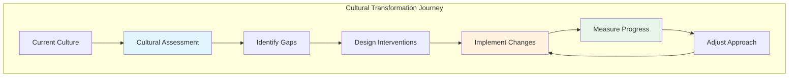
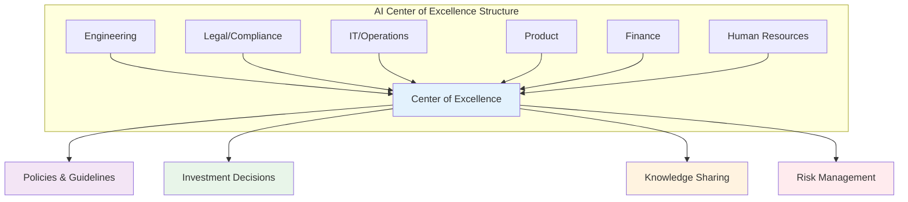
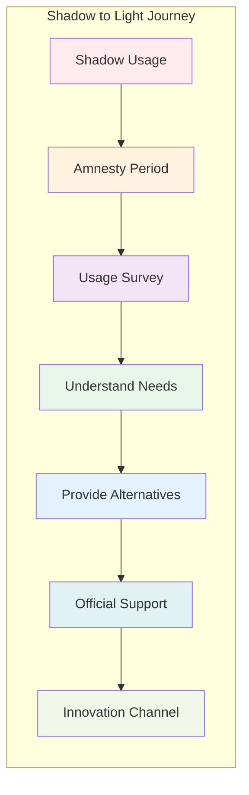
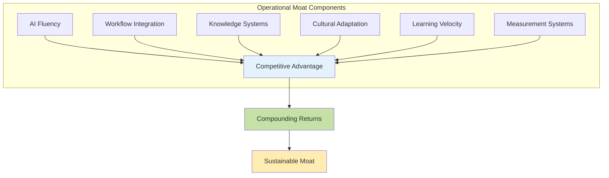

# Part 3: Enterprise Adoption Framework

## The Cultural Foundation

The most critical determinant of successful AI adoption isn't the technology chosen or the budget allocated—it's the organizational culture that either enables or constrains transformation. Culture eats strategy for breakfast, and this axiom holds especially true when introducing AI into development practices. Organizations must consciously evolve their cultural foundations before expecting technical transformation to take root.

The fundamental cultural shift required is from consensus-based to consent-based decision-making. This change reflects a deeper philosophical evolution from risk avoidance to intelligent experimentation, from perfect planning to iterative learning, from individual protection to collective growth.

Consider the journey documented in McKinsey's "The state of AI in early 2024" report. Their research found that while 72% of organizations report using AI in at least one business function, only 8% of respondents report adopting AI in more than five functions. The challenge isn't starting—it's scaling effectively. The report reveals a critical pattern: "High performers are using gen AI in more business functions—an average of three—than other organizations." This creates a compound effect where early, systematic adopters pull further ahead while organizations seeking perfect consensus fall behind.

### Consensus vs. Consent: A Critical Distinction

The shift from consensus to consent represents more than a procedural change—it's a fundamental reimagining of how organizations make decisions in an era of rapid technological evolution.

**Consensus-Based Decision Making** has long dominated enterprise software development:

| Characteristic | Impact | Example | Real-World Result |
|----------------|--------|---------|------------------|
| Everyone must agree | Slow progress, lowest common denominator | "We can't adopt AI tools until all architects approve" | 6-month evaluation cycles |
| Risk aversion dominates | Innovation stifled | "What if AI generates insecure code?" | Competitors gain advantage |
| Perfect information required | Analysis paralysis | "We need six months to evaluate all options" | Options change before decision |
| Change is threatening | Status quo preserved | "Our current process works fine" | Technical debt accumulates |
| Individual veto power | Single skeptic blocks progress | "I don't trust AI, so we shouldn't use it" | Talent leaves for progressive companies |

**Consent-Based Decision Making** enables AI transformation:

| Characteristic | Impact | Example | Real-World Result |
|----------------|--------|---------|------------------|
| No objections that cause harm | Faster experimentation | "Try AI for test generation if it doesn't touch production" | Innovation within weeks |
| Intelligent risk-taking | Innovation enabled | "Let's pilot with strong guardrails" | Learning accelerates |
| Good enough information | Rapid iteration | "Start with one team and learn" | Quick course corrections |
| Change is opportunity | Evolution embraced | "How might AI improve our workflow?" | Competitive advantages emerge |
| Collective wisdom | Diverse perspectives integrated | "What would make this safe enough to try?" | Balanced solutions found |

This shift doesn't mean abandoning caution—it means replacing blanket resistance with thoughtful experimentation. Instead of asking "What could go wrong?" teams ask "How can we try this safely?" Instead of seeking unanimous enthusiasm, they seek absence of fundamental objections.

One engineering director described their transformation: "We used to spend months in meetings debating whether to allow GitHub Copilot. Now we ask 'What guardrails would make you comfortable with a three-month pilot?' We went from paralysis to progress."

### Cultural Enablers and Inhibitors

Organizations must honestly assess their cultural readiness for AI adoption. Cultural enablers accelerate transformation, while inhibitors create friction that can derail even well-funded initiatives.

**Cultural Enablers:**
- **Learning Orientation**: Viewing failures as learning opportunities
  - Example: "Our AI generated a bug. Great! What can we learn about better prompting?"
- **Psychological Safety**: Team members feel safe to experiment and fail
  - Example: "Show and tell" sessions where developers share both successes and failures
- **Collaborative Spirit**: Success measured collectively, not individually
  - Example: Team velocity metrics rather than individual line counts
- **Growth Mindset**: Believing capabilities can be developed
  - Example: "I don't know AI yet" instead of "I'm not an AI person"
- **Intellectual Humility**: Acknowledging that AI might find better solutions
  - Example: Senior developer saying "The AI's approach is actually more elegant"
- **Experimentation Ethics**: Valuing learning over being right
  - Example: "Let's try both approaches and measure the results"

**Cultural Inhibitors:**
- **Blame Culture**: Failures punished rather than analyzed
  - Symptom: Developers hide AI usage to avoid scrutiny
- **Rigid Hierarchy**: Ideas must flow through command chains
  - Symptom: Junior developers' AI discoveries ignored
- **Individual Competition**: Team members compete rather than collaborate
  - Symptom: Hoarding effective prompts instead of sharing
- **Fixed Mindset**: Believing programming skill is innate
  - Symptom: "Real programmers don't need AI"
- **Expert Ego**: Senior developers threatened by AI capabilities
  - Symptom: Dismissing AI suggestions without consideration
- **Process Worship**: Valuing process compliance over outcomes
  - Symptom: "AI doesn't fit our SDLC, so we can't use it"

### Building Cultural Readiness

Transforming culture requires intentional, sustained effort across multiple dimensions:



**Assessment Tools:**

1. **Developer Surveys**: Anonymous assessments of attitudes toward AI
   - "How comfortable are you with AI assisting your development?"
   - "What concerns do you have about AI adoption?"
   - "What would help you feel more confident using AI tools?"

2. **Team Health Checks**: Regular pulse on psychological safety
   - "Can you share failures without fear?"
   - "Are new ideas welcomed regardless of source?"
   - "Do you feel supported in experimentation?"

3. **Innovation Metrics**: Tracking experimentation attempts
   - Number of AI experiments per team per month
   - Percentage of experiments shared with others
   - Rate of experiment adoption across teams

4. **Failure Analysis**: How the organization responds to failures
   - Time from failure to learning capture
   - Blame incidents vs. learning sessions
   - Failure story propagation speed

5. **Decision Velocity**: Time from idea to implementation
   - AI tool request to availability
   - Experiment proposal to approval
   - Learning to policy update

**Intervention Strategies:**

1. **Leadership Modeling**: Leaders publicly experiment with AI
   - CTO live-coding with AI in all-hands meetings
   - Engineering managers sharing their AI failures
   - Architects exploring AI-suggested designs openly

2. **Celebration Rituals**: Recognizing learning from failures
   - "Failure of the Month" awards with learning focus
   - AI experiment showcases regardless of outcome
   - Public recognition for knowledge sharing

3. **Safe Spaces**: Dedicated time/resources for experimentation
   - "AI Fridays" for exploration without deliverables
   - Sandbox environments with no production impact
   - Experimental budgets with no ROI requirements

4. **Story Sharing**: Spreading success narratives
   - Internal blog posts about AI wins
   - Lunch-and-learn sessions on discoveries
   - Cross-team AI collaboration showcases

5. **Skill Building**: Reducing fear through competence
   - AI literacy training for all developers
   - Prompt engineering workshops
   - Hands-on experimentation labs

## Policy Architecture

With cultural foundations in place, organizations need formal policy architectures that provide clear guidance while maintaining flexibility for innovation. Effective AI policies balance enablement with protection, creating frameworks that developers want to follow rather than work around.

The best policies emerge from understanding developer needs rather than imposing top-down restrictions. As one CISO noted: "We stopped trying to prevent AI usage—that ship had sailed. Instead, we asked developers what they needed to use AI safely and built our policies around that."

### Vendor and Tool Governance

Rather than blanket prohibitions that drive shadow IT, establish nuanced trust tiers that reflect actual risk levels:

```
┌─────────────────────────────────────────────────────────────────┐
│                        Trust Tier Framework                      │
├─────────────────────────────────────────────────────────────────┤
│                                                                 │
│  🚫 Prohibited                                                  │
│  └─ Consumer tools without enterprise agreements                │
│  └─ Tools that train on user data                             │
│  └─ Vendors without security certifications                    │
│                                                                 │
│  ⚠️  Restricted                                                 │
│  └─ Requires approval for specific use cases                   │
│  └─ Limited to non-sensitive data                             │
│  └─ Pilot programs only                                       │
│                                                                 │
│  ✓ Approved                                                    │
│  └─ Pre-vetted tools with usage guidelines                    │
│  └─ Clear data classification requirements                     │
│  └─ Standard procurement process                               │
│                                                                 │
│  ⭐ Preferred                                                   │
│  └─ Enterprise agreements in place                             │
│  └─ Full IT support available                                 │
│  └─ Integrated with existing systems                          │
│                                                                 │
└─────────────────────────────────────────────────────────────────┘
```

**Example Policy Implementation:**

| Tool Category | Specific Tool | Trust Tier | Rationale | Constraints | Evolution Path |
|---------------|---------------|------------|-----------|-------------|----------------|
| Consumer AI | ChatGPT (free) | Prohibited | No enterprise controls | N/A | Not applicable |
| Consumer AI | ChatGPT Plus | Restricted | Individual license | No sensitive data | → Approved if Teams version adopted |
| Enterprise AI | Azure OpenAI | Approved | Azure security controls | Follow data classification | → Preferred with proven value |
| Enterprise AI | AWS Bedrock Claude | Preferred | Full integration | Recommended for development | Maintain status |
| Local Models | Llama 2 | Restricted | Experimental only | Research projects only | → Approved with deployment framework |
| IDE Integration | GitHub Copilot | Approved | Microsoft backing | Code review required | → Preferred with training |
| CLI Tools | Claude Code | Preferred | High developer value | Standard tool for teams | Expand usage |

This tiered approach accomplishes several goals:
- Acknowledges that different tools have different risk profiles
- Provides clear guidance without absolute prohibitions
- Creates pathways for tool evolution (Restricted → Approved → Preferred)
- Respects developer autonomy while maintaining security

### Financial Enablement

Traditional IT budgeting models break down in the face of AI adoption. Organizations need new financial frameworks that support experimentation while maintaining fiscal responsibility.

**Budget Evolution Required:**

| Traditional Model | AI-Enabled Model | Rationale | Example |
|-------------------|------------------|-----------|---------|
| Annual tool budgets | Quarterly allocation | Rapid tool evolution | "Q1: GitHub Copilot, Q2: Claude Code, Q3: Evaluate new tools" |
| Department silos | Shared innovation pools | Cross-team learning | "Central AI experiment fund all teams can tap" |
| CapEx focused | OpEx flexibility | Consumption-based pricing | "Pay-per-token vs. seat licenses" |
| ROI predetermined | Learning valued | Experimentation needed | "50% budget for proven tools, 50% for experiments" |
| Individual licenses | Team subscriptions | Collaborative usage | "Team Claude Code account vs. personal subscriptions" |

**Financial Framework Components:**

1. **Professional Development Transformation**
   ```
   Traditional: $2,000/developer/year for training
   
   AI-Enabled: $2,000/developer/year split between:
   - $1,000 for AI tool subscriptions
   - $500 for API token experimentation  
   - $500 for traditional training
   
   Result: Developers can choose tools that work for them
   ```

2. **Team Experimentation Budgets**
   - Each team receives quarterly AI experimentation funds
   - No pre-approval needed below threshold ($500/month)
   - Simple reporting on usage and learnings
   - Successful experiments can trigger additional funding
   
   Real example: "Our mobile team discovered that spending $200/month on Claude API tokens saved 40 developer hours. We immediately increased their budget and rolled it out to other teams."

3. **Enterprise Scaling Mechanisms**
   - IT monitors individual/team AI expenses
   - Tools exceeding $10K/year trigger enterprise evaluation
   - Bulk licensing negotiated for widely adopted tools
   - Savings recycled into innovation funds
   
   Success story: "Individual GitHub Copilot subscriptions totaled $50K/year. Enterprise agreement cost $30K/year. We put the $20K savings into an AI experimentation fund."

4. **Success Metrics Beyond ROI**
   - Developer satisfaction scores: "How much does AI improve your daily work?"
   - Velocity improvements: "Story points per sprint with/without AI"
   - Quality metrics: "Defect rates in AI-assisted vs. traditional code"
   - Knowledge sharing instances: "AI discoveries shared across teams"
   - Innovation attempts: "Number of experiments, not just successes"

### Cross-Functional Governance

AI adoption cannot be governed by any single function. Successful organizations create cross-functional governance structures that balance diverse perspectives and needs.



**Governance Structure Roles:**

| Function | Primary Concern | Key Contributions | Veto Powers | Meeting Focus |
|----------|-----------------|-------------------|-------------|---------------|
| **Engineering** | Tool effectiveness | Technical evaluation, pilot results | Technical feasibility | "Does it actually help developers?" |
| **Legal/Compliance** | Risk management | Policy boundaries, contract review | Compliance violations | "Are we legally covered?" |
| **IT/Operations** | Security & scale | Infrastructure, integration, support | Security risks | "Can we support this at scale?" |
| **Product** | Business value | Use case prioritization, ROI | Strategic misalignment | "Does this advance our products?" |
| **Finance** | Cost optimization | Budget allocation, vendor negotiation | Budget overruns | "Is this financially sustainable?" |
| **HR** | Talent development | Training, culture, change management | People impact | "How do we skill up our teams?" |

**Effective Governance Principles:**

1. **Rapid Decision Cycles**: Weekly sync, monthly decisions
   - Week 1: New tool proposals submitted
   - Week 2: Technical and security review
   - Week 3: Pilot planning if approved
   - Week 4: Decision and communication

2. **Escalation Clarity**: Clear paths for exception handling
   - Developer request → Team lead approval (< $100/month)
   - Team lead → Department head ($100-500/month)
   - Department head → CoE (> $500/month or policy exception)

3. **Experimental Mindset**: "How might we try this safely?"
   - Default to "yes" with constraints rather than "no"
   - Time-box experiments (30-90 days)
   - Clear success criteria upfront
   - Learning valued regardless of outcome

4. **Learning Integration**: Failures inform policy evolution
   - Monthly retrospective on AI experiments
   - Policy updates based on learnings
   - Failed experiments celebrated for insights
   - Success patterns codified into standards

5. **Stakeholder Rotation**: Prevent entrenched positions
   - CoE membership rotates annually
   - Fresh perspectives encouraged
   - Alumni network maintains continuity
   - Cross-functional partnerships emphasized

## Addressing Shadow IT

Shadow IT represents both the biggest risk and the greatest opportunity in AI adoption. With 400 million ChatGPT subscribers globally and most organizations having policies against it, the shadow is already large. Smart organizations transform this shadow into light.

The reality is stark: developers are already using AI, with or without permission. One survey found that 78% of developers had used ChatGPT for work tasks, but only 22% had official approval. This gap between reality and policy creates risks while stifling innovation.

### Understanding the Shadow

Developers adopt AI tools in shadow for predictable reasons:

**Push Factors** (driving shadow adoption):
- Competitive pressure to maintain relevance
  - "My friend at another company ships features twice as fast using AI"
- Frustration with repetitive tasks
  - "I spent 3 hours writing boilerplate that AI could generate in minutes"
- Curiosity about new capabilities
  - "I wanted to see if AI could really help with code reviews"
- Peer influence and FOMO
  - "Everyone on Tech Twitter is talking about AI coding"
- Personal productivity goals
  - "I want to spend less time on mundane tasks"

**Pull Factors** (organizational failures):
- Slow or absent official AI policies
  - "We've been 'evaluating' AI tools for 18 months"
- Overly restrictive governance
  - "The approval process takes longer than my entire project"
- Lack of approved alternatives
  - "They banned ChatGPT but offered no replacement"
- No budget for experimentation
  - "I can't expense a $20/month tool that saves me hours"
- Cultural resistance to change
  - "My manager thinks AI is just hype"

### From Shadow to Light Strategy

Rather than fighting shadow IT, successful organizations create paths to legitimacy:



**Implementation Steps:**

1. **Declare Amnesty** (Month 1)
   - Announce 30-day amnesty for disclosure
   - No punishment for past usage
   - Focus on understanding, not controlling
   - Create anonymous reporting channels
   
   Sample communication: "We know many of you are already using AI tools. For the next 30 days, tell us what you're using and why—no questions asked, no consequences. Help us build better official support."

2. **Survey the Landscape** (Month 2)
   - What tools are being used?
   - For which use cases?
   - What value are developers seeing?
   - What risks are they taking?
   - What would they need to go legitimate?
   
   Typical findings: "67% using ChatGPT for code review, 45% for test generation, 89% for documentation. Main request: official tool that doesn't train on our code."

3. **Rapid Response** (Month 3)
   - Provide approved alternatives for top use cases
   - Create fast-track approval process
   - Establish experimental licenses
   - Launch internal champions program
   
   Success metric: "Within 30 days of amnesty ending, 80% of shadow users had migrated to official tools"

4. **Continuous Evolution** (Ongoing)
   - Monthly review of new tools
   - Quarterly policy updates
   - Regular success story sharing
   - Celebration of legitimate innovation
   
   Living system: "Our AI tool landscape changes monthly. That's not chaos—that's competitive advantage."

### Creating Safe Channels

The goal is making the official path more attractive than the shadow path:

| Shadow Path Attraction | Official Path Counter-Offer | Implementation Example |
|------------------------|----------------------------|------------------------|
| Immediate access | 24-hour approval for experiments | "Submit request by 3pm, answer by 3pm next day" |
| No bureaucracy | Single-form request process | "Three fields: tool name, use case, monthly cost" |
| Personal control | Individual sandbox environments | "Your own Azure OpenAI playground instance" |
| No scrutiny | Safe failure policy | "Experiments that fail teach us valuable lessons" |
| Cutting edge tools | Quarterly tool evaluation sprints | "Team volunteers test newest tools each quarter" |

Real success story: "We went from 200+ developers using personal ChatGPT accounts to 180 using enterprise Claude Code, 150 using GitHub Copilot, and 50 experimenting with approved new tools. Shadow usage dropped to near zero because official channels became better than shadow."

## Building an Operational Moat

The ultimate goal of enterprise AI adoption isn't to build technical capabilities that competitors can copy, but to create operational advantages that compound over time. This operational moat becomes the sustainable competitive advantage in an era where AI models are commoditized.

Warren Buffett popularized the concept of economic moats—sustainable competitive advantages that protect companies from competition. In the AI era, technical moats erode quickly as models improve and tools democratize. Operational moats, built through organizational learning and cultural evolution, prove far more durable.

### Understanding Operational vs. Technical Moats

**Technical Moats** (Rapidly Eroding):
- Access to specific AI models → Everyone can use GPT-4, Claude, etc.
- Proprietary algorithms → AI can replicate most approaches
- Custom integrations → Becoming standardized (MCP, etc.)
- Unique features → Easily copied with AI assistance

Consider how quickly technical advantages disappear: A startup's innovative feature built over 6 months can be replicated by competitors in 6 days using AI. Technical differentiation has never been more temporary.

**Operational Moats** (Steadily Deepening):
- How quickly teams adopt new capabilities
- Accumulated prompt engineering expertise  
- Refined human-AI collaboration patterns
- Organizational learning velocity
- Cultural comfort with constant change
- Integrated workflow optimizations

These advantages compound. A team that's been refining their AI collaboration for 12 months doesn't just work faster—they work differently. Their accumulated micro-optimizations, cultural adaptations, and refined workflows create capabilities that can't be copied by simply purchasing the same tools.

### Building Blocks of Operational Excellence

Organizations build operational moats through deliberate cultivation of capabilities that improve through use:



**1. AI Fluency at Scale**

Moving beyond individual experts to organizational capability:

- **Prompt Pattern Libraries**: Documented, tested, shared
  - Example: "Our 'code review' prompt evolved through 500+ iterations and now catches 90% of our common issues"
- **Collaboration Playbooks**: Proven human-AI workflows
  - Example: "The 'architecture design' playbook: human sketches, AI expands, human refines, AI implements"
- **Quality Frameworks**: AI-specific review criteria
  - Example: "Check for: overengineering, reinvented wheels, inconsistent patterns, missing context"
- **Failure Catalogs**: What doesn't work and why
  - Example: "AI consistently fails at date/time logic in our domain—always human review"
- **Success Templates**: Reproducible winning patterns
  - Example: "The 'API endpoint' template generates consistent, secure, documented endpoints"

**2. Workflow Integration Depth**

AI becomes invisible infrastructure rather than special tool:

- **Seamless Tool Chains**: AI integrated into every step
  - Pre-commit: AI reviews for common issues
  - CI/CD: AI generates test cases for new code
  - Post-deploy: AI monitors for anomalies
- **Automatic Context**: Systems that maintain AI memory
  - Project CLAUDE.md files with accumulated context
  - Git hooks that update AI context with each commit
  - IDE plugins that track decision history
- **Intelligent Routing**: Right AI for right task
  - Claude for complex reasoning
  - GPT-4 for creative solutions
  - Specialized models for domain tasks
- **Feedback Loops**: Continuous improvement built-in
  - Every AI interaction logged and analyzed
  - Patterns extracted and shared weekly
  - Prompt libraries updated based on outcomes
- **Metric Integration**: AI usage tracked like any resource
  - Token consumption per feature
  - AI contribution to velocity
  - Quality metrics for AI-assisted code

**3. Knowledge Systems Evolution**

From documentation to living intelligence:

- **Dynamic Knowledge Bases**: AI-maintained and updated
  - Documentation that updates itself based on code changes
  - AI that learns from every support ticket
  - Knowledge graphs built from team interactions
- **Pattern Recognition**: Automatic extraction of what works
  - ML models trained on successful pull requests
  - Automatic identification of effective patterns
  - Proactive suggestions based on history
- **Cross-Team Learning**: Insights flow between teams
  - Central repository of effective prompts
  - Weekly "AI wins" sharing sessions
  - Automatic propagation of improvements
- **Failure Analysis**: Systematic learning from mistakes
  - Every bug tagged with "AI-assisted" or not
  - Pattern analysis on AI-related issues
  - Preventive measures built into prompts
- **Innovation Capture**: New patterns recognized and spread
  - Novel approaches automatically flagged
  - Successful experiments documented
  - Best practices updated monthly

**4. Cultural Adaptation Speed**

Organizations that change faster than their environment:

- **Change Comfort**: Teams expect constant evolution
  - "What's new this week?" as standard greeting
  - Tooling changes welcomed, not resisted
  - Process updates seen as improvements
- **Experimentation Norm**: Trying new things is default
  - Every sprint includes experimentation time
  - Failure stories shared without shame
  - Innovation metrics tracked alongside delivery
- **Learning Celebration**: Growth valued over expertise
  - "I learned" valued more than "I knew"
  - Expertise seen as temporary state
  - Continuous learning built into roles
- **Failure Resilience**: Bounce back quickly from setbacks
  - Failed experiments analyzed within 24 hours
  - Learnings shared within 48 hours
  - New approach attempted within 72 hours
- **Future Orientation**: Always preparing for what's next
  - Quarterly "future tech" exploration
  - Skills development ahead of need
  - Infrastructure built for flexibility

### Measuring Moat Depth

Unlike technical capabilities, operational moats are measured through dynamic metrics:

| Moat Component | Shallow Indicators | Deep Indicators | Elite Indicators |
|----------------|-------------------|-----------------|------------------|
| **AI Fluency** | Few experts use AI | Every developer fluent | AI invisible in workflow |
| **Workflow Integration** | AI for special projects | AI in every commit | AI drives architecture |
| **Knowledge Systems** | Static documentation | Self-updating docs | Predictive knowledge |
| **Cultural Adaptation** | Resistance to change | Change anticipated | Change created |
| **Learning Velocity** | Quarterly updates | Daily improvements | Continuous evolution |

Real measurement example: "We track 'time to productive' for new AI tools. In January it was 3 weeks. By December it was 3 days. That acceleration is our moat."

### Competitive Implications

Organizations with deep operational moats experience compounding advantages:

**Year 1 Advantages:**
- Significant productivity gains (GitHub's research with Accenture showed developers using Copilot completed tasks 55% faster)
- Faster feature delivery
- Reduced bug rates
- Higher developer satisfaction (96% of developers in GitHub's research felt faster with repetitive tasks)

Example: "We're seeing real productivity gains similar to what GitHub documented - developers are completing tasks significantly faster, especially on repetitive work."

**Year 2 Advantages:**
- New architectural patterns emerge
- Cross-team innovation accelerates
- Competitive features delivered faster
- Talent attraction improves

Example: "Our 'AI-first' architecture lets us add features in days that competitors need weeks for."

**Year 3+ Advantages:**
- Organization operates at different speed
- Innovation becomes systematic
- Market responsiveness unprecedented
- Competitors cannot catch up

Example: "We prototype, test, and deploy features faster than competitors can write requirements."

The key insight: while competitors can buy the same AI tools tomorrow, they cannot buy the organizational capabilities built through months of deliberate practice, cultural evolution, and systematic learning. The moat isn't in the tools—it's in how the organization uses them.

## Implementation Roadmap

Moving from theory to practice requires a structured approach that balances urgency with sustainability. This roadmap provides a proven path while maintaining flexibility for organizational uniqueness.

### Phase 0: Foundation Setting (Weeks -4 to 0)

Before official launch, successful organizations lay groundwork that determines success:

**Week -4: Leadership Alignment**
- Executive education on AI possibilities
  - 2-hour workshop: "AI impact on software development"
  - Demo: Live coding session showing 10x productivity gains
  - Discussion: Competitive implications of inaction
- Cultural change commitment
  - Leadership pledge to model behavior
  - Agreement on consent-based decisions
  - Commitment to learning from failure
- Budget allocation approval
  - Shift from training to tools budget
  - Innovation fund establishment
  - Success metric agreement beyond ROI
- Communication strategy development
  - Key messages for different audiences
  - Channel selection (all-hands, email, Slack)
  - Champion identification for amplification

**Week -3: Pioneer Identification**
- Survey for existing AI users
  - Anonymous questionnaire via Forms
  - "What AI tools do you currently use?"
  - "What value have you seen?"
- Identify potential champions
  - Look for: Early adopters, influencers, teachers
  - Mix of: Senior and junior, different teams
  - Ensure: Psychological safety for honesty
- Map influence networks
  - Who do developers turn to for advice?
  - Which teams drive technical decisions?
  - Where do innovations typically start?
- Plan initial communications
  - Champion pre-briefing sessions
  - FAQ development based on survey
  - Resistance point identification

**Week -2: Infrastructure Preparation**
- IT security review
  - Network requirements for AI tools
  - Data classification updates
  - Access control mechanisms
- Procurement processes streamlined
  - Pre-approved vendor list
  - Simplified purchase process
  - Rapid evaluation criteria
- Legal framework drafted
  - Updated employment agreements
  - IP ownership clarifications
  - Vendor contract templates
- Sandbox environment setup
  - Isolated development environments
  - Pre-configured AI tool access
  - Usage monitoring established

**Week -1: Soft Launch**
- Champion early access
  - 20-30 developers get first access
  - Daily check-ins for feedback
  - Rapid issue resolution
- Feedback channels established
  - Dedicated Slack channel
  - Weekly office hours scheduled
  - Issue tracking system ready
- Initial documentation created
  - Getting started guides
  - Best practices from pioneers
  - FAQ based on real questions
- Launch plan finalized
  - All-hands presentation ready
  - Communication materials approved
  - Success metrics dashboards live

### Phase 1: Controlled Ignition (Weeks 1-4)

**Week 1: Public Launch**

Monday - All-hands announcement
- CEO: Strategic importance (5 min)
- CTO: Technical approach (10 min)
- Champion: Live demo (15 min)
- Q&A: Address concerns (15 min)

Tuesday-Friday rollout:
- Sign-up process opens (self-service)
- First training sessions (2x daily)
- Slack channel active support
- Daily stand-ups with pioneers
- Success stories captured

**Week 2: Early Adoption**
- 50-100 developers active
- Daily stand-ups for issue resolution
- First productivity metrics gathered
- Quick wins documented and shared
- Resistance patterns identified

Common Week 2 issues:
- "AI gives different answers each time" → Training on deterministic prompts
- "Generated code doesn't match our style" → Style guide integration
- "I don't know what to use it for" → Use case workshops

**Week 3: Rapid Iteration**
- Process adjustments based on feedback
- Additional tools evaluated (based on requests)
- Success stories amplified (internal blog)
- Skeptic conversion focus (1-on-1s)
- Measurement refinement

Typical adjustments:
- Approval process: 3 days → 24 hours
- Training format: Lecture → Hands-on labs
- Tool selection: Single option → Multiple choices

**Week 4: Foundation Assessment**
- Adoption metrics reviewed
  - Target: 25% of developers active
  - Quality: 80% satisfaction score
  - Impact: Measurable productivity gains
- Champion feedback synthesized
  - Common patterns identified
  - Improvement priorities ranked
  - Phase 2 recommendations
- Executive update delivered
  - Quantitative results
  - Qualitative insights
  - Go/no-go for expansion

### Phase 2: Expanding the Fire (Weeks 5-12)

**Weeks 5-6: Second Wave**
- Open to all volunteers (remove waitlist)
- Structured onboarding program (2-hour workshop)
- Peer mentoring established (champions + new users)
- Tool standardization begins (preferred tools emerge)
- Measurement systems activated (automated dashboards)

**Weeks 7-8: Pattern Recognition**
- Common use cases documented
  - Test generation (85% adoption)
  - Documentation (70% adoption)
  - Code review (60% adoption)
  - Architecture design (40% adoption)
- Best practices emerging
  - Prompt patterns library started
  - Workflow integrations documented
  - Team playbooks created
- Training refined based on patterns
- Community self-organizing

**Weeks 9-10: Systematic Improvement**
- Workflow integration deepens
  - Git hooks for AI review
  - IDE plugins customized
  - CI/CD pipeline integration
- Cross-team sharing formalized
  - Weekly demo sessions
  - Prompt pattern repository
  - Success metrics shared
- Innovation velocity increasing
  - Features delivered faster
  - Experimentation normalized
  - Learning accelerating

**Weeks 11-12: Preparation for Scale**
- Infrastructure scaling tested
  - Load testing for 100% adoption
  - Enterprise agreements negotiated
  - Support processes refined
- Success undeniable
  - Metrics show clear value
  - Skeptics converting
  - Demand exceeding capacity
- Organization ready for majority

### Phase 3: Organizational Transformation (Weeks 13-24)

**Weeks 13-16: Majority Adoption**
- Default expectation shifts
  - AI assistance assumed, not exceptional
  - Non-users need to justify why not
  - Tools part of standard onboarding
- Advanced patterns emerging
  - Architecture-level AI integration
  - AI-driven development workflows
  - Automated quality assurance
- Competitive advantages visible
  - Feature velocity 3-5x baseline
  - Bug rates reduced 40%
  - Developer satisfaction up 30%

**Weeks 17-20: Excellence Emergence**
- Operational moat deepening
  - Unique workflows developed
  - Institutional knowledge captured
  - Competitive practices emerged
- Innovation systematic
  - Every team experimenting
  - Failures celebrated for learning
  - Successes rapidly propagated
- Market leadership evident
  - Recruiting advantage clear
  - Competitors falling behind
  - Customers noting velocity

**Weeks 21-24: Future Foundation**
- Next generation planning
  - Emerging AI capabilities evaluated
  - Infrastructure modernization planned
  - Skills development roadmap created
- Continuous evolution embedded
  - Change becomes normal
  - Learning systemized
  - Innovation expected
- Transformation complete
  - Culture permanently shifted
  - Operational excellence achieved
  - Competitive moat established

### Critical Success Factors

Throughout implementation, certain factors determine success:

1. **Executive Sponsorship**: Visible, sustained support
   - Weekly CEO mentions in all-hands
   - CTO actively using AI tools
   - Board updates on progress

2. **Champion Network**: Distributed leadership
   - 1 champion per 10 developers
   - Regular champion sync meetings
   - Recognition and rewards

3. **Quick Wins**: Early, demonstrable value
   - First success within 48 hours
   - Weekly win announcements
   - Metrics that matter tracked

4. **Communication**: Constant, multi-channel
   - Daily Slack updates
   - Weekly email summaries
   - Monthly all-hands demos

5. **Support Systems**: Responsive, helpful
   - <4 hour response time
   - Solution-oriented approach
   - Continuous improvement

6. **Measurement**: Clear, fair, motivating
   - Individual and team metrics
   - Quality and quantity balanced
   - Learning valued equally

7. **Evolution**: Continuous improvement
   - Weekly retrospectives
   - Monthly policy updates
   - Quarterly strategy reviews

8. **Celebration**: Recognition and rewards
   - Public success acknowledgment
   - Innovation bonuses
   - Career advancement paths

## The Enterprise Imperative

Organizations face a critical moment. The question is not whether to adopt AI-assisted development, but whether to lead or follow. Early adopters are already building operational moats that will become increasingly difficult to cross. The window for establishing competitive advantage through thoughtful AI adoption is finite.

Consider the parallel to cloud adoption a decade ago. Organizations that moved quickly to the cloud gained operational advantages that compounded—faster deployment, greater scalability, reduced costs. Those advantages enabled them to out-innovate competitors who remained on-premise. The laggards eventually adopted cloud technology, but never recovered the lost ground.

AI adoption follows a similar but accelerated pattern. The operational advantages compound faster, the competitive gaps widen quicker, and the catch-up difficulty increases exponentially. Organizations that build AI-native development capabilities today will operate at a fundamentally different level than those that delay.

Success requires more than technology deployment. It demands cultural transformation, policy evolution, and operational excellence. Organizations that master these elements don't just adopt AI—they transform into learning machines that continuously evolve faster than their competition.

The framework presented here provides a proven path from current state to AI-native future. But frameworks don't transform organizations—people do. Leadership must commit, cultures must evolve, and teams must embrace the journey. The reward for those who succeed is not just increased productivity or reduced costs—it's the ability to imagine and build products that weren't possible before.

The enterprise adoption journey begins with a simple recognition: the future of software development is AI-augmented. Organizations can either shape that future or be shaped by it. Those who choose to lead, who build the cultural foundations and operational capabilities described here, will find themselves with sustainable advantages that compound over time.

The next chapter explores how teams can implement these principles in their daily practice, turning organizational vision into developer reality. The journey from enterprise strategy to team execution requires its own patterns and practices—patterns that the most successful organizations are already discovering and refining.

---

## Navigation

### Next Chapter
[Part 4: Team Implementation Patterns →](Part-04-Team-Implementation.md)

### Suggested Reading Paths

**For Individual Developers:**
- Consider [Part 5: Development Practices](Part-05-Development-Practices.md) for practical techniques
- Review [Part 6: Antipatterns](Part-06-Antipatterns.md) to understand risks

**For Team Leads:**
- Continue to [Part 4: Team Implementation Patterns](Part-04-Team-Implementation.md) for team dynamics
- Then [Part 6: Antipatterns](Part-06-Antipatterns.md) for risk awareness

**For Architects and Technical Leaders:**
- Jump to [Part 8: Technical Architecture](Part-08-Technical-Architecture.md) for technical patterns
- Consider [Part 7: Coordination and Governance](Part-07-Coordination-and-Governance.md) for governance design

**For Executives and Decision Makers:**
- Continue to [Part 10: The Path Forward](Part-10-The-Path-Forward.md) for future vision
- Review [Part 6: Antipatterns](Part-06-Antipatterns.md) for risk awareness

[← Back to Table of Contents](README.md)