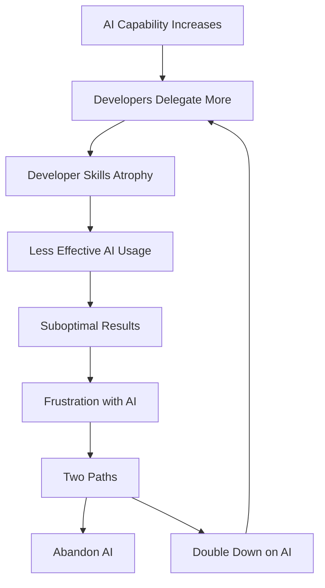
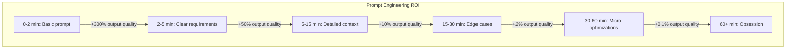
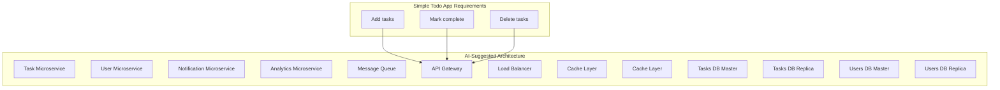
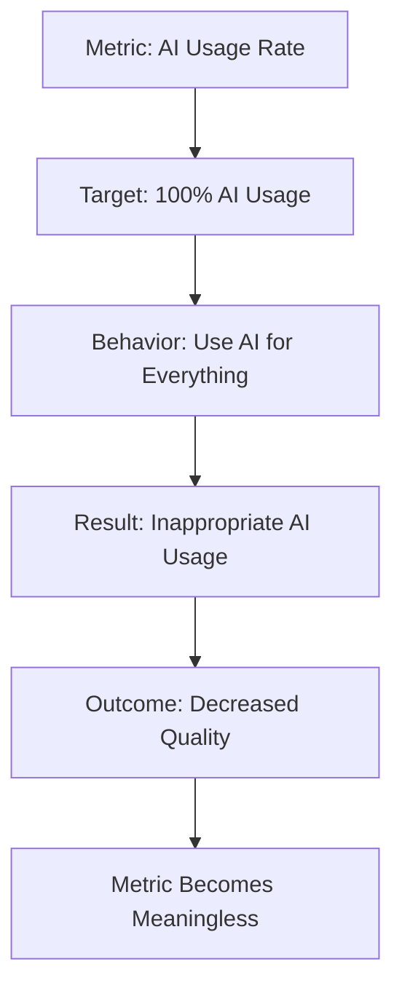
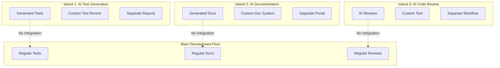

# Part 6: Antipatterns

## The Dark Side of AI Adoption

Every powerful tool can be misused, and AI in software development is no exception. The antipatterns that emerge from misapplied AI aren't just inefficiencies—they can fundamentally undermine team productivity, code quality, and organizational culture. Understanding these antipatterns is crucial for sustainable AI adoption.

These patterns emerge not from malice but from misunderstanding. Teams excited about AI's potential often rush into adoption without considering the systemic effects. The antipatterns described here come from real observations across dozens of teams, representing genuine pitfalls that well-intentioned developers fall into. Recognizing these patterns early can save months of painful correction later.

What makes these antipatterns particularly dangerous is their initial appearance of success. A team using AI to generate massive amounts of code might seem productive. Developers cranking out features at unprecedented speed appear to be thriving. Documentation that writes itself sounds like a dream come true. Yet beneath these surface wins, fundamental problems accumulate like rust on a bridge—invisible until the structure fails.

## The Overreliance Trap

The most seductive and dangerous antipattern is overreliance—when developers stop thinking critically and delegate too much cognitive work to AI. This pattern emerges gradually, making it particularly insidious. Like a frog in slowly heating water, developers don't notice their skills atrophying until they face a problem AI can't solve.

### How Overreliance Develops

The journey into overreliance follows a predictable path, each stage building on the previous one's apparent success. Understanding this progression helps teams recognize warning signs before reaching crisis point.

**Week 1-4: The Honeymoon Phase**

The initial experience with AI feels magical. A developer who previously spent hours writing boilerplate code discovers they can generate entire modules in minutes. Test suites that took days to write appear instantly. Documentation that was perpetually out of date now updates itself. 

Sarah, a senior developer at a fintech startup, described her first month: "I felt like I'd discovered superpowers. Tasks that used to take hours were done in minutes. I was shipping features faster than ever. My manager was thrilled. I was thrilled. Everything seemed perfect."

The honeymoon phase creates a dopamine loop. Each successful AI interaction reinforces the behavior. Developers start looking for more opportunities to use AI, expanding from simple code generation to increasingly complex tasks.

**Week 5-12: Expanding Delegation**

Success breeds confidence, sometimes misplaced. Developers who initially used AI for boilerplate start delegating architectural decisions. "Why spend time designing when AI can suggest an architecture?" becomes the prevailing thought.

During this phase, a subtle shift occurs. Developers move from using AI as a tool to using it as a crutch. They stop sketching solutions on whiteboards before asking AI. They skip the thinking phase and jump straight to prompting. The mental muscles that turn requirements into designs begin to atrophy.

One team lead noticed the change in his developers: "Code reviews became weird. When I asked why they chose a particular pattern, the answer was increasingly 'the AI suggested it.' They couldn't explain the tradeoffs or alternatives because they hadn't considered any."

**Week 13-20: Skill Atrophy**

By this stage, the deterioration becomes noticeable. Developers struggle with tasks they once handled easily. Debugging becomes particularly challenging—when AI can't immediately solve a problem, developers lack the systematic approach to investigate.

The atrophy isn't uniform. Skills used daily with AI assistance remain sharp. But foundational skills—algorithm design, performance analysis, security assessment—decay from disuse. It's like a guitarist who only plays with backing tracks forgetting how to play solo.

A stark example came from a team that had fully embraced AI for six months. When their AI tools went down during a critical production issue, they struggled to debug a race condition—something any senior developer should handle. "We sat there staring at the logs like junior developers," one admitted. "We'd forgotten how to think through concurrent execution paths."

**Week 21+: Crisis Point**

The crisis arrives inevitably. It might be a production issue AI can't solve, a security vulnerability AI didn't catch, or a performance problem requiring deep optimization. The team discovers they lack the skills to handle it.

Worse, the junior developers who joined during the AI era never developed these skills at all. They learned to prompt, not to program. They can generate code but not understand it. They're like pilots who learned on autopilot—capable in normal conditions but helpless when manual control is needed.

### Symptoms of Overreliance

The symptoms manifest in code reviews, debugging sessions, and architectural discussions. Here's how to recognize them:

```python
# Overreliance Example 1: Lost Debugging Skills
class OverreliantDeveloper:
    def fix_bug(self, error):
        # Immediately asks AI without attempting to understand
        return ai.fix_this(error)  # No learning happens
        
class HealthyDeveloper:
    def fix_bug(self, error):
        # First attempts to understand the issue
        hypothesis = self.analyze_error(error)
        
        # Uses AI to validate and expand thinking
        ai_suggestions = ai.suggest_fixes(error, hypothesis)
        
        # Learns from both success and failure
        solution = self.synthesize_solution(hypothesis, ai_suggestions)
        self.document_learning(error, solution)
        return solution
```

The difference is subtle but critical. The overreliant developer treats AI as a magic oracle. The healthy developer uses AI as a collaborator, maintaining their own analytical skills while leveraging AI's capabilities.

Other symptoms include:
- Inability to explain code they've "written"
- Panic when AI tools are unavailable
- Declining performance in technical interviews
- Avoidance of problems AI struggles with
- Loss of architectural intuition

### The Knowledge Paradox

Overreliance creates a paradox: the more capable AI becomes, the less capable developers need to be, but the less capable developers are, the less effectively they can use AI. This downward spiral accelerates as AI improves.



The paradox deepens when we consider that effective AI usage requires strong foundational knowledge. Developers need to understand what they're asking for, evaluate what they receive, and integrate it properly. Without this foundation, AI becomes a random code generator rather than an intelligent assistant.

A senior architect explained it well: "Using AI effectively is like conducting an orchestra. You need to know what each instrument should sound like to notice when something's off. If you've never heard a violin, you can't tell if the AI is playing it wrong."

### Prevention Strategies

Preventing overreliance requires deliberate practice and organizational commitment. These strategies have proven effective across multiple teams:

**1. Mandatory Understanding Sessions**

Before accepting any AI-generated code, developers must demonstrate understanding. This isn't bureaucracy—it's skill preservation.

```yaml
# team-practices.yml
understanding_requirements:
  before_ai_implementation:
    - Must explain problem in own words
    - Must sketch potential approach
    - Must identify edge cases
    
  after_ai_generation:
    - Must review every line
    - Must explain why code works
    - Must identify potential issues
    
  weekly_practice:
    - "No AI Fridays" - solve problems manually
    - Code reading sessions
    - Algorithm implementation practice
```

One team implemented "Teaching Tuesdays" where developers explain AI-generated code to junior members. "If you can't teach it, you don't understand it" became their mantra. The practice revealed gaps in understanding and forced deeper engagement with the code.

**2. The Teaching Test**

The teaching test provides a clear benchmark: can you explain this code to someone else without referring to AI? This test works because teaching requires decomposition, understanding relationships, and anticipating questions—all skills that atrophy with overreliance.

A tech lead described their approach: "Every PR must include a 'teaching section' where the developer explains the solution as if to a new team member. No hiding behind 'the AI did it.' You merged it, you own it, you teach it."

**3. Regular Skill Audits**

Systematic assessment prevents skill decay from going unnoticed:

```python
# skill_audit.py
class DeveloperSkillAudit:
    def quarterly_assessment(self, developer):
        skills_to_test = [
            "debug_without_ai",
            "implement_algorithm_from_scratch",
            "explain_architectural_decisions",
            "optimize_performance_manually",
            "security_analysis_without_tools"
        ]
        
        results = {}
        for skill in skills_to_test:
            results[skill] = self.test_skill(developer, skill)
            
        if any(score < 0.7 for score in results.values()):
            return "Skill remediation needed"
```

These audits aren't punitive—they're preventive maintenance for human capital. Like athletes who cross-train to prevent injury, developers need regular practice of fundamental skills to prevent atrophy.

**4. AI Sabbaticals**

Some teams implement periodic "AI sabbaticals"—days or weeks where developers work without AI assistance. This serves multiple purposes:
- Reveals skill gaps before they become critical
- Rebuilds confidence in fundamental abilities
- Provides perspective on appropriate AI usage
- Creates appreciation for AI as a tool, not a crutch

**5. Peer Review Requirements**

Requiring human review of AI-generated code creates natural checkpoints for understanding:
- Reviewers must understand code to approve it
- Authors must understand code to defend it
- Discussion deepens everyone's comprehension
- Knowledge spreads through the team

## The Copy-Paste Catastrophe

This antipattern occurs when developers blindly copy AI-generated code without understanding or adapting it to their specific context. It's particularly dangerous because the code often "works" initially but creates hidden technical debt that compounds over time.

The copy-paste catastrophe differs from traditional copy-paste programming in its scale and subtlety. When developers copy from Stack Overflow, they usually adapt the code to their needs. With AI, the code often looks so polished and complete that developers assume it's correct as-is. This assumption plants time bombs throughout the codebase.

### Manifestations of Copy-Paste Catastrophe

The catastrophe manifests in various forms, each creating its own flavor of technical debt. Understanding these manifestations helps teams recognize and prevent them.

#### Context Mismatch

AI generates code based on patterns it has learned, but it doesn't understand your specific context. This leads to mismatches that aren't immediately obvious:

```python
# AI generates this for a "user authentication" prompt
class UserAuthenticator:
    def authenticate(self, username, password):
        # AI assumes SQL database
        query = "SELECT * FROM users WHERE username = ?"
        user = self.db.execute(query, [username]).fetchone()
        
        # AI assumes bcrypt
        if bcrypt.checkpw(password.encode(), user['password_hash']):
            return self.generate_jwt_token(user)
            
# But your project:
# - Uses MongoDB, not SQL
# - Uses different password hashing
# - Doesn't use JWT tokens
# Developer copies anyway because "it looks right"
```

The developer sees familiar patterns—database queries, password checking, token generation—and assumes correctness. They might even add the missing imports, making the code syntactically valid while semantically wrong for their system.

A backend developer shared their experience: "I asked for user authentication code. The AI gave me this beautiful, clean implementation. I copied it, fixed the imports, and it worked in testing. Three weeks later, we discovered it was checking passwords against the wrong database table because our schema was different. The bug was subtle because authentication still worked—just with the wrong users!"

#### Hidden Dependencies

AI often generates code that depends on specific versions, libraries, or language features without making these dependencies explicit:

```javascript
// AI generates modern JavaScript
const processData = async (data) => {
    const results = await Promise.allSettled(
        data.map(item => processItem(item))
    );
    
    return results
        .filter(r => r.status === 'fulfilled')
        .map(r => r.value)
        .flat()
        ?.at(-1) ?? null;  // Uses optional chaining and nullish coalescing
};

// Copied into a project targeting older browsers
// Breaks in production because of unsupported syntax
```

The code works perfectly in development where modern Node.js runs. It passes tests in Chrome. But when deployed to production serving Internet Explorer 11 users (yes, they still exist in enterprise), it fails catastrophically.

#### Architectural Impedance Mismatch

Perhaps most dangerous is when AI-generated code follows different architectural patterns than the existing codebase:

```python
# Existing codebase uses dependency injection
class ExistingService:
    def __init__(self, database, cache, logger):
        self.database = database
        self.cache = cache
        self.logger = logger

# AI generates code with hardcoded dependencies
class AIGeneratedService:
    def __init__(self):
        self.database = PostgreSQL()  # Direct instantiation
        self.cache = Redis()          # Breaks DI pattern
        self.logger = Logger()        # Untestable
```

One developer copies this because it's simpler than the existing pattern. Soon, others follow suit. Within months, the codebase has two competing architectural styles, making it harder to understand, test, and maintain.

### The Compound Interest of Bad Copies

Each copied-without-understanding code block compounds technical debt. The progression is predictable and devastating:

| Time | Debt Accumulation | Impact | Real Example |
|------|-------------------|---------|--------------|
| Day 1 | Single mismatched pattern | Negligible | "Just one different auth method" |
| Week 1 | 10-20 inconsistencies | Minor confusion | "Why do we have two logging styles?" |
| Month 1 | 100+ divergent patterns | Significant complexity | "New devs take weeks to understand our patterns" |
| Month 3 | Architectural incoherence | Major refactor needed | "We need to standardize, but where to start?" |
| Month 6 | System unintelligible | Complete rewrite considered | "It's easier to rebuild than understand" |

A team lead documented their descent: "It started innocently. One developer copied AI-generated database code that used a different connection pattern. Others saw it and assumed it was our new standard. Soon we had five different database patterns, three authentication methods, and nobody knew which was correct. Code reviews became archaeology expeditions."

### Prevention and Recovery

Preventing the copy-paste catastrophe requires both technical and cultural measures:

**Prevention Checklist:**

Before accepting any AI-generated code, developers must verify:

```markdown
## Before Accepting AI-Generated Code

- [ ] Does this match our coding standards?
- [ ] Are all imports/dependencies available?
- [ ] Does it align with our architectural patterns?
- [ ] Have I understood every line?
- [ ] Have I considered our specific context?
- [ ] Will this work with our target environment?
- [ ] Does it handle our edge cases?
- [ ] Is the error handling appropriate?
- [ ] Does it respect our security requirements?
- [ ] Will other team members understand it?
```

This checklist isn't bureaucracy—it's pattern matching. Developers internalize these checks until they become automatic, like a pilot's pre-flight inspection.

**Recovery Strategy:**

When copy-paste catastrophe has already taken root, recovery requires systematic archaeology:

```python
# code_archaeology.py
class CodeArchaeology:
    """Recover from copy-paste catastrophe"""
    
    def identify_ai_generated_code(self, codebase):
        patterns = [
            "inconsistent_naming_conventions",
            "multiple_paradigms_in_same_file",
            "generic_error_messages",
            "todo_comments_never_addressed",
            "mismatched_architectural_patterns"
        ]
        
        suspects = []
        for file in codebase.files:
            if self.matches_patterns(file, patterns):
                suspects.append(file)
                
        return suspects
        
    def remediation_plan(self, suspects):
        return {
            "immediate": self.find_critical_issues(suspects),
            "short_term": self.identify_inconsistencies(suspects),
            "long_term": self.plan_architectural_alignment(suspects)
        }
```

One team's recovery story: "We spent three months cleaning up copy-paste debt. We found seven different error handling patterns, four authentication methods, and countless minor inconsistencies. The cleanup was painful, but the alternative was a codebase nobody could understand."

**Cultural Safeguards:**

- **Code Ownership**: "You merge it, you own it"—developers must understand code they introduce
- **Review Requirements**: Reviewers reject code the author can't explain
- **Pattern Documentation**: Clear documentation of approved patterns
- **AI Attribution**: Comments indicating AI-generated code for extra scrutiny

## The Prompt Engineering Obsession

Some teams become so focused on crafting perfect prompts that they spend more time prompt engineering than they would have spent coding. This antipattern represents a fundamental misunderstanding of AI's role in development.

### The Seduction of the Perfect Prompt

The obsession begins innocently. A developer discovers that better prompts yield better results. They iterate, refine, and improve. Soon, they're spending 30 minutes crafting prompts for 5-minute tasks, convinced that the perfect prompt will yield perfect code.

This mindset treats AI as a puzzle to be solved rather than a tool to be used. It's like spending hours sharpening a pencil to write a single word—the preparation exceeds the task's requirements.

### Signs of Prompt Obsession

The obsession manifests in recognizable patterns:

```python
# Antipattern: 45 minutes crafting the "perfect" prompt
prompt = """
You are an expert Python developer with 15 years of experience in 
enterprise systems. You have deep knowledge of SOLID principles,
design patterns, and clean code practices. You always write
comprehensive tests and documentation. You consider performance
implications and security concerns. You follow PEP 8 strictly
and use type hints. You prefer functional approaches where
appropriate but understand when OOP is better. You have worked
with Django, Flask, FastAPI, and understand their tradeoffs.
You're familiar with PostgreSQL, MongoDB, Redis, and Elasticsearch.
You understand microservices, event-driven architecture, and DDD.
You always consider scalability, maintainability, and readability.
You write code that is self-documenting but add comments where
clarification helps. You consider error handling, logging, and
monitoring. You understand CI/CD, DevOps practices, and cloud
deployment. You're security-conscious and always validate input...
[continues for 500 more words]

Now, create a function that adds two numbers.
"""

# Reality: 30 seconds would have been faster
def add(a: int, b: int) -> int:
    return a + b
```

A developer recalled their wake-up moment: "I spent an hour crafting the perfect prompt for a date formatting function. My colleague wrote it in two minutes. That's when I realized I'd lost the plot."

### The Diminishing Returns Curve

Prompt engineering follows a sharp diminishing returns curve. Initial improvements are dramatic, but further refinement yields minimal benefit:



Understanding this curve helps developers invest effort appropriately. The goal isn't perfection—it's efficiency. A "good enough" prompt that takes 2 minutes often beats a "perfect" prompt that takes 20.

### Breaking the Obsession

Several strategies help teams break free from prompt obsession:

**The 5-Minute Rule:**
If you've spent more than 5 minutes on a prompt for a simple task, stop and code it yourself. This hard limit prevents rabbit holes and maintains perspective.

**Prompt Templates, Not Prompt Crafting:**
Instead of crafting bespoke prompts, use templates:

```yaml
# prompt-templates.yml
standard_templates:
  feature_implementation:
    template: |
      Implement {feature_name} with:
      - Input: {input_spec}
      - Output: {output_spec}
      - Constraints: {constraints}
      Use our standard patterns.
    max_time: 2 minutes
    
  bug_fix:
    template: |
      Fix: {bug_description}
      Error: {error_message}
      Context: {relevant_code}
    max_time: 1 minute
    
  refactoring:
    template: |
      Refactor {code_section} to:
      - Improve: {improvement_goals}
      - Maintain: {preservation_requirements}
    max_time: 3 minutes
```

**Task-Appropriate Effort:**
Match prompt effort to task complexity:
- Simple CRUD: 30 seconds
- Algorithm implementation: 2-3 minutes
- Architecture design: 5-10 minutes
- Complex system design: Consider human-first approach

**Prompt Iteration Limits:**
If the AI doesn't understand after three attempts, the problem likely needs human clarification first. Continued iteration rarely helps and often indicates unclear requirements.

## The Complexity Explosion

AI makes it trivially easy to generate complex solutions to simple problems. This antipattern occurs when teams accept AI's tendency toward over-engineering without applying human judgment about appropriate complexity levels.

### The Over-Engineering Trap

AI models trained on enterprise codebases often suggest enterprise-grade solutions for every problem, regardless of scale. They don't understand context or constraints—they pattern-match and generate what they've seen most often.

Consider this real example where a developer asked for a simple even number check:

```python
# Task: Check if a number is even
# AI-generated monstrosity:
class NumberParityChecker:
    def __init__(self):
        self.parity_cache = {}
        self.check_count = 0
        self.performance_monitor = PerformanceMonitor()
        
    def check_even(self, number):
        self.performance_monitor.start_timing()
        
        if number in self.parity_cache:
            return self.parity_cache[number]
            
        result = self._perform_parity_check(number)
        self.parity_cache[number] = result
        self.check_count += 1
        
        self.performance_monitor.end_timing()
        return result
        
    def _perform_parity_check(self, number):
        # Complex bit manipulation for "performance"
        return (number & 1) == 0
        
    def get_statistics(self):
        return {
            'checks_performed': self.check_count,
            'cache_hit_rate': self._calculate_cache_hit_rate(),
            'average_check_time': self.performance_monitor.average_time()
        }

# What it should be:
def is_even(n):
    return n % 2 == 0
```

The AI created a caching system for a mathematical operation that's already faster than cache lookup. It added performance monitoring for an operation measured in nanoseconds. It turned one line into thirty, adding no value but significant complexity.

### The Architecture Astronaut Syndrome

This syndrome occurs when AI suggests architectural patterns appropriate for Google-scale problems when you're building a simple CRUD app:



A startup founder shared their experience: "We asked AI to design our MVP architecture. It suggested microservices, event sourcing, CQRS, and a service mesh. We were three developers building a todo app. We almost implemented it before sanity prevailed."

### Complexity Budgets

The solution is implementing complexity budgets that prevent explosion:

```python
# complexity_budget.py
class ComplexityBudget:
    def __init__(self, max_complexity=10):
        self.max_complexity = max_complexity
        
    def evaluate_solution(self, code):
        metrics = {
            'cyclomatic_complexity': self.calculate_cyclomatic(code),
            'nesting_depth': self.calculate_nesting(code),
            'abstraction_layers': self.count_abstractions(code),
            'dependency_count': self.count_dependencies(code)
        }
        
        total_complexity = sum(metrics.values())
        
        if total_complexity > self.max_complexity:
            return f"REJECTED: Complexity {total_complexity} exceeds budget {self.max_complexity}"
            
        return "APPROVED"
```

Teams that implement complexity budgets report better outcomes:
- Simpler, more maintainable code
- Faster development cycles
- Easier onboarding
- Reduced bug rates
- Better performance

### The YAGNI Principle

"You Aren't Gonna Need It" becomes even more critical with AI. Since generating complex code is easy, the temptation to add "just in case" features multiplies. Teams must actively resist this temptation.

One team instituted "YAGNI Reviews" where every PR was examined for unnecessary complexity:
- Does this solve an actual problem?
- Is this the simplest solution that works?
- Are we adding flexibility we don't need?
- Could we add this complexity later if needed?

Their lead developer explained: "AI makes it free to generate complex code, but it's not free to maintain. Every abstraction, every feature, every line of code has a carrying cost. We evaluate that cost, not the generation cost."

## The Documentation Delusion

This antipattern occurs when teams rely entirely on AI-generated documentation without ensuring it accurately reflects the code's actual behavior, limitations, and intent. The documentation looks comprehensive but misleads rather than informs.

### Types of Documentation Delusion

Documentation delusion manifests in several forms, each creating its own problems:

#### Hallucinated Functionality

AI sometimes documents features that don't exist, creating false expectations:

```python
class DataProcessor:
    def process(self, data):
        """
        AI-generated documentation:
        
        This method processes data using advanced machine learning algorithms
        to optimize performance. It automatically scales across multiple cores,
        handles distributed processing, and includes built-in fault tolerance.
        
        Features:
        - Auto-scaling based on load
        - ML-based optimization
        - Distributed processing support
        - Automatic retry logic
        - Real-time monitoring
        
        Returns:
            ProcessedData: Optimized and analyzed data
        """
        # Actual implementation:
        return data.upper()  # Just converts to uppercase
```

A QA engineer discovered this disconnect: "The docs promised ML optimization and distributed processing. The code just uppercased strings. We spent days trying to figure out how to enable the 'advanced features' before realizing they didn't exist."

#### Context-Free Documentation

AI generates generic documentation without understanding project conventions:

```javascript
/**
 * AI generates generic documentation without understanding context
 * 
 * @param {Object} user - The user object
 * @param {string} user.name - The user's name
 * @param {number} user.age - The user's age
 * @returns {boolean} Returns true if successful
 */
function processUser(user) {
    // But in this codebase, 'user' is actually a UUID string
    // The AI didn't understand the project's conventions
    return database.delete(user);  // And it's a deletion, not a process!
}
```

These mismatches create confusion and waste time. Developers reading the documentation expect one thing but find another, leading to bugs and misunderstandings.

#### Aspirational Documentation

Sometimes AI documents what the code should do rather than what it does:

```python
def optimize_query(query):
    """
    AI-generated documentation:
    
    Optimizes SQL queries using advanced parsing and query plan analysis.
    Reduces query execution time by 40-60% through intelligent rewriting.
    """
    # Actual implementation:
    return query  # TODO: Implement optimization
```

This creates technical debt disguised as features. Future developers assume the optimization exists and build dependent features, only to discover the foundation is missing.

### Documentation Quality Gates

Preventing documentation delusion requires systematic validation:

```python
# doc_quality_gate.py
class DocumentationValidator:
    def validate_documentation(self, func, doc):
        issues = []
        
        # Check if documentation matches implementation
        if not self.params_match(func, doc):
            issues.append("Parameter mismatch")
            
        # Check for hallucinated features
        if self.contains_unimplemented_features(func, doc):
            issues.append("Documents non-existent features")
            
        # Check for meaningful content
        if self.is_generic_boilerplate(doc):
            issues.append("Generic documentation without specific value")
            
        # Verify examples actually work
        if not self.examples_execute(doc):
            issues.append("Examples don't run")
            
        return issues
```

### Living Documentation Principles

Good documentation with AI requires:

1. **Verification**: Every claim in documentation must be verifiable in code
2. **Specificity**: Documentation must reflect this code, not generic patterns
3. **Accuracy**: Parameters, returns, and exceptions must match exactly
4. **Maintenance**: Documentation must update when code changes
5. **Examples**: Code examples must actually run

A team that recovered from documentation delusion shared their approach: "We treat documentation like tests. If it doesn't match reality, the build fails. This forced us to keep docs honest and current."

## The Security Theater

This antipattern emerges when teams assume AI-generated code is secure by default, or when they implement security features that provide no real protection. It's particularly dangerous because security flaws often remain hidden until exploited.

### The Illusion of Security

AI can generate code that looks secure but isn't. It uses security-related terms and patterns without understanding their purpose:

```python
# Example 1: Fake Encryption
class SecurityTheater:
    def encrypt_password(self, password):
        # AI suggested this "encryption"
        return base64.b64encode(password.encode()).decode()
        # Base64 is encoding, not encryption!
        
    def validate_input(self, user_input):
        # AI's "security validation"
        if "script" in user_input.lower():
            return False  # Trivially bypassed
        return True
        
    def secure_api_key(self):
        # AI's key "security"
        return "sk_" + self.api_key  # Adding prefix doesn't secure anything
```

These patterns create false confidence. Developers see "encrypt", "validate", and "secure" in function names and assume protection exists. Code reviews might even pass because reviewers see security-conscious naming.

### Real Security vs Theater

Understanding the difference between security theater and real security is crucial:

| Security Theater | Real Security | Why It Matters |
|-----------------|---------------|----------------|
| Base64 "encryption" | Proper cryptographic libraries | Base64 is reversible encoding |
| Checking for "script" keyword | Comprehensive input sanitization | Trivial to bypass with "ScRiPt" |
| Hidden form fields for auth | Proper session management | Client-side data is untrusted |
| Client-side validation only | Server-side validation | Clients can bypass checks |
| Obscure variable names | Actual access controls | Security through obscurity fails |
| Comments saying "secure" | Security testing and audits | Comments aren't protection |

A penetration tester shared their findings: "We reviewed an AI-assisted codebase that looked security-conscious. Every function had 'secure' or 'safe' in the name. But underneath, it was security theater. The AI had learned the vocabulary but not the concepts."

### Security-First AI Usage

Preventing security theater requires explicit security requirements in every interaction:

```yaml
# security-first-ai.yml
ai_security_practices:
  pre_generation:
    - Include security requirements in prompt
    - Specify threat model
    - Define trust boundaries
    
  post_generation:
    - Run SAST tools
    - Check OWASP compliance
    - Verify crypto implementations
    - Test input validation
    - Review authentication logic
    
  never_ai_generate:
    - Cryptographic algorithms
    - Authentication schemes
    - Security policies
    - Access control logic
```

Critical security components should never be fully delegated to AI. A security architect explained: "AI can suggest security patterns, but humans must implement critical security controls. The stakes are too high for probabilistic generation."

## The Metric Manipulation

Teams sometimes game their metrics to show AI adoption success, focusing on vanity metrics rather than meaningful outcomes. This antipattern undermines the genuine benefits of AI by obscuring real problems.

### Vanity Metrics vs Value Metrics

The distinction between activity and achievement becomes crucial:

```python
# Vanity metrics that don't indicate real value
vanity_metrics = {
    "lines_of_code_generated": 50000,  # More isn't better
    "ai_prompts_per_day": 200,         # Activity isn't productivity
    "test_count": 10000,               # Quantity isn't quality
    "documentation_pages": 500,         # Volume isn't clarity
    "ai_tool_adoption_rate": 100,      # Usage isn't effectiveness
}

# Value metrics that indicate real improvement
value_metrics = {
    "feature_delivery_time": -40,       # % reduction
    "production_defect_rate": -60,      # % reduction
    "developer_satisfaction": +30,       # % increase
    "code_review_time": -50,            # % reduction
    "time_to_market": -35,              # % reduction
}
```

A VP of Engineering learned this lesson: "We celebrated hitting 100% AI tool adoption and 10x code generation. Then we discovered our bug rate had doubled and feature delivery hadn't improved. We were measuring motion, not progress."

### The Goodhart Effect

"When a measure becomes a target, it ceases to be a good measure." This principle becomes especially relevant with AI metrics:



Teams start using AI not because it helps, but because it's measured. Developers generate unnecessary code to hit generation targets. Quality suffers while metrics improve.

### Meaningful Measurement Framework

Building metrics that matter requires focusing on outcomes:

```python
# meaningful_metrics.py
class MeaningfulMetrics:
    def __init__(self):
        self.baseline = self.establish_baseline()
        
    def measure_ai_impact(self):
        return {
            "business_impact": {
                "feature_velocity": self.compare_feature_delivery(),
                "customer_satisfaction": self.measure_nps_change(),
                "revenue_impact": self.calculate_time_to_market_value()
            },
            "engineering_health": {
                "code_quality": self.measure_maintainability_index(),
                "team_satisfaction": self.survey_developer_happiness(),
                "knowledge_retention": self.test_understanding_levels()
            },
            "operational_efficiency": {
                "incident_rate": self.track_production_issues(),
                "recovery_time": self.measure_mttr(),
                "deployment_frequency": self.track_release_cadence()
            }
        }
```

The key is measuring what you actually care about, not what's easy to measure. Customer value, not code volume. Developer capability, not tool usage. System reliability, not generation speed.

## The Island of Automation

This antipattern occurs when teams create isolated pockets of AI automation that don't integrate with the broader development ecosystem. Instead of streamlining workflows, these islands create complexity and confusion.

### Symptoms of Automation Islands

Islands form when teams solve problems in isolation without considering the broader system:



Each island requires its own maintenance, training, and processes. Developers must context-switch between systems. Information doesn't flow between islands. The supposed automation creates more work than it saves.

A team lead described their island problem: "We had AI generating tests in one format, documentation in another system, and code reviews in a third tool. Developers spent more time navigating between systems than benefiting from automation."

### Integration-First Automation

The solution is designing automation that enhances rather than replaces existing workflows:

```yaml
# integration-first-automation.yml
principles:
  - start_with_existing_tools
  - extend_dont_replace
  - maintain_single_source_of_truth
  - automate_bridges_not_islands

implementation:
  ai_tests:
    integrate_with: existing_test_framework
    output_format: standard_test_files
    reporting: unified_test_reports
    
  ai_documentation:
    integrate_with: existing_doc_system
    output_format: standard_markdown
    publishing: current_pipeline
    
  ai_reviews:
    integrate_with: pr_workflow
    output_format: github_comments
    process: existing_review_process
```

Teams that follow integration-first principles report:
- Smoother adoption curves
- Less training required
- Better information flow
- Reduced context switching
- Higher overall productivity

## Recovery Strategies

When antipatterns are already embedded, recovery requires careful planning and execution. The key is addressing root causes, not just symptoms.

### The Recovery Roadmap

Recovery follows a predictable path from assessment through transformation:

```python
# recovery_roadmap.py
class AntipatternRecovery:
    def assess_damage(self, codebase):
        return {
            "overreliance_score": self.measure_skill_atrophy(),
            "copy_paste_debt": self.calculate_technical_debt(),
            "complexity_score": self.measure_over_engineering(),
            "documentation_accuracy": self.verify_documentation(),
            "security_gaps": self.audit_security(),
            "metric_gaming": self.detect_metric_manipulation()
        }
        
    def create_recovery_plan(self, assessment):
        priorities = self.prioritize_by_impact(assessment)
        
        return {
            "immediate": self.critical_fixes(priorities),
            "short_term": self.skill_rebuilding_plan(priorities),
            "medium_term": self.architecture_alignment(priorities),
            "long_term": self.culture_transformation(priorities)
        }
        
    def execute_recovery(self, plan):
        # Phase 1: Stop the bleeding
        self.implement_guardrails()
        
        # Phase 2: Rebuild skills
        self.mandatory_training_program()
        
        # Phase 3: Fix architecture
        self.gradual_refactoring()
        
        # Phase 4: Cultural change
        self.establish_new_practices()
```

### Recovery Timeline

Recovery takes time and sustained effort:

| Phase | Duration | Focus | Success Metrics |
|-------|----------|-------|-----------------|
| Stabilization | 2-4 weeks | Stop antipattern growth | No new instances |
| Skill Rebuilding | 4-8 weeks | Restore core competencies | Skill assessments pass |
| Debt Reduction | 8-16 weeks | Fix existing problems | Code quality improves |
| Practice Evolution | 16-24 weeks | New sustainable patterns | Healthy metrics |
| Culture Shift | 6-12 months | Embedded good practices | Self-sustaining improvement |

A team that successfully recovered shared their experience: "Recovery wasn't quick or easy. We had to rebuild skills, refactor systems, and change culture. But six months later, we were stronger than before we adopted AI. We learned to use AI as a tool, not a crutch."

## Building Antipattern Resistance

The best approach to antipatterns is preventing them from taking root. Organizations can build immunity through systematic practices and cultural antibodies.

### Organizational Antibodies

Like biological immune systems, organizations can develop mechanisms to detect and respond to antipatterns:

```python
# antipattern_antibodies.py
class OrganizationalAntibodies:
    def __init__(self):
        self.detectors = [
            OverrelianceDetector(),
            CopyPasteDetector(),
            ComplexityDetector(),
            SecurityTheaterDetector(),
            MetricGamingDetector()
        ]
        
    def continuous_monitoring(self):
        while True:
            for detector in self.detectors:
                issues = detector.scan()
                if issues:
                    self.alert_and_respond(issues)
            
            time.sleep(86400)  # Daily scan
            
    def alert_and_respond(self, issues):
        for issue in issues:
            if issue.severity == "critical":
                self.immediate_intervention(issue)
            else:
                self.scheduled_remediation(issue)
```

These antibodies work through:
- Continuous monitoring of code and practices
- Pattern recognition for early warning signs
- Automated alerts when thresholds are crossed
- Defined response procedures for each antipattern
- Learning from each incident to improve detection

### Cultural Vaccines

Certain cultural practices provide immunity against antipatterns:

**1. Blameless Post-Mortems**
When antipatterns are discovered, focus on learning, not punishment. A developer who admits to overreliance should be praised for recognition, not criticized for the problem.

**2. Rotation Practices**
Regularly rotate AI tool usage patterns. "No AI Fridays" prevent overreliance. "AI-only sprints" reveal where human skills have atrophied.

**3. Teaching Requirements**
"If you can't teach it, you can't merge it" ensures understanding. Regular teaching sessions reveal knowledge gaps before they become critical.

**4. Simplicity Celebrations**
Publicly recognize elegant, simple solutions over complex ones. Make heroes of developers who reduce complexity rather than those who add features.

**5. Security Champions**
Embed security experts who review AI-generated code with special attention to security theater. Their expertise prevents false security assumptions.

**6. Metric Integrity Teams**
Groups focused on ensuring metrics reflect real value, not gamed numbers. They regularly audit and adjust metrics to maintain meaning.

## The Path to Healthy AI Adoption

Avoiding antipatterns isn't about restricting AI usage—it's about using AI wisely. Healthy adoption patterns share common characteristics that distinguish them from antipatterns:

```yaml
healthy_ai_adoption:
  principles:
    - human_judgment_paramount
    - understanding_before_implementation
    - simplicity_over_cleverness
    - integration_over_isolation
    - continuous_learning
    
  practices:
    - regular_skill_assessment
    - complexity_budgets
    - security_first_generation
    - meaningful_metrics
    - integrated_automation
    
  culture:
    - psychological_safety
    - learning_orientation
    - quality_focus
    - sustainable_pace
    - continuous_improvement
```

The difference between healthy adoption and antipatterns often comes down to mindset. Teams that view AI as a powerful but fallible assistant thrive. Teams that view AI as either a silver bullet or an existential threat struggle.

## Conclusion

Antipatterns in AI adoption aren't inevitable—they're preventable with awareness, good practices, and organizational commitment. The patterns described in this chapter represent real pitfalls that teams have encountered, but also overcome.

The journey from antipattern to healthy practice isn't always smooth. Teams will stumble, make mistakes, and occasionally fall into traps. The key is recognizing these patterns early, responding quickly, and learning from each experience.

The most successful teams share several characteristics:
- They maintain healthy skepticism without cynicism
- They celebrate learning from failures
- They measure what matters, not what's easy
- They integrate AI into existing workflows
- They never stop developing human skills

Most importantly, they remember that AI is a tool wielded by humans. Its effectiveness depends entirely on the wisdom, skill, and judgment of those who use it. No amount of AI capability can compensate for human carelessness, ignorance, or abdication of responsibility.

The antipatterns described here serve as warning signs—markers on the map showing where others have struggled. By understanding these patterns, teams can navigate around them, finding safer paths to AI adoption success.

The next chapter explores how to build governance and coordination mechanisms that reinforce positive patterns while preventing antipatterns from taking root. The goal isn't to constrain AI usage but to channel it toward sustainable, beneficial outcomes that enhance rather than undermine human capability.

---