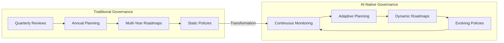
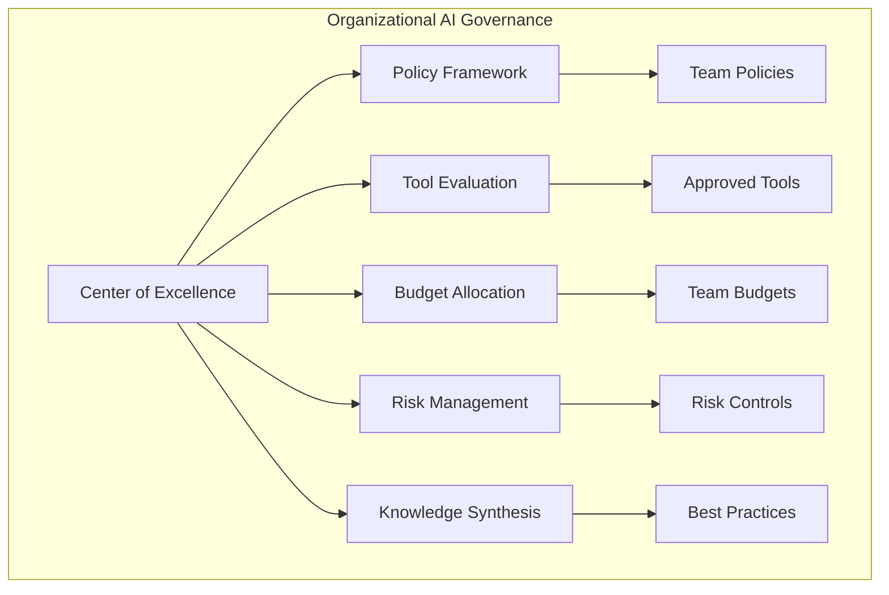
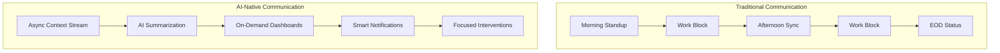
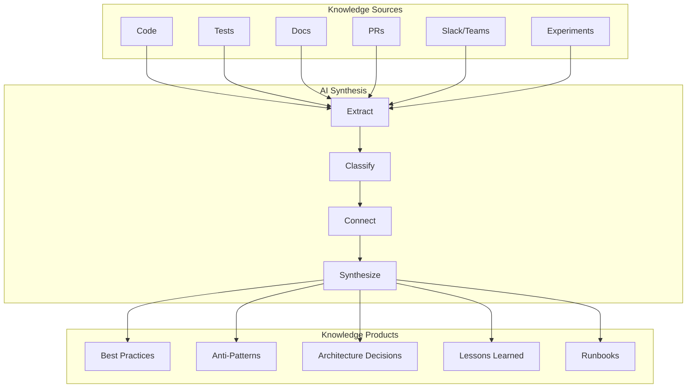

# Part 7: Coordination and Governance

## The New Coordination Challenge

AI-assisted development doesn't just change how individuals work—it fundamentally alters how teams coordinate, make decisions, and maintain alignment. The traditional coordination mechanisms designed for human-speed development break down when faced with AI-accelerated velocity, requiring new governance frameworks that balance autonomy with coherence, speed with safety, and innovation with stability.

The coordination challenge is particularly acute because AI amplifies both positive and negative patterns. A well-coordinated team using AI can achieve unprecedented productivity and quality. A poorly coordinated team can create technical debt and architectural chaos at equally unprecedented speed. The difference often comes down to the governance structures and coordination mechanisms they establish.

Consider the experience of a 200-person engineering organization that adopted AI tools without updating their coordination practices. Within three months, they had five different authentication implementations, three competing architectural patterns, and such divergent coding styles that developers couldn't understand each other's code. The CTO reflected: "We gave everyone Formula One cars but kept the old traffic rules. The result was predictable—chaos at high speed."

## Governance at Scale

Traditional governance assumes predictable change rates and human-manageable complexity. Software development governance evolved over decades to handle the pace at which humans could write code, make mistakes, and create problems. AI shatters both assumptions, requiring governance that can operate at machine speed while maintaining human oversight.

The shift is profound. Where traditional governance might review architectural decisions quarterly, AI-native governance must evaluate patterns daily. Where traditional processes might approve new tools annually, AI-native organizations evaluate and adopt tools monthly. The governance challenge isn't just about speed—it's about maintaining coherence while enabling the velocity that AI makes possible.

### The Governance Evolution

The evolution from traditional to AI-native governance represents a fundamental shift in how organizations think about control and enablement:



This transformation isn't just about doing the same things faster—it's about fundamentally different approaches to governance. Traditional governance acts as a gatekeeper, reviewing and approving. AI-native governance acts as an enabler, monitoring and adapting.

Research from Georgetown's Center for Security and Emerging Technology reveals the complexity of AI governance: "The AI governance challenge stems from fragmented authority and misaligned incentives across different organizational levels." Their study found that successful AI governance requires "coordination mechanisms that balance innovation with risk management, requiring new forms of cross-functional collaboration that traditional governance structures weren't designed to handle."

### Multi-Level Governance Framework

Effective AI governance operates at multiple levels simultaneously, each with its own balance of autonomy and constraint. Like a federal system of government, each level has specific responsibilities and freedoms.

#### Level 1: Individual Developer Governance

At the individual level, developers need maximum autonomy to leverage AI effectively while operating within safety boundaries:

```yaml
# individual-governance.yml
developer_level:
  autonomy:
    - Tool selection within approved list
    - Prompt engineering freedom
    - Implementation approach choice
    - Local experimentation
    
  constraints:
    - Complexity budgets
    - Security requirements
    - Code review mandatory
    - Documentation standards
    
  monitoring:
    - Token usage tracking
    - Code quality metrics
    - Security scan results
    - Knowledge sharing participation
```

The key insight is that constraints should be outcome-based, not process-based. Instead of dictating how developers must work, the governance framework defines what outcomes they must achieve. This preserves the creative freedom essential for effective AI collaboration while maintaining necessary guardrails.

One developer described the impact: "Under our old governance, I had to fill out a form to try a new library. Now I can experiment with any approved AI tool instantly, as long as my code meets quality gates. I'm more productive and more accountable."

#### Level 2: Team Governance

Team-level governance coordinates individual efforts while maintaining team cohesion:

```python
# team_governance.py
class TeamGovernance:
    def __init__(self, team_id):
        self.team_id = team_id
        self.policies = self.load_team_policies()
        self.metrics = TeamMetrics()
        
    def enforce_policies(self, action):
        # Real-time policy enforcement
        if self.violates_policy(action):
            return self.block_with_explanation(action)
            
        # Track for pattern analysis
        self.metrics.record(action)
        
        # Learn from outcomes
        if self.is_novel_pattern(action):
            self.flag_for_review(action)
            
        return self.approve(action)
        
    def adapt_policies(self):
        # Weekly adaptation cycle
        patterns = self.metrics.analyze_week()
        
        # Successful patterns become policies
        for pattern in patterns.successful:
            if pattern.frequency > 3 and pattern.success_rate > 0.8:
                self.propose_policy_update(pattern)
                
        # Failed patterns become warnings
        for pattern in patterns.failed:
            if pattern.frequency > 2:
                self.add_antipattern_detection(pattern)
```

Teams develop their own governance patterns based on their specific needs and context. A team working on financial systems might have stricter controls around AI-generated calculations. A team building internal tools might have more relaxed policies around UI generation.

The key is that team governance is adaptive. What works becomes policy. What fails becomes a warning. The system learns and evolves based on real outcomes, not theoretical concerns.

#### Level 3: Organizational Governance

At the organizational level, governance provides frameworks and resources while avoiding micromanagement:



The organizational level focuses on enablement rather than control. Instead of dictating how teams must work, it provides the tools, budgets, and frameworks that allow teams to work effectively. This servant-leadership approach to governance has proven more effective than command-and-control structures.

### Dynamic Policy Framework

Static policies can't keep pace with AI evolution. A policy written today about AI usage might be obsolete next month when new capabilities emerge. Dynamic policies adapt based on outcomes, creating a governance system that evolves as fast as the technology it governs.

```python
# dynamic_policy_framework.py
class DynamicPolicy:
    def __init__(self, initial_policy):
        self.current = initial_policy
        self.history = [initial_policy]
        self.outcomes = []
        
    def evaluate_outcome(self, action, result):
        self.outcomes.append({
            'action': action,
            'result': result,
            'policy_version': len(self.history) - 1
        })
        
        # Analyze if policy helped or hindered
        if self.should_adapt():
            self.evolve_policy()
            
    def should_adapt(self):
        recent_outcomes = self.outcomes[-20:]
        success_rate = sum(1 for o in recent_outcomes if o['result'].positive) / len(recent_outcomes)
        
        # Adapt if success rate drops below 70%
        return success_rate < 0.7
        
    def evolve_policy(self):
        # AI analyzes failures to suggest adaptations
        failures = [o for o in self.outcomes if not o['result'].positive]
        adaptations = self.ai_suggest_policy_changes(failures)
        
        # Human review and approval
        approved_adaptations = self.human_review(adaptations)
        
        # Create new policy version
        new_policy = self.apply_adaptations(self.current, approved_adaptations)
        self.history.append(new_policy)
        self.current = new_policy
```

A concrete example: An organization's initial policy prohibited AI code generation for payment processing. After six months of data showing zero security incidents in AI-assisted code versus several in human-written code, the policy evolved. Now it requires AI assistance for payment code, with mandatory security reviews. The policy adapted based on evidence, not assumptions.

## Decision-Making in AI-Accelerated Environments

When AI can generate solutions in seconds, traditional decision-making processes become bottlenecks. A decision that took a week to make through traditional channels might delay dozens of AI-generated improvements. Teams need new frameworks for rapid, quality decisions that match the pace of AI-assisted development.

The challenge isn't just speed—it's maintaining decision quality while accelerating the process. Poor fast decisions are worse than good slow decisions. The goal is good fast decisions, which requires rethinking how decisions are classified, routed, and made.

### The Decision Velocity Challenge

Traditional decision-making assumes several things that AI invalidates:

**Time to gather information**: In traditional development, gathering information for decisions took days or weeks. Developers researched options, architects drew diagrams, committees reviewed proposals. With AI, information gathering happens in minutes. The bottleneck shifts from information availability to human processing capacity.

**Human-speed analysis**: Traditional processes assumed humans would analyze options and trade-offs manually. AI can generate and analyze dozens of options in the time it takes to schedule a meeting. The challenge becomes selecting from abundance rather than creating from scarcity.

**Deliberative discussion**: Traditional decision-making valued thorough discussion and consensus building. While discussion remains valuable for complex decisions, many decisions that once required meetings can now be resolved through consent-based processes or even automation.

**Consensus building**: Getting everyone to agree made sense when changes were expensive and difficult to reverse. With AI, the cost of being wrong drops dramatically. It's often better to make a reversible decision quickly than to spend weeks building consensus.

### Tiered Decision Framework

Not all decisions require the same rigor. A tiered approach matches decision weight to process weight, ensuring that trivial decisions don't create bottlenecks while critical decisions receive appropriate scrutiny:

```python
# decision_framework.py
class DecisionFramework:
    def classify_decision(self, decision):
        impact = self.assess_impact(decision)
        reversibility = self.assess_reversibility(decision)
        urgency = self.assess_urgency(decision)
        
        if impact == "LOW" and reversibility == "HIGH":
            return "AUTONOMOUS"  # Individual decides
        elif impact == "MEDIUM" or reversibility == "MEDIUM":
            return "COLLABORATIVE"  # Team decides
        elif impact == "HIGH" or reversibility == "LOW":
            return "GOVERNED"  # Governance body decides
        else:
            return "STRATEGIC"  # Executive decides
            
    def route_decision(self, decision, classification):
        routes = {
            "AUTONOMOUS": self.individual_decision_process,
            "COLLABORATIVE": self.team_decision_process,
            "GOVERNED": self.governance_decision_process,
            "STRATEGIC": self.executive_decision_process
        }
        
        return routes[classification](decision)
```

This framework transforms decision-making from a one-size-fits-all process to a nuanced system. A developer choosing between two AI-suggested implementations (low impact, highly reversible) decides immediately. A team considering a new architectural pattern (medium impact, medium reversibility) collaborates to decide. A choice about AI vendors (high impact, low reversibility) goes through governance.

### Decision Automation Patterns

Some decisions can be automated while maintaining human oversight. This isn't about removing human judgment—it's about applying human judgment at scale through predefined rules:

```yaml
# automated_decisions.yml
automated_decision_patterns:
  tool_selection:
    criteria:
      - cost_within_budget
      - security_approved
      - team_familiarity
    automation: full
    human_override: always_available
    
  architecture_patterns:
    criteria:
      - proven_pattern
      - fits_constraints
      - team_expertise
    automation: recommendation
    human_decision: required
    
  security_responses:
    criteria:
      - known_vulnerability
      - automated_fix_available
      - low_risk_change
    automation: implement_with_notification
    human_review: within_24_hours
```

A team lead explained their experience: "We automated routine decisions like library updates and security patches. What used to consume hours in meetings now happens automatically with notification. We spend our decision-making energy on things that actually require human judgment."

### Consent-Based Progression

Moving from consensus to consent accelerates decisions while maintaining safety. Consent doesn't mean everyone agrees—it means no one has fundamental objections that would cause harm:

```python
# consent_based_decisions.py
class ConsentBasedDecision:
    def __init__(self, proposal):
        self.proposal = proposal
        self.objections = []
        
    def gather_input(self, stakeholders):
        for stakeholder in stakeholders:
            response = stakeholder.review(self.proposal)
            
            if response.has_objection:
                self.objections.append({
                    'stakeholder': stakeholder,
                    'objection': response.objection,
                    'severity': response.severity
                })
                
    def can_proceed(self):
        # Proceed unless there are severe objections
        severe_objections = [o for o in self.objections if o['severity'] == 'SEVERE']
        return len(severe_objections) == 0
        
    def address_objections(self):
        for objection in self.objections:
            if objection['severity'] == 'MODERATE':
                # Modify proposal to address
                self.proposal = self.modify_for_objection(objection)
            elif objection['severity'] == 'MILD':
                # Document and monitor
                self.add_monitoring(objection)
```

The shift to consent-based decisions dramatically accelerates development. A team that previously spent days building consensus for each architectural decision now makes decisions in hours. They discovered that most objections were preferences, not fundamental concerns. By focusing on real objections, they move faster while maintaining safety.

## Communication in High-Velocity Teams

When development velocity increases 5-10x, traditional communication patterns break down. The morning standup that worked for human-speed development becomes a bottleneck when teams generate dozens of PRs daily. Teams need new approaches to maintain alignment without becoming communication bottlenecks.

The challenge is maintaining human connection and shared understanding while operating at machine speed. The solution isn't to eliminate human communication—it's to make it more effective and targeted.

### Asynchronous-First Communication

Synchronous communication doesn't scale with AI velocity. When developers can generate and iterate on solutions in minutes, waiting for the next standup or scheduling meetings becomes untenable:



The asynchronous-first approach doesn't eliminate synchronous communication—it makes it special. When teams do meet synchronously, it's for high-value activities like design discussions, problem-solving, or team building, not status updates.

A distributed team shared their transformation: "We eliminated daily standups and replaced them with AI-generated summaries. Now when we meet, it's to solve problems together, not to recite what we did yesterday. Our meetings are fewer but far more valuable."

### Continuous Context Streams

Replace point-in-time communication with continuous context streams that capture the flow of work:

```python
# continuous_context.py
class ContinuousContextStream:
    def __init__(self, team_id):
        self.team_id = team_id
        self.context_buffer = []
        self.ai_summarizer = ContextSummarizer()
        
    def add_context(self, event):
        # Everything generates context
        self.context_buffer.append({
            'timestamp': datetime.now(),
            'type': event.type,
            'actor': event.actor,
            'action': event.action,
            'impact': event.impact,
            'metadata': event.metadata
        })
        
        # Trigger summarization if needed
        if self.needs_summary():
            self.generate_summary()
            
    def needs_summary(self):
        # Summarize when buffer reaches threshold or time passes
        return (len(self.context_buffer) > 100 or 
                self.time_since_last_summary() > timedelta(hours=1))
                
    def generate_summary(self):
        summary = self.ai_summarizer.summarize(self.context_buffer)
        
        # Different summaries for different audiences
        return {
            'developer': summary.technical_view(),
            'manager': summary.progress_view(),
            'stakeholder': summary.business_view(),
            'architect': summary.architectural_view()
        }
```

This approach creates ambient awareness without constant interruption. Team members can check in when they need context rather than having context pushed at them on a schedule. The AI summarization ensures that the information is digestible and relevant to each person's role.

### Smart Notification Systems

Not everything needs immediate attention. Smart notification systems understand urgency and relevance, routing information appropriately:

```yaml
# smart_notifications.yml
notification_rules:
  immediate:
    - security_vulnerabilities
    - production_breakage
    - blocked_team_members
    - critical_decisions_needed
    
  within_hour:
    - architecture_divergence
    - performance_regression
    - unusual_ai_patterns
    - budget_threshold_approaching
    
  daily_digest:
    - progress_updates
    - metric_summaries
    - knowledge_sharing
    - pattern_recognition
    
  weekly_summary:
    - trend_analysis
    - learning_outcomes
    - policy_adaptations
    - strategic_alignment
```

The key is that notifications are intelligent, not just rule-based. The system learns what each person cares about and adapts notification patterns accordingly. A developer debugging a performance issue might get immediate notifications about related metrics. A manager might get daily summaries unless something requires intervention.

### Communication Patterns for AI-Native Teams

New communication patterns emerge that leverage AI to enhance rather than replace human communication:

```python
# communication_patterns.py
class AINativeCommunication:
    def __init__(self):
        self.patterns = {
            'broadcast': self.async_broadcast,
            'collaboration': self.ai_mediated_collab,
            'escalation': self.smart_escalation,
            'knowledge_share': self.automated_documentation
        }
        
    def async_broadcast(self, message):
        # AI enriches with context
        enriched = self.ai_add_context(message)
        
        # Smart routing based on content
        recipients = self.determine_recipients(enriched)
        
        # Personalized delivery
        for recipient in recipients:
            self.deliver_personalized(enriched, recipient)
            
    def ai_mediated_collab(self, participants, topic):
        # AI facilitates async collaboration
        workspace = self.create_ai_workspace(topic)
        
        # Participants contribute async
        for participant in participants:
            workspace.notify(participant)
            
        # AI synthesizes contributions
        workspace.ai_synthesize()
        
        # Consensus through consent
        return workspace.gather_consent()
```

These patterns enable new forms of collaboration. A team designing a new feature might never meet synchronously, instead collaborating through an AI-mediated workspace that captures ideas, synthesizes proposals, and facilitates decision-making asynchronously.

## Knowledge Management at Scale

The volume of knowledge generated by AI-native teams exceeds human capacity to organize manually. A single team might generate hundreds of code files, thousands of test cases, and tens of thousands of lines of documentation weekly. Traditional knowledge management—wikis, documents, and manual organization—breaks down at this scale.

The solution isn't to generate less knowledge—it's to manage it differently. AI-native teams need self-organizing knowledge systems that surface relevant information when needed without requiring manual curation.

### The Knowledge Explosion

The scale of knowledge generation in AI-native teams is staggering:

- **10x more code**: Every feature spawns variations, experiments, and alternatives
- **20x more documentation**: AI generates comprehensive docs for everything
- **50x more test cases**: Exhaustive test generation explores every edge case
- **100x more experiments**: Low cost of trying things leads to constant experimentation

A team lead described the challenge: "We went from struggling to document anything to drowning in documentation. Every function had pages of AI-generated docs. Every feature had dozens of experimental branches. We needed a completely different approach to knowledge management."

### Self-Organizing Knowledge Systems

The answer is systems that organize themselves based on usage patterns and relationships:

```python
# self_organizing_knowledge.py
class SelfOrganizingKnowledge:
    def __init__(self):
        self.knowledge_graph = KnowledgeGraph()
        self.pattern_recognizer = PatternRecognizer()
        self.relevance_engine = RelevanceEngine()
        
    def ingest_knowledge(self, artifact):
        # Extract knowledge atoms
        atoms = self.extract_atoms(artifact)
        
        # Connect to existing knowledge
        for atom in atoms:
            connections = self.find_connections(atom)
            self.knowledge_graph.add_with_connections(atom, connections)
            
        # Recognize emerging patterns
        patterns = self.pattern_recognizer.analyze(self.knowledge_graph)
        
        # Surface relevant insights
        self.surface_insights(patterns)
        
    def surface_insights(self, patterns):
        for pattern in patterns:
            if pattern.significance > 0.7:
                # Notify relevant people
                stakeholders = self.relevance_engine.find_stakeholders(pattern)
                self.notify_with_context(stakeholders, pattern)
                
            if pattern.frequency > 5:
                # Codify as best practice
                self.create_best_practice(pattern)
```

These systems don't require manual organization. Knowledge finds its own structure based on how it's used and what it connects to. Relevant information surfaces when needed without requiring developers to search through thousands of documents.

### Knowledge Synthesis Patterns

AI excels at synthesizing knowledge from multiple sources into actionable insights:



This synthesis happens continuously. As teams work, the system extracts patterns, identifies what works, and automatically creates guidance for future work. It's like having a dedicated knowledge manager who never sleeps and never misses a detail.

### Living Documentation Architecture

Documentation that updates itself based on system evolution solves the eternal problem of outdated docs:

```python
# living_documentation.py
class LivingDocumentation:
    def __init__(self, codebase):
        self.codebase = codebase
        self.doc_graph = DocumentationGraph()
        self.update_monitor = UpdateMonitor()
        
    def continuous_update_cycle(self):
        while True:
            # Monitor for changes
            changes = self.update_monitor.detect_changes()
            
            for change in changes:
                # Determine documentation impact
                impact = self.assess_doc_impact(change)
                
                if impact.requires_update:
                    # Generate update proposals
                    proposals = self.generate_update_proposals(change, impact)
                    
                    # Auto-apply if confidence high
                    if proposals.confidence > 0.9:
                        self.apply_updates(proposals)
                    else:
                        # Queue for human review
                        self.queue_for_review(proposals)
                        
            # Periodic coherence check
            if self.time_for_coherence_check():
                self.ensure_documentation_coherence()
                
            time.sleep(300)  # 5-minute cycles
```

Living documentation eliminates the documentation debt that plagues traditional projects. When code changes, documentation updates automatically. When new patterns emerge, they're documented immediately. The documentation is always current because it's generated from the living system, not maintained separately.

## Coordination Mechanisms

High-velocity teams need coordination mechanisms that operate at the speed of development while maintaining coherence. Traditional coordination through meetings and documents can't keep pace with teams shipping multiple times daily.

### Event-Driven Coordination

Replace scheduled coordination with event-driven patterns that respond to what's actually happening:

```python
# event_driven_coordination.py
class EventDrivenCoordination:
    def __init__(self):
        self.event_bus = EventBus()
        self.coordinators = {}
        self.register_coordinators()
        
    def register_coordinators(self):
        self.coordinators['architecture'] = ArchitectureCoordinator()
        self.coordinators['security'] = SecurityCoordinator()
        self.coordinators['performance'] = PerformanceCoordinator()
        self.coordinators['integration'] = IntegrationCoordinator()
        
    def handle_event(self, event):
        # Route to relevant coordinators
        relevant = self.determine_relevant_coordinators(event)
        
        responses = []
        for coordinator_type in relevant:
            response = self.coordinators[coordinator_type].evaluate(event)
            responses.append(response)
            
        # Synthesize responses
        action = self.synthesize_action(responses)
        
        # Execute coordination action
        if action.required:
            self.execute_coordination(action)
```

This approach ensures coordination happens when needed, not on a schedule. A breaking API change triggers immediate coordination with affected teams. A successful pattern triggers knowledge sharing. The coordination effort matches the coordination need.

### Coordination Patterns

Different scenarios require different coordination patterns, each optimized for its specific needs:

```yaml
# coordination_patterns.yml
patterns:
  breaking_change:
    trigger: api_contract_modification
    coordination:
      - notify_downstream_teams
      - generate_migration_guide
      - schedule_sync_if_complex
      - track_adoption_progress
      
  architecture_drift:
    trigger: pattern_divergence_detected
    coordination:
      - analyze_divergence_reason
      - if_valid: update_architecture_guide
      - if_invalid: create_correction_task
      - notify_architect_group
      
  security_issue:
    trigger: vulnerability_detected
    coordination:
      - immediate_notification
      - auto_generate_fix_if_possible
      - escalate_if_critical
      - track_remediation
      
  performance_regression:
    trigger: metric_threshold_breach
    coordination:
      - auto_profile_issue
      - generate_optimization_options
      - notify_owning_team
      - monitor_resolution
```

Each pattern is designed for its specific coordination need. Security issues require immediate, high-priority coordination. Architecture drift might require thoughtful analysis before coordination. The system adapts its response to the situation.

### Coordination Metrics

Measuring coordination effectiveness helps teams optimize their collaboration:

```python
# coordination_metrics.py
class CoordinationMetrics:
    def __init__(self):
        self.metrics = {
            'decision_velocity': self.measure_decision_speed(),
            'alignment_score': self.measure_team_alignment(),
            'knowledge_flow': self.measure_knowledge_distribution(),
            'integration_friction': self.measure_integration_issues(),
            'communication_efficiency': self.measure_comm_overhead()
        }
        
    def generate_dashboard(self):
        return {
            'health_score': self.calculate_overall_health(),
            'bottlenecks': self.identify_bottlenecks(),
            'improvement_areas': self.suggest_improvements(),
            'trend_analysis': self.analyze_trends()
        }
        
    def identify_bottlenecks(self):
        bottlenecks = []
        
        # Decision bottlenecks
        if self.metrics['decision_velocity'] < 0.7:
            bottlenecks.append({
                'type': 'decision_making',
                'severity': 'high',
                'suggestion': 'Move more decisions to consent-based model'
            })
            
        # Knowledge silos
        if self.metrics['knowledge_flow'] < 0.6:
            bottlenecks.append({
                'type': 'knowledge_sharing',
                'severity': 'medium',
                'suggestion': 'Increase automated documentation'
            })
            
        return bottlenecks
```

These metrics reveal coordination problems before they become critical. A declining decision velocity might indicate that the team has outgrown their current decision-making process. Poor knowledge flow might suggest that information silos are forming. The metrics enable proactive improvements rather than reactive fixes.

## Risk Management in AI-Native Development

AI introduces new risk categories while amplifying existing ones. The speed of AI development means risks can materialize and compound faster than ever before. Traditional risk management, designed for human-speed development, can't keep pace. Organizations need risk management that operates continuously, adapts automatically, and prevents problems rather than just detecting them.

### AI-Specific Risk Categories

Understanding AI-specific risks is the first step in managing them effectively:

```python
# ai_risk_framework.py
class AIRiskFramework:
    def __init__(self):
        self.risk_categories = {
            'hallucination': HallucinationRisk(),
            'security': SecurityRisk(),
            'architectural': ArchitecturalRisk(),
            'knowledge': KnowledgeLossRisk(),
            'velocity': VelocityRisk(),
            'quality': QualityRisk(),
            'compliance': ComplianceRisk()
        }
        
    def assess_risk(self, context):
        risk_profile = {}
        
        for category, assessor in self.risk_categories.items():
            risk_profile[category] = {
                'level': assessor.assess_level(context),
                'mitigations': assessor.suggest_mitigations(context),
                'monitoring': assessor.monitoring_strategy(context)
            }
            
        return RiskProfile(risk_profile)
```

Each risk category requires specific understanding and mitigation:

**Hallucination Risk**: AI generates plausible but incorrect code. A team discovered their AI had "invented" a database table that didn't exist, but the code looked so reasonable that it passed review. Only integration tests caught the issue.

**Security Risk**: AI trained on public code might suggest insecure patterns. One organization found their AI consistently recommended an outdated authentication library with known vulnerabilities because it appeared frequently in training data.

**Architectural Risk**: AI can generate code that works locally but violates architectural principles. Teams report "architectural drift" where AI-generated code slowly diverges from established patterns.

**Knowledge Loss Risk**: Over-reliance on AI can cause teams to lose fundamental skills. "We realized none of our junior developers could debug without AI assistance," one team lead shared. "We were building knowledge debt."

**Velocity Risk**: The ability to generate code quickly can outpace the ability to understand and maintain it. Teams can literally develop themselves into a corner, creating systems too complex to comprehend.

**Quality Risk**: More code doesn't mean better code. AI can generate volumes of mediocre code that passes tests but creates maintenance nightmares.

**Compliance Risk**: AI-generated code might violate licenses, include copyrighted content, or fail regulatory requirements. Financial services companies particularly struggle with this risk.

### Dynamic Risk Mitigation

Static risk controls can't keep pace with AI velocity. Dynamic controls adapt based on observed patterns:

```yaml
# dynamic_risk_controls.yml
risk_controls:
  hallucination_detection:
    static_controls:
      - import_validation
      - dependency_checking
      - api_verification
      
    dynamic_controls:
      - pattern_learning: learn_from_caught_hallucinations
      - threshold_adjustment: adapt_based_on_false_positives
      - context_awareness: understand_project_specific_patterns
      
  security_controls:
    static_controls:
      - owasp_scanning
      - dependency_vulnerability_check
      - secret_detection
      
    dynamic_controls:
      - threat_model_evolution: adapt_to_new_attack_vectors
      - ai_specific_patterns: detect_ai_security_antipatterns
      - behavioral_analysis: identify_unusual_security_patterns
```

Dynamic controls learn and improve. When a hallucination is caught, the system learns to detect similar patterns. When a security issue is found, the controls adapt to prevent recurrence. The risk management system becomes smarter over time.

### Risk Monitoring Dashboard

Real-time visibility into risk enables proactive management:

```python
# risk_monitoring.py
class RiskMonitoringDashboard:
    def __init__(self):
        self.monitors = {
            'real_time': RealTimeMonitor(),
            'trend': TrendAnalyzer(),
            'predictive': PredictiveRiskModel()
        }
        
    def generate_risk_view(self):
        return {
            'current_state': {
                'overall_risk': self.calculate_overall_risk(),
                'hot_spots': self.identify_risk_hotspots(),
                'recent_incidents': self.get_recent_incidents()
            },
            'trends': {
                'risk_velocity': self.monitors['trend'].risk_velocity(),
                'emerging_patterns': self.monitors['trend'].emerging_patterns(),
                'mitigation_effectiveness': self.monitors['trend'].measure_mitigations()
            },
            'predictions': {
                'future_risk_areas': self.monitors['predictive'].predict_risks(),
                'resource_needs': self.monitors['predictive'].predict_resources(),
                'intervention_points': self.monitors['predictive'].suggest_interventions()
            }
        }
```

The dashboard provides different views for different audiences. Developers see technical risks and mitigation suggestions. Managers see trend analysis and resource needs. Executives see overall risk posture and strategic implications. Everyone has the information they need to manage risk at their level.

## Compliance and Audit

AI-native development creates new compliance challenges. Traditional audit approaches designed for human-speed changes can't verify AI-speed development. When a team ships 50 updates daily, quarterly audits become meaningless. Organizations need continuous compliance approaches that provide constant assurance without slowing development.

### Continuous Compliance

Replace periodic audits with continuous compliance monitoring:

```python
# continuous_compliance.py
class ContinuousCompliance:
    def __init__(self, compliance_requirements):
        self.requirements = compliance_requirements
        self.monitors = self.create_monitors()
        self.evidence_collector = EvidenceCollector()
        
    def create_monitors(self):
        monitors = {}
        for req in self.requirements:
            monitors[req.id] = self.create_monitor_for_requirement(req)
        return monitors
        
    def continuous_monitoring(self):
        while True:
            for req_id, monitor in self.monitors.items():
                status = monitor.check_compliance()
                
                if status.non_compliant:
                    self.handle_non_compliance(req_id, status)
                    
                # Collect evidence continuously
                self.evidence_collector.collect(req_id, status)
                
            # Generate compliance dashboard
            self.update_dashboard()
            
            time.sleep(60)  # Check every minute
            
    def handle_non_compliance(self, req_id, status):
        severity = self.assess_severity(req_id, status)
        
        if severity == 'CRITICAL':
            # Immediate remediation
            self.immediate_remediation(req_id, status)
        elif severity == 'HIGH':
            # Scheduled remediation
            self.schedule_remediation(req_id, status)
        else:
            # Track for batch remediation
            self.queue_remediation(req_id, status)
```

Continuous compliance transforms compliance from a periodic burden to an embedded capability. Issues are caught and fixed immediately. Evidence is collected automatically. Audits become reviews of already-collected evidence rather than disruptive investigations.

### AI-Aware Audit Trails

Traditional audit trails can't capture AI decision-making. They show what happened but not why AI made specific choices. AI-aware audit trails capture the complete context:

```python
# ai_audit_trail.py
class AIAuditTrail:
    def __init__(self):
        self.trail = []
        
    def record_ai_action(self, action):
        self.trail.append({
            'timestamp': datetime.now(),
            'action_type': action.type,
            'ai_model': action.model,
            'prompt': action.prompt,
            'context': action.context,
            'output': action.output,
            'human_review': action.human_review,
            'modifications': action.modifications,
            'final_result': action.final_result,
            'impact': self.assess_impact(action)
        })
        
    def generate_audit_report(self, timeframe):
        relevant_actions = self.filter_by_timeframe(timeframe)
        
        return {
            'summary': self.summarize_ai_usage(relevant_actions),
            'risk_assessment': self.assess_audit_risks(relevant_actions),
            'compliance_status': self.verify_compliance(relevant_actions),
            'recommendations': self.generate_recommendations(relevant_actions)
        }
```

These audit trails enable new forms of accountability. Auditors can understand not just what code was generated, but why AI made specific suggestions, what context influenced decisions, and how humans modified AI output. This transparency builds trust with regulators and auditors.

## Building Adaptive Governance

The ultimate goal is governance that evolves as fast as the technology it governs. Static governance frameworks become obstacles. Adaptive governance enables innovation while maintaining safety.

### The Learning Governance System

Governance systems must learn from their own effectiveness:

```python
# learning_governance.py
class LearningGovernanceSystem:
    def __init__(self):
        self.governance_model = GovernanceModel()
        self.outcome_tracker = OutcomeTracker()
        self.adaptation_engine = AdaptationEngine()
        
    def governance_cycle(self):
        while True:
            # Apply current governance
            decisions = self.governance_model.make_decisions()
            
            # Track outcomes
            outcomes = self.outcome_tracker.track(decisions)
            
            # Learn from outcomes
            learnings = self.analyze_outcomes(outcomes)
            
            # Adapt governance model
            if self.should_adapt(learnings):
                proposals = self.adaptation_engine.generate_proposals(learnings)
                approved = self.human_review(proposals)
                self.governance_model.apply_adaptations(approved)
                
            # Document evolution
            self.document_governance_evolution()
            
            time.sleep(86400)  # Daily cycle
```

This creates a governance system that improves through use. Policies that enable good outcomes are reinforced. Policies that create friction without value are relaxed. The system evolves toward optimal governance through experience rather than theory.

### Governance Metrics

Measuring governance effectiveness ensures it's achieving its goals:

```yaml
# governance_metrics.yml
effectiveness_metrics:
  innovation_enablement:
    - time_to_approve_new_tools
    - experimentation_rate
    - successful_innovation_adoption
    
  risk_management:
    - incidents_prevented
    - incident_response_time
    - risk_prediction_accuracy
    
  team_satisfaction:
    - governance_friction_score
    - autonomy_perception
    - support_effectiveness
    
  business_outcomes:
    - time_to_market_impact
    - quality_metrics
    - cost_efficiency
```

These metrics reveal whether governance is enabling or constraining. High innovation metrics with low incident rates indicate effective governance. Low satisfaction with high friction suggests governance is becoming bureaucratic. The metrics guide continuous improvement.

## The Future of Coordination and Governance

As AI capabilities expand, coordination and governance must continue evolving. The patterns emerging today hint at the transformations to come.

### Near-Term Evolution (1-2 years)

The immediate future brings AI as an active participant in governance:

- **AI participates in governance decisions**: AI advisors provide data-driven input to governance bodies
- **Predictive risk management becomes standard**: AI predicts risks before they materialize
- **Real-time compliance verification**: Every change is verified for compliance instantly
- **Automated coordination for routine decisions**: AI handles coordination for well-understood patterns

Organizations already experimenting with these capabilities report positive results. "Our AI governance advisor catches issues we miss and suggests policy improvements we wouldn't think of," one governance lead shared.

### Medium-Term Evolution (3-5 years)

The medium term brings more fundamental changes:

- **Self-governing development systems**: Systems that maintain their own governance within boundaries
- **AI-human governance partnerships**: Governance bodies include AI members with specific expertise
- **Predictive policy adaptation**: Policies evolve proactively based on predicted future needs
- **Quantum coordination for complex systems**: Handling exponentially complex coordination challenges

These changes will require new thinking about the role of human judgment in governance. Rather than making all decisions, humans will set boundaries and values within which AI systems operate autonomously.

### Long-Term Evolution (5+ years)

The long term brings governance as an emergent property:

- **Emergent governance from system behavior**: Governance patterns emerge from successful outcomes
- **Minimal human intervention required**: Systems are largely self-governing
- **Self-healing organizational structures**: Organizations adapt structure based on needs
- **Governance as embedded system property**: Governance isn't added on but built in

This future isn't about removing humans from governance—it's about elevating human involvement to higher-order concerns like ethics, values, and strategic direction while systems handle operational governance.

## Conclusion

Coordination and governance in AI-native development isn't about control—it's about creating frameworks that enable speed while maintaining safety, foster innovation while managing risk, and evolve as rapidly as the technology they govern.

The organizations succeeding with AI-native governance share common characteristics. They view governance as an enabler, not a constraint. They build adaptive systems that learn and improve. They balance autonomy with alignment. Most importantly, they recognize that governance in the AI age must be as dynamic and intelligent as the systems it governs.

The journey from traditional to AI-native governance isn't always smooth. Teams will face resistance from those comfortable with existing processes. They'll make mistakes as they learn what level of control is appropriate. They'll struggle to find the right balance between speed and safety.

But the rewards justify the effort. Organizations with effective AI-native governance move faster while maintaining quality. They innovate freely within clear boundaries. They adapt quickly to new opportunities and challenges. They build sustainable competitive advantages through their ability to harness AI effectively and safely.

Key principles for effective AI-native governance:

1. **Dynamic Over Static**: Policies and processes that evolve based on outcomes
2. **Consent Over Consensus**: Faster decisions without sacrificing safety
3. **Continuous Over Periodic**: Real-time monitoring replaces batch reviews
4. **Automated Over Manual**: Let machines handle routine governance
5. **Learning Over Rigid**: Systems that improve through experience
6. **Enabling Over Restricting**: Governance should accelerate, not impede

The next chapter explores the technical architecture required to support these new ways of working, examining how to build systems that can evolve as rapidly as the AI tools that help create them.

---

## Navigation

### Next Chapter
[Part 8: Technical Architecture →](Part-08-Technical-Architecture.md)

### Suggested Reading Paths

**For Individual Developers:**
- Consider [Part 8: Technical Architecture](Part-08-Technical-Architecture.md) for technical patterns
- Review [Part 9: Enablement and Education](Part-09-Enablement-and-Education.md) for learning resources

**For Team Leads:**
- Continue to [Part 9: Enablement and Education](Part-09-Enablement-and-Education.md) for skill building
- Review [Part 5: Development Practices](Part-05-Development-Practices.md) for technical details

**For Architects and Technical Leaders:**
- Continue to [Part 8: Technical Architecture](Part-08-Technical-Architecture.md) for implementation patterns
- Consider reviewing earlier chapters for context

**For Executives and Decision Makers:**
- Jump to [Part 10: The Path Forward](Part-10-The-Path-Forward.md) for strategic vision
- Consider [Part 4: Team Implementation](Part-04-Team-Implementation.md) for change management

[← Back to Table of Contents](README.md)