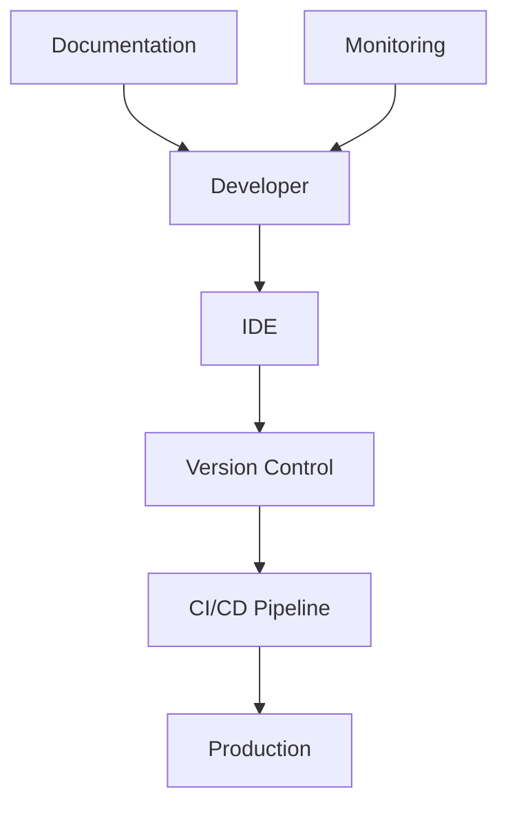
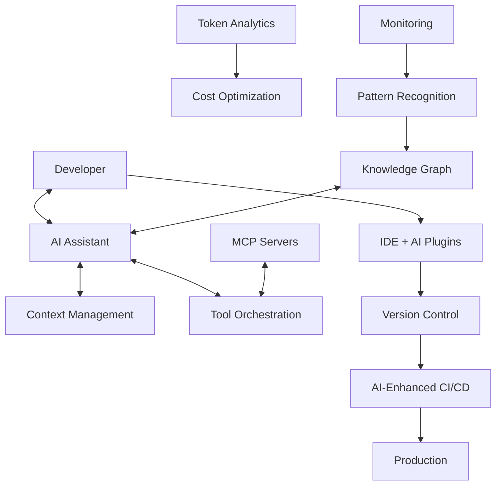

# Part 8: Technical Architecture

## Building the Foundation for AI-Native Development

The technical architecture of AI-native development teams represents a fundamental shift from traditional software infrastructure. It's not simply about adding AI tools to existing systems—it's about reimagining how code flows from thought to production, how knowledge persists across interactions, and how systems learn and improve through use.

Consider the transformation at a major e-commerce platform. Their traditional architecture was a carefully orchestrated symphony of microservices, databases, and deployment pipelines—all designed for human-speed development. When they introduced AI tools, they initially treated them as add-ons, like hanging ornaments on an existing tree. The result was chaos. AI-generated code didn't fit their patterns. Context was lost between sessions. Token costs spiraled out of control.

"We realized we weren't just adopting new tools," their chief architect reflected. "We were building for an entirely different paradigm. It was like trying to run jet fuel through a steam engine. We needed to redesign everything from first principles."

This chapter explores the architectural patterns, integration strategies, and technical foundations necessary to support truly AI-native development practices. It's a journey from traditional, linear architectures to dynamic, learning systems that evolve through use.

## The Architecture Evolution

The shift from traditional to AI-native architecture isn't incremental—it's transformational. Traditional development architecture evolved over decades to support human workflows: developers write code, commit to version control, run through CI/CD, deploy to production. It's linear, predictable, and human-paced.

### Traditional Architecture: Built for Human Scale

Traditional development architecture focused on human-centric workflows:



This architecture assumes several things that AI invalidates:
- Developers work on one thing at a time
- Code is written deliberately and incrementally
- Context lives in human memory
- Documentation is a separate activity
- Learning happens through human experience

These assumptions made sense when humans were the only intelligent agents in the system. But AI changes everything.

### AI-Native Architecture: Built for Machine-Human Collaboration

AI-native architecture creates a more complex, interconnected system:



This architecture recognizes new realities:
- Developers and AI work in parallel on multiple tasks
- Code generation happens in bursts, not incrementally
- Context must be explicitly managed and persisted
- Documentation is generated continuously
- Learning happens through both human and machine experience

The difference is profound. A developer at a fintech startup described their experience: "In our old architecture, I was the intelligence and the tools were dumb. Now, I'm collaborating with intelligent systems. The architecture had to evolve to support this partnership."

## Core Architectural Principles

Building AI-native architecture requires embracing new principles that might seem foreign to traditional architects. These principles aren't just technical choices—they represent fundamental shifts in how we think about software systems.

### 1. Context as a First-Class Citizen

In traditional development, context lives in developers' heads. They remember why decisions were made, what patterns to follow, which approaches have been tried. This implicit context works at human scale but breaks down with AI collaboration.

In AI-native systems, context must be explicit, persistent, and accessible:

```yaml
# context-architecture.yaml
context_layers:
  persistent:
    - project_knowledge: "CLAUDE.md files"
    - architectural_decisions: "ADRs + AI annotations"
    - domain_models: "Structured entity definitions"
    - team_patterns: "Learned interaction patterns"
  
  session:
    - current_task: "Active story/feature context"
    - recent_changes: "Last N commits/PRs"
    - error_history: "Recent debugging context"
    - conversation_memory: "Current AI interaction"
  
  ephemeral:
    - token_buffer: "Active prompt context"
    - tool_state: "MCP server states"
    - cache_layer: "Temporary computations"
```

A team lead explained the transformation: "We used to joke that if our senior developer got hit by a bus, we'd be in trouble because so much lived in his head. Now our context is externalized. The AI knows our patterns, our decisions, our constraints. It's like having perpetual pair programming with someone who never forgets."

This principle changes how teams work. Instead of relying on tribal knowledge, they build systems that capture and preserve context automatically. Every decision, every pattern, every learning becomes part of the system's memory.

### 2. Bidirectional Learning Loops

Traditional systems are static—they do what they're programmed to do. AI-native systems learn from both human and AI interactions, creating feedback loops that improve over time:

```python
class LearningArchitecture:
    def __init__(self):
        self.human_patterns = PatternStore()
        self.ai_patterns = PatternStore()
        self.synthesis_engine = SynthesisEngine()
    
    async def capture_interaction(self, interaction: Interaction):
        # Capture both sides of the interaction
        human_intent = await self.extract_human_intent(interaction)
        ai_response = await self.extract_ai_response(interaction)
        
        # Learn from success and failure
        if interaction.outcome == "success":
            self.human_patterns.store_positive(human_intent)
            self.ai_patterns.store_positive(ai_response)
        else:
            failure_analysis = await self.analyze_failure(interaction)
            self.improve_patterns(failure_analysis)
    
    async def synthesize_knowledge(self):
        # Combine human and AI learnings
        combined_patterns = self.synthesis_engine.merge(
            self.human_patterns,
            self.ai_patterns
        )
        
        # Generate new architectural patterns
        return self.generate_improvements(combined_patterns)
```

These learning loops create systems that get better through use. A mobile app team discovered their AI assistant was suggesting increasingly sophisticated patterns over time. Investigation revealed it was learning from their code reviews, combining human feedback with AI capabilities to generate better suggestions.

"It's eerie," one developer noted. "The AI started suggesting patterns we hadn't explicitly taught it. It learned from watching us work, understanding what we accepted and rejected. Our architecture is literally getting smarter."

### 3. Token-Aware Design

Every architectural decision must consider token economics. In traditional development, the main constraints are CPU, memory, and network. In AI-native development, tokens become a critical resource that must be managed carefully:

```typescript
interface TokenAwareComponent {
  estimateTokenUsage(input: any): TokenEstimate;
  optimizeForTokens(input: any): OptimizedInput;
  trackActualUsage(usage: TokenUsage): void;
}

class TokenAwareRouter implements TokenAwareComponent {
  private routes: Map<string, Route> = new Map();
  private tokenBudget: TokenBudget;
  
  async route(request: Request): Promise<Response> {
    // Estimate token cost for each potential route
    const estimates = await Promise.all(
      Array.from(this.routes.values()).map(route => ({
        route,
        estimate: this.estimateTokenUsage(request)
      }))
    );
    
    // Select optimal route based on token budget
    const optimal = this.selectOptimalRoute(estimates, this.tokenBudget);
    
    // Track actual usage for future optimization
    const response = await optimal.route.handle(request);
    this.trackActualUsage(response.tokenUsage);
    
    return response;
  }
}
```

Token awareness permeates every level of the architecture. A startup learned this lesson painfully when their first month's AI bill exceeded their entire IT budget. "We were treating tokens like they were free," their CTO admitted. "Now every component knows its token budget and optimizes accordingly. It's like adding a new dimension to system design."

## The AI-Native Stack

Building AI-native systems requires a carefully orchestrated stack of technologies, each layer designed to support human-AI collaboration. This isn't just about choosing tools—it's about creating an integrated environment where AI augmentation feels natural and effortless.

### Layer 1: Development Interface

The development interface is where humans and AI meet. It must support natural interaction while maintaining the power and precision developers expect:

```yaml
# ai-native-stack.yaml
development_interface:
  primary_ai:
    tool: "Claude Code"
    deployment: "CLI + IDE Integration"
    features:
      - "Multi-file context awareness"
      - "Tool use capabilities"
      - "Persistent memory via CLAUDE.md"
      - "MCP integration"
  
  ide_augmentation:
    supported:
      - "VS Code + Continue/Cody"
      - "IntelliJ + AI Assistant"
      - "Vim + Copilot"
      - "Emacs + Company-mode"
    capabilities:
      - "Inline completion"
      - "Context-aware suggestions"
      - "Refactoring assistance"
      - "Test generation"
  
  version_control:
    platform: "GitHub/GitLab"
    ai_features:
      - "AI-powered PR reviews"
      - "Commit message generation"
      - "Conflict resolution assistance"
      - "Pattern detection in changes"
```

The interface layer has evolved dramatically. A senior developer described the transformation: "I used to context-switch constantly between my IDE, terminal, browser, and documentation. Now it's seamless. I can ask Claude Code to implement a feature, and it understands my entire codebase context. It's like having a senior developer looking over my shoulder, except they've read every line of code we've ever written."

### Layer 2: Context and Memory

Context management becomes the nervous system of AI-native architecture. Without it, every AI interaction starts from zero. With it, AI becomes a true collaborator that understands the project deeply:

```python
class ContextArchitecture:
    """Manages persistent and ephemeral context for AI interactions"""
    
    def __init__(self, project_root: Path):
        self.project_root = project_root
        self.context_db = ContextDatabase()
        self.vector_store = VectorStore()
        self.memory_manager = MemoryManager()
    
    async def build_context(self, task: Task) -> Context:
        # Layer 1: Project-wide context
        project_context = await self.load_project_context()
        
        # Layer 2: Task-specific context
        task_context = await self.load_task_context(task)
        
        # Layer 3: Historical patterns
        patterns = await self.vector_store.search_similar(task)
        
        # Layer 4: Team knowledge
        team_knowledge = await self.load_team_patterns(task.team)
        
        # Synthesize into unified context
        return Context(
            project=project_context,
            task=task_context,
            patterns=patterns,
            team=team_knowledge,
            budget=self.calculate_token_budget(task)
        )
    
    async def persist_learnings(self, interaction: Interaction):
        # Extract learnings from interaction
        learnings = await self.extract_learnings(interaction)
        
        # Store in appropriate layers
        if learnings.is_project_wide:
            await self.update_project_context(learnings)
        
        if learnings.is_pattern:
            await self.vector_store.add(learnings.pattern)
        
        if learnings.is_team_specific:
            await self.update_team_knowledge(learnings)
```

The impact of proper context management is profound. One team reported: "Before context management, every AI session felt like starting over. We'd explain our architecture, our patterns, our constraints again and again. Now the AI knows us better than we know ourselves. It remembers decisions from months ago that we'd forgotten."

### Layer 3: Tool Orchestration

Modern development involves dozens of tools. AI-native architecture must orchestrate these tools intelligently, routing requests to the right tool at the right time:

```typescript
// mcp-orchestration.ts
class MCPOrchestrationLayer {
  private servers: Map<string, MCPServer> = new Map();
  private router: IntentRouter;
  private optimizer: TokenOptimizer;
  
  async initialize(config: MCPConfig) {
    // Load MCP servers based on team configuration
    for (const serverConfig of config.servers) {
      const server = await this.createServer(serverConfig);
      this.servers.set(server.id, server);
    }
    
    // Initialize intent routing
    this.router = new IntentRouter(this.servers);
    
    // Set up token optimization
    this.optimizer = new TokenOptimizer(config.tokenBudget);
  }
  
  async handleIntent(intent: DeveloperIntent): Promise<Result> {
    // Route intent to appropriate MCP tools
    const route = await this.router.route(intent);
    
    // Optimize for token usage
    const optimizedPlan = await this.optimizer.optimize(route);
    
    // Execute with monitoring
    return this.executeWithMonitoring(optimizedPlan);
  }
  
  private async executeWithMonitoring(plan: ExecutionPlan): Promise<Result> {
    const monitor = new ExecutionMonitor();
    
    try {
      // Execute plan steps
      const results = [];
      for (const step of plan.steps) {
        const result = await this.servers.get(step.server).execute(step);
        results.push(result);
        monitor.track(step, result);
      }
      
      // Analyze execution for improvements
      const analysis = await monitor.analyze();
      await this.improveRouting(analysis);
      
      return Result.success(results);
    } catch (error) {
      return Result.failure(error, monitor.getTrace());
    }
  }
}
```

Tool orchestration transforms how developers work. Instead of manually switching between tools, they express intent and the system handles the complexity. "I asked the AI to 'set up monitoring for our new service,'" a developer explained. "It created Terraform configs, set up Prometheus exporters, configured Grafana dashboards, and even created runbooks. What would have taken me days took minutes."

## Advanced Architectural Patterns

As teams mature in their AI adoption, advanced patterns emerge that push the boundaries of what's possible. These patterns represent the cutting edge of AI-native architecture.

### Pattern 1: Self-Healing Code Systems

The dream of self-healing systems becomes reality with AI. These systems detect issues and fix them automatically, maintaining code quality without human intervention:

```python
class SelfHealingArchitecture:
    """Automatically detects and fixes common issues"""
    
    def __init__(self):
        self.monitors = [
            PerformanceMonitor(),
            SecurityMonitor(),
            QualityMonitor(),
            PatternMonitor()
        ]
        self.healers = [
            PerformanceHealer(),
            SecurityHealer(),
            QualityHealer(),
            PatternHealer()
        ]
    
    async def monitor_codebase(self, codebase: Codebase):
        issues = []
        
        # Continuous monitoring
        for monitor in self.monitors:
            detected = await monitor.scan(codebase)
            issues.extend(detected)
        
        # Prioritize issues
        prioritized = self.prioritize_issues(issues)
        
        # Attempt automatic healing
        for issue in prioritized:
            if issue.severity > Severity.LOW:
                await self.attempt_healing(issue)
    
    async def attempt_healing(self, issue: Issue):
        # Find appropriate healer
        healer = self.find_healer(issue.type)
        
        if healer and healer.can_handle(issue):
            # Generate fix
            fix = await healer.generate_fix(issue)
            
            # Validate fix
            if await self.validate_fix(fix):
                # Apply with human approval
                await self.apply_with_approval(fix)
            else:
                # Log for human intervention
                await self.log_for_review(issue, fix)
```

A team using self-healing systems reported remarkable results: "We woke up to find our AI had fixed 17 performance issues overnight. It identified inefficient queries, optimized them, ran benchmarks to verify improvements, and created PRs with detailed explanations. Our Monday morning was surprisingly peaceful."

The key is that these systems don't operate autonomously—they work within carefully defined boundaries with human oversight. They handle the routine, freeing humans for the exceptional.

### Pattern 2: Distributed AI Agents

Complex systems benefit from specialized AI agents working in concert. Like a team of specialists, each agent excels at specific tasks:

```yaml
# distributed-agent-architecture.yaml
agent_architecture:
  orchestrator:
    role: "Central coordination and task distribution"
    capabilities:
      - "Task decomposition"
      - "Agent selection"
      - "Result synthesis"
      - "Conflict resolution"
  
  specialized_agents:
    code_generator:
      focus: "New feature implementation"
      models: ["Claude-3-Opus", "GPT-4"]
      context_window: "200k tokens"
    
    test_writer:
      focus: "Comprehensive test generation"
      models: ["Claude-3-Sonnet"]
      strategies: ["unit", "integration", "e2e"]
    
    refactoring_agent:
      focus: "Code improvement and optimization"
      models: ["Claude-3-Sonnet", "Local-CodeLlama"]
      patterns: ["SOLID", "DRY", "performance"]
    
    documentation_agent:
      focus: "Maintaining accurate documentation"
      models: ["Claude-3-Haiku", "GPT-3.5"]
      outputs: ["API docs", "README", "Architecture"]
    
    review_agent:
      focus: "Code review and quality assurance"
      models: ["Claude-3-Opus"]
      checks: ["security", "performance", "patterns"]
  
  communication:
    protocol: "Async message passing"
    format: "Structured JSON + Embeddings"
    persistence: "Event-sourced log"
```

This distributed approach mirrors how human teams work. A tech lead described their implementation: "We have our 'code generation' agent that's amazing at implementing features but sometimes over-engineers. Our 'review' agent catches this and suggests simplifications. Our 'test' agent ensures everything is covered. It's like having a perfectly coordinated team that never sleeps."

### Pattern 3: Intelligent Caching Layer

Traditional caching stores exact matches. Intelligent caching understands semantic similarity, dramatically improving hit rates:

```typescript
class IntelligentCache {
  private cache: Map<string, CacheEntry> = new Map();
  private embeddings: EmbeddingService;
  private similarity: SimilarityService;
  
  async get(query: Query): Promise<Result | null> {
    // Try exact match first
    const exact = this.cache.get(query.hash());
    if (exact && !exact.isExpired()) {
      return exact.result;
    }
    
    // Try semantic similarity match
    const embedding = await this.embeddings.embed(query);
    const similar = await this.findSimilar(embedding);
    
    if (similar && this.isSimilarEnough(similar, query)) {
      // Adapt previous result to current query
      return this.adaptResult(similar.result, query);
    }
    
    return null;
  }
  
  async set(query: Query, result: Result): Promise<void> {
    // Store with embedding for future similarity matching
    const embedding = await this.embeddings.embed(query);
    
    this.cache.set(query.hash(), {
      query,
      result,
      embedding,
      timestamp: Date.now(),
      accessCount: 0,
      tokenCost: result.tokenCost
    });
    
    // Prune cache based on token economics
    await this.pruneCache();
  }
  
  private async pruneCache(): Promise<void> {
    // Calculate value of each cache entry
    const entries = Array.from(this.cache.entries()).map(([key, entry]) => ({
      key,
      value: this.calculateValue(entry)
    }));
    
    // Keep high-value entries
    const sorted = entries.sort((a, b) => b.value - a.value);
    const toKeep = sorted.slice(0, this.maxEntries);
    
    // Rebuild cache
    const newCache = new Map();
    toKeep.forEach(({ key }) => {
      newCache.set(key, this.cache.get(key)!);
    });
    this.cache = newCache;
  }
}
```

The impact of intelligent caching is substantial. One team reduced their token costs by 60% while improving response times. "The cache understands that 'create a user login function' and 'implement authentication method' are similar requests. It adapts previous solutions instead of generating from scratch."

## Infrastructure for Scale

As AI-native development scales from teams to organizations, infrastructure must evolve to handle increased complexity and load. This isn't just about adding more servers—it's about building systems that scale intelligently.

### Multi-Model Orchestration

Different AI models excel at different tasks. Intelligent orchestration routes requests to the optimal model based on requirements:

```python
class ModelOrchestrator:
    """Intelligently routes requests to optimal models"""
    
    def __init__(self, config: ModelConfig):
        self.models = self._initialize_models(config)
        self.router = CostAwareRouter()
        self.monitor = PerformanceMonitor()
    
    async def process(self, request: Request) -> Response:
        # Analyze request characteristics
        characteristics = self.analyze_request(request)
        
        # Select optimal model based on:
        # - Task complexity
        # - Context size
        # - Required capabilities
        # - Cost constraints
        # - Latency requirements
        model = self.router.select_model(
            characteristics,
            self.models,
            request.constraints
        )
        
        # Process with fallback
        try:
            response = await model.process(request)
            self.monitor.record_success(model, request, response)
            return response
        except ModelError as e:
            # Fallback to alternative model
            fallback = self.router.select_fallback(model, characteristics)
            response = await fallback.process(request)
            self.monitor.record_fallback(model, fallback, request, response)
            return response
    
    def analyze_request(self, request: Request) -> RequestCharacteristics:
        return RequestCharacteristics(
            complexity=self._estimate_complexity(request),
            context_size=len(request.context),
            requires_reasoning="complex" in request.tags,
            requires_creativity="creative" in request.tags,
            domain_specific=self._detect_domain(request)
        )
```

Multi-model orchestration delivers dramatic improvements. A platform team reported: "We use Claude for complex reasoning, GPT-4 for creative solutions, and local models for simple transformations. Our costs dropped 40% while quality improved. It's like having specialists for every task."

### Security and Compliance Layer

Security in AI-native architecture requires new approaches. Traditional security focused on code scanning and access control. AI-native security must also handle prompt injection, data leakage, and model manipulation:

```yaml
# security-architecture.yaml
security_layers:
  input_sanitization:
    - secret_detection:
        patterns: ["API keys", "passwords", "tokens"]
        action: "redact or reject"
    - pii_detection:
        types: ["email", "phone", "ssn", "credit_card"]
        action: "mask or anonymize"
    - injection_prevention:
        checks: ["prompt injection", "command injection"]
        action: "sanitize or block"
  
  model_interaction:
    - audit_logging:
        capture: ["prompt", "response", "tokens", "cost"]
        retention: "90 days"
    - rate_limiting:
        per_user: "1000 requests/hour"
        per_team: "10000 requests/hour"
        cost_based: "$100/day"
    - access_control:
        model_tiers: ["basic", "advanced", "premium"]
        feature_flags: ["code_execution", "external_apis"]
  
  output_validation:
    - security_scanning:
        checks: ["vulnerable dependencies", "security antipatterns"]
        action: "warn or block"
    - license_compliance:
        allowed: ["MIT", "Apache-2.0", "BSD"]
        action: "flag for review"
    - quality_gates:
        metrics: ["complexity", "test coverage", "documentation"]
        action: "require human review"
```

A security engineer explained their approach: "AI introduces new attack vectors we'd never considered. Prompt injection can make AI generate malicious code. We've built defense in depth—scanning inputs, monitoring interactions, validating outputs. It's security for a new era."

### Monitoring and Observability

AI systems require new observability approaches. Traditional monitoring tracks requests, errors, and performance. AI monitoring must also track token usage, model performance, and learning effectiveness:

```typescript
class AIObservabilityPlatform {
  private metrics: MetricsCollector;
  private traces: TraceCollector;
  private analytics: AnalyticsEngine;
  
  async instrument(interaction: AIInteraction): Promise<void> {
    const span = this.traces.startSpan('ai.interaction');
    
    try {
      // Pre-interaction metrics
      this.metrics.record('ai.request.start', {
        model: interaction.model,
        context_size: interaction.contextSize,
        estimated_tokens: interaction.estimatedTokens
      });
      
      // Execute interaction
      const result = await interaction.execute();
      
      // Post-interaction metrics
      this.metrics.record('ai.request.complete', {
        model: interaction.model,
        actual_tokens: result.tokensUsed,
        latency: result.latency,
        cost: result.cost,
        success: result.success
      });
      
      // Analyze for patterns
      await this.analytics.analyze({
        interaction,
        result,
        span: span.getContext()
      });
      
    } finally {
      span.end();
    }
  }
  
  generateDashboard(): Dashboard {
    return new Dashboard({
      panels: [
        new TokenUsagePanel(this.metrics),
        new CostAnalysisPanel(this.metrics),
        new ModelPerformancePanel(this.metrics),
        new ErrorRatePanel(this.metrics),
        new LatencyDistributionPanel(this.metrics),
        new PatternInsightsPanel(this.analytics)
      ]
    });
  }
}
```

Comprehensive observability reveals insights impossible with traditional monitoring. One team discovered their AI was most effective on Tuesdays and Thursdays. Investigation revealed those were their pair programming days—the AI learned from watching collaboration patterns.

## Migration Strategies

Moving from traditional to AI-native architecture requires careful planning and execution. The journey can't happen overnight, but it also can't take years. Organizations need pragmatic migration strategies that deliver value quickly while building toward the full vision.

### The Phased Approach

Successful migrations follow a phased approach that builds capabilities incrementally:

```python
class ArchitectureMigration:
    """Manages the transition from traditional to AI-native architecture"""
    
    def __init__(self, current_arch: Architecture, target_arch: Architecture):
        self.current = current_arch
        self.target = target_arch
        self.migration_plan = self._create_plan()
    
    def _create_plan(self) -> MigrationPlan:
        return MigrationPlan([
            # Phase 1: Add AI capabilities to existing tools
            MigrationPhase(
                name="Tool Augmentation",
                duration_weeks=4,
                steps=[
                    "Install AI plugins in IDEs",
                    "Add Claude Code to developer environments",
                    "Integrate AI code review tools",
                    "Set up token tracking"
                ],
                rollback_plan="Remove plugins, maintain existing workflow"
            ),
            
            # Phase 2: Introduce context management
            MigrationPhase(
                name="Context Layer",
                duration_weeks=6,
                steps=[
                    "Create CLAUDE.md templates",
                    "Implement context persistence",
                    "Build knowledge extraction pipeline",
                    "Train team on context management"
                ],
                rollback_plan="Archive context files, revert to traditional docs"
            ),
            
            # Phase 3: Deploy MCP infrastructure
            MigrationPhase(
                name="Tool Orchestration",
                duration_weeks=8,
                steps=[
                    "Deploy MCP servers for critical workflows",
                    "Create custom tool definitions",
                    "Integrate with existing APIs",
                    "Build monitoring dashboard"
                ],
                rollback_plan="Disable MCP servers, maintain manual workflows"
            ),
            
            # Phase 4: Enable self-improvement
            MigrationPhase(
                name="Learning Systems",
                duration_weeks=12,
                steps=[
                    "Implement interaction logging",
                    "Deploy pattern recognition",
                    "Create feedback loops",
                    "Establish improvement metrics"
                ],
                rollback_plan="Disable learning systems, maintain static patterns"
            )
        ])
    
    async def execute_phase(self, phase: MigrationPhase) -> PhaseResult:
        """Execute a migration phase with monitoring and rollback capability"""
        monitor = PhaseMonitor(phase)
        
        try:
            for step in phase.steps:
                await self.execute_step(step)
                monitor.record_progress(step)
                
                # Check health metrics
                if not await self.health_check():
                    raise MigrationError(f"Health check failed at {step}")
            
            return PhaseResult.success(phase, monitor.get_metrics())
            
        except Exception as e:
            # Execute rollback
            await self.rollback(phase)
            return PhaseResult.failure(phase, e, monitor.get_metrics())
```

Each phase builds on the previous one, creating momentum while managing risk. A platform team that successfully migrated shared their experience: "We started with simple IDE plugins. Developers loved the productivity boost. That buy-in made the next phases easier. By the time we were deploying MCP servers, the team was pulling for more AI capabilities, not resisting them."

### Migration Patterns and Anti-Patterns

Successful migrations follow patterns that work and avoid those that don't:

**Successful Patterns:**
- Start with volunteer early adopters
- Provide clear rollback paths
- Measure impact continuously
- Celebrate small wins publicly
- Build on existing workflows

**Common Anti-Patterns:**
- Big bang replacement of all tools
- Forcing adoption before proving value
- Ignoring security and compliance early
- Underestimating training needs
- Neglecting cost management

One architect reflected on their failed first attempt: "We tried to migrate everything at once. It was a disaster. Our second attempt was incremental. We proved value at each step. The difference was night and day."

## Future-Proofing Considerations

The AI landscape evolves rapidly. Architectures built today must accommodate capabilities we can barely imagine. Future-proofing isn't about predicting the future—it's about building flexibility to adapt as the future unfolds.

### Preparing for Next-Generation AI

The architectures we build today must be ready for tomorrow's capabilities:

```yaml
# future-architecture.yaml
future_capabilities:
  autonomous_agents:
    preparation:
      - "Design for agent-to-agent communication"
      - "Build approval workflows for autonomous actions"
      - "Implement comprehensive audit trails"
      - "Create sandboxed execution environments"
  
  multimodal_development:
    preparation:
      - "Support for image/diagram understanding"
      - "Voice-based programming interfaces"
      - "Video explanation generation"
      - "AR/VR development environments"
  
  quantum_readiness:
    preparation:
      - "Abstract computation models"
      - "Quantum-safe cryptography"
      - "Hybrid classical-quantum workflows"
      - "New complexity paradigms"
  
  edge_ai:
    preparation:
      - "Local model deployment infrastructure"
      - "Federated learning capabilities"
      - "Privacy-preserving architectures"
      - "Offline-first development modes"
```

These preparations aren't about implementing features that don't exist—they're about building architectures flexible enough to incorporate them when they do. A forward-thinking architect explained: "We're building hooks for capabilities that don't exist yet. When multimodal models mature, we'll be ready. When quantum computing arrives, we'll adapt. The architecture is designed to evolve."

## Measuring Architectural Success

How do we know if our AI-native architecture is succeeding? Traditional metrics like uptime and response time still matter, but new metrics become equally important:

```python
class ArchitectureMetrics:
    """Tracks the health and effectiveness of AI-native architecture"""
    
    def calculate_metrics(self) -> Dict[str, Metric]:
        return {
            # Efficiency Metrics
            "token_efficiency": self.tokens_per_feature / self.baseline_tokens,
            "cache_hit_rate": self.cache_hits / self.total_requests,
            "model_routing_accuracy": self.optimal_routes / self.total_routes,
            
            # Quality Metrics
            "ai_generated_bug_rate": self.ai_bugs / self.total_bugs,
            "pattern_reuse_rate": self.reused_patterns / self.total_patterns,
            "documentation_coverage": self.documented_features / self.total_features,
            
            # Economic Metrics
            "cost_per_story_point": self.total_ai_cost / self.story_points,
            "roi_ratio": self.value_delivered / self.total_investment,
            "efficiency_gain": self.current_velocity / self.baseline_velocity,
            
            # Learning Metrics
            "pattern_discovery_rate": self.new_patterns / self.time_period,
            "improvement_velocity": self.metric_improvement_rate,
            "knowledge_retention": self.reused_knowledge / self.total_knowledge
        }
```

These metrics tell a story beyond traditional technical metrics. They reveal whether the architecture is truly enabling AI-native development or just adding AI as a veneer. One team discovered their "pattern discovery rate" was accelerating exponentially—their architecture was learning and improving faster over time, a compound effect impossible with traditional systems.

## Implementation Checklist

Building AI-native architecture is a journey. This checklist provides concrete steps for teams ready to begin:

### Phase 1: Foundation (Weeks 1-4)
- [ ] Audit current development architecture
- [ ] Identify integration points for AI tools
- [ ] Design context management strategy
- [ ] Plan token budget and cost controls
- [ ] Select initial tool set

### Phase 2: Core Infrastructure (Weeks 5-12)
- [ ] Deploy AI development interfaces
- [ ] Implement context persistence layer
- [ ] Set up MCP server infrastructure
- [ ] Create monitoring dashboards
- [ ] Establish security controls

### Phase 3: Advanced Patterns (Weeks 13-20)
- [ ] Implement multi-model orchestration
- [ ] Deploy intelligent caching
- [ ] Enable self-healing systems
- [ ] Build learning loops
- [ ] Create pattern libraries

### Phase 4: Optimization (Weeks 21-24)
- [ ] Optimize token usage patterns
- [ ] Refine model selection algorithms
- [ ] Enhance security scanning
- [ ] Improve cache hit rates
- [ ] Document best practices

Each phase builds capabilities while delivering value. Teams can adjust timelines based on their context, but the sequence matters—each phase creates foundations for the next.

## Conclusion

The technical architecture for AI-native development is not a destination but a journey. It requires continuous evolution, learning, and adaptation. The systems we build today must be flexible enough to incorporate the AI advances of tomorrow while maintaining the stability and reliability our users depend on.

The transformation from traditional to AI-native architecture represents one of the most significant shifts in software engineering history. It's not just about faster development or better tools—it's about creating systems that learn, adapt, and improve through use. These systems don't just execute instructions; they understand intent, learn patterns, and evolve solutions.

Success comes from treating architecture as a living system that learns and improves through use. By building in feedback loops, learning mechanisms, and self-improvement capabilities, we create architectures that don't just support AI-native development—they embody it.

The organizations that master these architectural patterns will find themselves not just using AI, but thinking and building in fundamentally new ways. They will create systems that are more adaptive, more intelligent, and more capable than anything we've built before. The competitive advantages will compound as their systems learn and improve faster than traditional architectures can evolve.

But perhaps most importantly, these architectures will enable developers to focus on what humans do best—creative problem solving, strategic thinking, and building meaningful solutions—while AI handles the mechanical and repetitive aspects of software creation. It's not about replacing human intelligence with artificial intelligence; it's about combining them in ways that amplify both.

The next chapter explores how to build and sustain the human capabilities necessary to thrive in this new architectural paradigm. Because ultimately, the most sophisticated architecture means nothing without people who know how to leverage it effectively.

---

## Navigation

### Next Chapter
[Part 9: Enablement and Education →](Part-09-Enablement-and-Education.md)

### Suggested Reading Paths

**For Individual Developers:**
- Continue to [Part 9: Enablement and Education](Part-09-Enablement-and-Education.md) for learning resources
- Review earlier chapters for specific technical patterns

**For Team Leads:**
- Jump to [Part 9: Enablement and Education](Part-09-Enablement-and-Education.md) for skill building programs
- Consider [Part 5: Development Practices](Part-05-Development-Practices.md) for team practices

**For Architects and Technical Leaders:**
- Review [Part 3: Enterprise Adoption](Part-03-Enterprise-Adoption.md) for organizational impact
- Consider [Part 7: Coordination and Governance](Part-07-Coordination-and-Governance.md) for governance patterns

**For Executives and Decision Makers:**
- Skip to [Part 10: The Path Forward](Part-10-The-Path-Forward.md) for future vision
- Review [Part 3: Enterprise Adoption](Part-03-Enterprise-Adoption.md) for strategic planning

[← Back to Table of Contents](README.md)