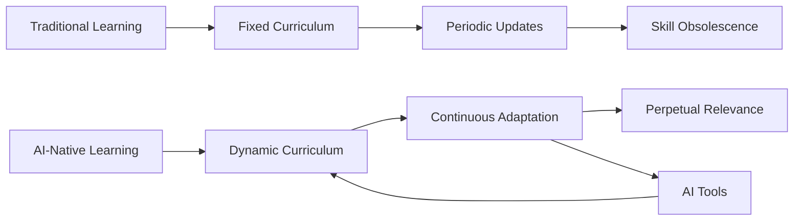
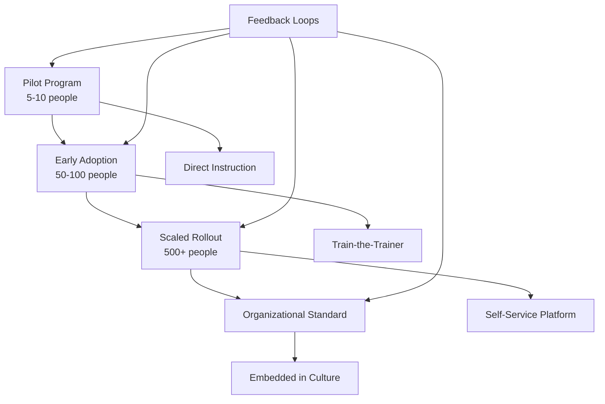

# Part 9: Enablement and Education

## Building Human Capabilities for the AI-Native Era

The most sophisticated AI tools and architectures mean nothing without humans who know how to wield them effectively. This chapter explores how to build, scale, and sustain the human capabilities necessary for AI-native development—from individual skill development to organizational learning systems.

The journey begins with a stark realization: traditional approaches to technical education are fundamentally broken in the AI era. MIT Sloan research found that "Companies that invest more in AI-related employee training see performance gains that far outpace competitors." Yet the same research revealed that only 25% of companies provide comprehensive AI training. Even more concerning, industry reports suggest that up to 80% of corporate AI training programs fail to produce lasting behavior change, teaching employees about AI rather than how to work with AI.

"We treated AI like it was just another programming language to learn," their learning director reflected. "We missed that it requires a completely different mindset—from knowing answers to asking questions, from writing code to directing intelligence, from individual mastery to collaborative discovery."

Enablement and education in the AI era isn't about one-time training sessions or certification programs. It's about creating continuous learning systems that evolve as rapidly as the technology itself, fostering mindsets that embrace augmentation, and building cultures where human-AI collaboration becomes second nature.

## The Learning Imperative

The half-life of technical skills continues to shrink. What took decades to become obsolete now happens in years, sometimes months. AI accelerates this trend while simultaneously providing tools to manage it. Organizations face a dual challenge: helping their people learn to work with AI while using AI to help their people learn more effectively.

A senior developer at a fintech startup captured the challenge perfectly: "I spent 15 years mastering Java. Now I need to master not a language, but a new way of thinking. It's like learning to conduct an orchestra when you've only ever played solo violin."

### The Fundamental Shift

The shift from traditional to AI-native learning represents a fundamental change in how we think about capability development:



This isn't just about learning faster—it's about learning differently:

| Traditional Learning | AI-Native Learning |
|---------------------|-------------------|
| Expert-designed curriculum | AI-assisted, data-driven content |
| Fixed learning paths | Personalized journeys |
| Periodic assessment | Continuous evaluation |
| Knowledge transfer | Skill application |
| Individual learning | Collaborative discovery |
| Static materials | Living documentation |

The distinction matters. Traditional learning assumes stable knowledge that can be packaged and delivered. AI-native learning recognizes that knowledge itself is dynamic, context-dependent, and best discovered through experimentation.

## Foundational Concepts

Before teams can effectively use AI, they must understand its nature. This isn't about technical details of transformer architectures or training processes—it's about developing accurate mental models that enable productive collaboration.

### Understanding What AI Is (and Isn't)

The biggest barrier to effective AI adoption isn't technical—it's conceptual. People approach AI with mental models ranging from "magic oracle" to "job-stealing robot." Neither enables productive collaboration.

A team lead shared their breakthrough moment: "We spent weeks arguing about whether to trust AI. Then someone asked, 'What would you do with a brilliant intern who was right 80% of the time but occasionally confused fiction with fact?' Suddenly everyone knew how to work with AI."

**Core Mental Models:**

**1. The Simulation Framework**

Instead of viewing AI as mysterious technology, think of it as a sophisticated simulation:

```
Question: "What would you do with a system that could simulate human reasoning with 70-90% accuracy?"

This reframes AI from "magic" to "powerful but imperfect tool"
- Where would you use it? (Pattern recognition, first drafts, exploration)
- Where wouldn't you? (Final decisions, ethical judgments, critical systems)
- How would you verify its output? (Human review, testing, validation)
```

This framework immediately clarifies appropriate use cases. One developer explained: "Once I started thinking of AI as a really good simulator of human knowledge, everything clicked. I knew when to trust it, when to verify, and when to take over."

**2. The Collaboration Model**

AI isn't a replacement for human intelligence—it's a complement with different strengths:

```python
class AICollaboration:
    def __init__(self):
        self.human_strengths = [
            "context_understanding",
            "ethical_judgment", 
            "creative_leaps",
            "stakeholder_empathy"
        ]
        self.ai_strengths = [
            "pattern_matching",
            "consistent_execution",
            "broad_knowledge",
            "tireless_iteration"
        ]
    
    def optimal_outcome(self, task):
        # Neither human nor AI alone, but the combination
        return self.human_strengths + self.ai_strengths
```

This model transforms the relationship from competition to collaboration. A senior architect described the shift: "I stopped asking 'Can AI do my job?' and started asking 'How can AI amplify my capabilities?' The answer transformed how I work."

**3. The Tool Evolution Perspective**

AI represents the next step in tool evolution, not a break from history:
- Compilers didn't replace programmers, they amplified them
- IDEs didn't make developers lazy, they made them productive
- AI won't replace thinking, it will accelerate it

This historical context reduces fear and increases adoption. "Every generation of programmers has feared the next abstraction layer," one veteran developer noted. "My grandfather feared compilers. My father feared garbage collection. I feared frameworks. My kids will probably fear whatever comes after AI. But each layer has created more opportunities, not fewer."

## Curriculum Architecture

Effective AI education requires carefully structured curricula that build from foundational understanding to advanced application. The key is making it practical, not theoretical.

### Tier 1: AI Fundamentals (All Roles)

Everyone in the organization needs basic AI literacy, not just developers. This foundational knowledge enables productive collaboration and informed decision-making.

**Duration:** 3-4 hours total (can be split across sessions)

**Module 1: Demystifying AI (1 hour)**

The first module strips away hype and fear to reveal AI's true nature:

```yaml
topics:
  what_ai_is_not:
    - "Not conscious or sentient"
    - "Not infallible or omniscient"
    - "Not a replacement for human judgment"
    - "Not magic—just mathematics at scale"
  
  what_ai_is:
    - "Pattern recognition engine"
    - "Statistical prediction system"
    - "Knowledge synthesis tool"
    - "Augmentation platform"
  
  activities:
    - "Compare AI outputs to identify patterns"
    - "Find and discuss AI failures/hallucinations"
    - "Explore edge cases and limitations"
```

One facilitator shared a powerful exercise: "We have participants ask the same question to different AI models and compare answers. When they see variations and errors, the mystique disappears. They start understanding AI as a tool with strengths and limitations."

**Module 2: Effective AI Communication (1 hour)**

Learning to communicate with AI is like learning a new language—it requires practice and patterns:

```python
class PromptingFundamentals:
    def __init__(self):
        self.principles = [
            "Be specific about desired outcomes",
            "Provide relevant context",
            "Use examples to clarify intent",
            "Iterate based on responses",
            "Verify critical information"
        ]
    
    def practice_exercise(self, task_type):
        exercises = {
            "code_generation": self.code_prompt_exercise(),
            "debugging": self.debug_prompt_exercise(),
            "documentation": self.doc_prompt_exercise(),
            "architecture": self.design_prompt_exercise()
        }
        return exercises[task_type]
    
    def code_prompt_exercise(self):
        return {
            "poor_prompt": "Write a function to process data",
            "better_prompt": "Write a Python function that takes a list of dictionaries containing 'name' and 'age' keys, filters for age > 18, and returns sorted by name",
            "best_prompt": """Write a Python function with:
            - Input: List[Dict] with 'name' (str) and 'age' (int) keys
            - Processing: Filter for age > 18
            - Output: List[Dict] sorted alphabetically by name
            - Include type hints and docstring
            - Handle edge cases (empty list, missing keys)
            Example input: [{'name': 'Alice', 'age': 25}, {'name': 'Bob', 'age': 17}]
            Example output: [{'name': 'Alice', 'age': 25}]"""
        }
```

The progression from poor to better to best illustrates the importance of specificity. "The 'aha' moment comes when people realize that clear communication with AI mirrors clear communication with humans," one trainer observed. "If you can't explain what you want to a colleague, you can't explain it to AI either."

**Module 3: Trust and Verification (1 hour)**

Knowing when to trust AI and when to verify is crucial for safe, effective usage:

```typescript
interface TrustFramework {
  whenToTrust: {
    highConfidence: [
      "Syntax and boilerplate generation",
      "Common patterns and algorithms",
      "Test case generation",
      "Documentation templates"
    ],
    mediumConfidence: [
      "Business logic implementation",
      "Performance optimization",
      "Security recommendations",
      "Architecture suggestions"
    ],
    lowConfidence: [
      "Domain-specific calculations",
      "Regulatory compliance",
      "Real-time system design",
      "Novel algorithm creation"
    ]
  },
  
  verificationStrategies: {
    automated: ["Unit tests", "Integration tests", "Static analysis"],
    manual: ["Code review", "Logic validation", "Output inspection"],
    collaborative: ["Pair debugging", "Team review", "Stakeholder validation"]
  }
}
```

A QA engineer shared their approach: "I teach people to treat AI output like code from a brilliant but inexperienced developer. You appreciate the speed and creativity but verify everything important."

**Module 4: Practical Application (1 hour)**

Theory without practice is useless. The final module focuses on hands-on experience:
- Working with real tools in a safe environment
- Solving actual problems from their domain
- Sharing successes and failures with peers
- Building confidence through supported practice

"We learned to make this module immediately relevant," an instructor explained. "Generic exercises fail. But when a developer uses AI to solve their actual backlog item? That's when adoption happens."

### Tier 2: Role-Specific AI Skills

After foundational knowledge, people need skills specific to their roles. This targeted approach ensures relevance and immediate applicability.

#### For Developers: AI-Assisted Coding

Developers need to transform from code writers to code directors, orchestrating AI to produce better software faster:

```yaml
developer_curriculum:
  week_1_basics:
    - setting_up_tools:
        - "IDE integration (Continue, Copilot, Cody)"
        - "CLI tools (Claude Code, aider)"
        - "Web interfaces as fallback"
    - first_workflows:
        - "Generate-review-refine cycle"
        - "Test-driven development with AI"
        - "Debugging with AI assistance"
  
  week_2_intermediate:
    - advanced_prompting:
        - "Multi-file context management"
        - "Architecture documentation as context"
        - "Using examples effectively"
    - code_review:
        - "AI as first reviewer"
        - "Identifying AI-generated code smells"
        - "Maintaining code consistency"
  
  week_3_advanced:
    - complex_tasks:
        - "Refactoring legacy code"
        - "Cross-language migrations"
        - "Performance optimization"
    - team_patterns:
        - "Sharing prompt templates"
        - "Collaborative AI sessions"
        - "Knowledge preservation"
  
  week_4_mastery:
    - specialized_techniques:
        - "Domain-specific fine-tuning"
        - "Custom tool creation"
        - "Workflow automation"
    - metrics_and_optimization:
        - "Tracking productivity gains"
        - "Cost optimization"
        - "Quality metrics"
```

A developer who completed this curriculum shared their transformation: "Week 1, I was copying and pasting from ChatGPT. By Week 4, I was orchestrating multiple AI tools to refactor our entire authentication system. It's like learning to fly after a lifetime of walking."

#### For Architects: AI-Augmented Design

Architects face unique challenges in the AI era. They must design systems that are both AI-friendly and AI-resilient:

```python
class ArchitectAICurriculum:
    def __init__(self):
        self.modules = [
            self.system_design_module(),
            self.pattern_exploration_module(),
            self.decision_documentation_module(),
            self.evolution_planning_module()
        ]
    
    def system_design_module(self):
        return {
            "name": "AI-Assisted System Design",
            "exercises": [
                "Generate multiple architecture options for requirements",
                "Use AI to identify potential bottlenecks",
                "Explore trade-offs with AI analysis",
                "Document decisions with AI assistance"
            ],
            "tools": ["Mermaid diagram generation", "ADR templates", "C4 modeling"]
        }
    
    def pattern_exploration_module(self):
        return {
            "name": "Pattern Discovery and Application",
            "exercises": [
                "Extract patterns from existing codebases",
                "Generate pattern variations",
                "Evaluate pattern fitness",
                "Create pattern documentation"
            ],
            "ai_techniques": [
                "Comparative analysis prompts",
                "Pattern mutation strategies",
                "Fitness evaluation frameworks"
            ]
        }
```

An enterprise architect described their learning journey: "AI didn't replace my architectural thinking—it accelerated it. I can now explore 10 different architectures in the time it used to take to design one. The hard part is choosing, not creating."

#### For Managers: AI Team Leadership

Managers face perhaps the biggest adjustment. They must lead teams whose capabilities are being amplified in unprecedented ways:

```yaml
manager_curriculum:
  understanding_ai_impact:
    - velocity_changes:
        - "2-10x productivity gains"
        - "Non-linear progress patterns"
        - "New bottlenecks (review, integration)"
    - team_dynamics:
        - "Changing role definitions"
        - "Skill gap management"
        - "Motivation and engagement"
    - process_adaptation:
        - "Sprint planning with AI velocity"
        - "Resource allocation strategies"
        - "Quality assurance evolution"
  
  enabling_ai_adoption:
    - cultural_changes:
        - "From consensus to consent"
        - "Experimentation encouragement"
        - "Failure as learning"
    - practical_support:
        - "Tool procurement"
        - "Time for learning"
        - "Safe practice spaces"
    - success_metrics:
        - "Beyond velocity"
        - "Quality indicators"
        - "Team satisfaction"
```

A engineering manager shared their perspective: "The hardest part was letting go of traditional metrics. Story points became meaningless when one developer with AI could outproduce a team without it. We had to completely rethink how we measure success."

## Advanced Learning Pathways

Beyond basic skills, organizations need pathways for continuous advancement. The most effective approach we've found is the Roguelike Learning Method.

### The Roguelike Learning Method

Extending the roguelike development methodology to learning creates engaging, effective skill development. Like the video games that inspired it, this approach embraces failure as a path to mastery:

```python
class RoguelikeLearning:
    """Game-inspired learning methodology"""
    
    def __init__(self, skill_domain: str):
        self.skill_domain = skill_domain
        self.attempts = []
        self.learnings = []
        self.current_level = 1
    
    def attempt_challenge(self, challenge: Challenge) -> AttemptResult:
        """Try to solve a challenge with current skills"""
        start_time = time.now()
        
        # Attempt the challenge
        result = self.execute_attempt(challenge)
        
        # Record what happened
        attempt = Attempt(
            challenge=challenge,
            approach=result.approach,
            outcome=result.outcome,
            duration=time.now() - start_time,
            tools_used=result.tools,
            blockers=result.blockers
        )
        
        self.attempts.append(attempt)
        
        # Extract learnings
        learnings = self.extract_learnings(attempt)
        self.learnings.extend(learnings)
        
        # Level up if successful
        if result.success:
            self.current_level += 1
        
        return result
    
    def extract_learnings(self, attempt: Attempt) -> List[Learning]:
        """Convert attempt into reusable knowledge"""
        learnings = []
        
        if attempt.outcome == "success":
            learnings.append(Learning(
                type="pattern",
                content=f"Approach {attempt.approach} works for {attempt.challenge.type}",
                confidence=0.8
            ))
        else:
            learnings.append(Learning(
                type="antipattern",
                content=f"Avoid {attempt.approach} for {attempt.challenge.type} because {attempt.blockers}",
                confidence=0.9
            ))
        
        return learnings
```

The beauty of this approach is that it makes failure productive. A junior developer described their experience: "I used to fear making mistakes. Now I see them as leveling up. Each failed attempt teaches me something I couldn't learn any other way."

### Example Roguelike Learning Session

Here's how a real learning session unfolds:

```yaml
roguelike_session:
  challenge: "Build a real-time chat system"
  time_limit: "4 hours"
  
  attempt_1:
    duration: "45 minutes"
    approach: "Ask AI to generate complete solution"
    outcome: "Overwhelming complexity, unclear architecture"
    learning: "Need to decompose into smaller parts"
  
  attempt_2:
    duration: "60 minutes"
    approach: "Focus on message transport layer only"
    outcome: "Working WebSocket implementation"
    learning: "Narrower scope enables progress"
  
  attempt_3:
    duration: "50 minutes"
    approach: "Add authentication to WebSocket"
    outcome: "Security vulnerabilities identified"
    learning: "AI good at function, needs help with security"
  
  attempt_4:
    duration: "45 minutes"
    approach: "Research security patterns, then implement"
    outcome: "Secure authenticated chat"
    learning: "Human research + AI implementation effective"
  
  attempt_5:
    duration: "40 minutes"
    approach: "Scale to multiple rooms"
    outcome: "Performance issues discovered"
    learning: "AI needs explicit performance constraints"
  
  session_outcome:
    skills_developed:
      - "Problem decomposition"
      - "Security awareness"
      - "Performance consideration"
      - "Human-AI task division"
    confidence_level: "Ready for production project"
```

Each attempt builds on previous learnings, creating compound growth. The participant isn't just learning about chat systems—they're learning how to learn with AI.

## Creating Learning Communities

Individual learning is powerful, but community learning is transformative. Organizations that build strong learning communities see faster adoption, better practices, and sustained innovation.

### Internal AI Champions Network

Champions networks create multiplicative effects. Each champion can influence 5-10 others, creating exponential growth in capabilities:

```typescript
interface ChampionNetwork {
  structure: {
    leads: ChampionLead[];
    members: Champion[];
    sponsors: ExecutiveSponsor[];
  };
  
  activities: {
    weekly: [
      "Office hours for AI assistance",
      "Tool tip sharing",
      "Quick win celebrations"
    ];
    monthly: [
      "Technique workshops",
      "External speaker sessions",
      "Cross-team demos"
    ];
    quarterly: [
      "Hackathons with AI focus",
      "Strategy alignment sessions",
      "Community retrospectives"
    ];
  };
  
  resources: {
    communication: "Dedicated Slack channel";
    documentation: "Shared knowledge base";
    budget: "Innovation fund access";
    time: "20% time for exploration";
  };
  
  metrics: {
    engagement: "Active participation rate";
    impact: "Techniques adopted by teams";
    growth: "New champions onboarded";
    innovation: "New patterns discovered";
  };
}
```

A champion network lead shared their experience: "We started with 5 enthusiasts. Within 6 months, we had 50 active champions affecting 500 developers. The network effect is real—knowledge spreads like wildfire when you create the right conditions."

### Peer Learning Formats

Different formats serve different learning styles and objectives. The key is variety and accessibility.

#### AI Pair Programming Sessions

Structured pairing accelerates learning through shared discovery:

```python
class AIPairProgramming:
    """Structured peer learning through AI-assisted pairing"""
    
    def __init__(self, participants: Tuple[Developer, Developer]):
        self.driver = participants[0]  # Controls keyboard
        self.navigator = participants[1]  # Guides strategy
        self.ai_assistant = AIAssistant()
    
    def session_structure(self, duration_minutes: int = 120):
        return [
            Phase("Setup", 10, [
                "Choose problem to solve",
                "Agree on success criteria",
                "Set up shared environment"
            ]),
            Phase("Exploration", 30, [
                "Navigator researches approaches with AI",
                "Driver experiments with implementations",
                "Both discuss trade-offs"
            ]),
            Phase("Implementation", 60, [
                "Driver codes with AI assistance",
                "Navigator reviews and guides",
                "Switch roles every 20 minutes"
            ]),
            Phase("Reflection", 20, [
                "Document what worked",
                "Identify AI interaction patterns",
                "Share learnings with team"
            ])
        ]
```

The magic happens in the interaction. One participant described it: "Watching someone else work with AI showed me possibilities I'd never considered. We discovered patterns together that neither of us would have found alone."

#### Prompt Pattern Libraries

Shared knowledge accelerates everyone's learning:

```yaml
prompt_pattern_library:
  categories:
    code_generation:
      - name: "Specification-First"
        template: |
          Create a {language} {component_type} with these specifications:
          - Input: {input_description}
          - Processing: {processing_steps}
          - Output: {output_description}
          - Constraints: {constraints}
          - Example: {example}
        when_to_use: "Clear requirements, standard patterns"
      
      - name: "Test-Driven"
        template: |
          Given these tests:
          ```{test_code}```
          Implement the code to make them pass.
          Use {language} following {style_guide}.
        when_to_use: "Behavior is well-defined"
    
    debugging:
      - name: "Symptom-Based"
        template: |
          Debug this issue:
          - Expected: {expected_behavior}
          - Actual: {actual_behavior}
          - Code: {relevant_code}
          - Error: {error_message}
          - Context: {system_context}
        when_to_use: "Clear reproduction steps"
    
    refactoring:
      - name: "Pattern-Based"
        template: |
          Refactor this code to follow the {pattern_name} pattern:
          ```{current_code}```
          Maintain existing functionality while improving {quality_attribute}.
        when_to_use: "Code works but needs structure"
```

These libraries become living documents. A team lead noted: "Our prompt library is like our collective brain. Every good prompt gets added, every improvement gets shared. New team members become productive in days instead of weeks."

## Measuring Learning Effectiveness

Without measurement, learning programs become faith-based initiatives. Effective measurement tracks not just participation but application and impact:

```python
class LearningMetrics:
    """Track and measure AI skill development"""
    
    def __init__(self):
        self.metrics = {
            "skill_application": self.track_skill_application(),
            "productivity_gains": self.measure_productivity(),
            "quality_improvements": self.assess_quality(),
            "confidence_growth": self.survey_confidence(),
            "knowledge_sharing": self.track_knowledge_transfer()
        }
    
    def track_skill_application(self) -> SkillMetrics:
        return SkillMetrics(
            prompting_effectiveness=self.analyze_prompt_quality(),
            tool_utilization=self.measure_tool_usage(),
            workflow_integration=self.assess_workflow_changes(),
            problem_solving_speed=self.track_resolution_time()
        )
    
    def measure_productivity(self) -> ProductivityMetrics:
        """Track before/after productivity changes"""
        return ProductivityMetrics(
            features_per_sprint=self.count_delivered_features(),
            code_volume=self.measure_code_output(),
            rework_rate=self.track_revisions(),
            cycle_time=self.measure_idea_to_production()
        )
    
    def generate_report(self, timeframe: TimeFrame) -> Report:
        """Create comprehensive learning effectiveness report"""
        return Report(
            individual_progress=self.analyze_individual_growth(),
            team_improvements=self.measure_team_metrics(),
            organizational_impact=self.assess_business_value(),
            recommendations=self.generate_recommendations()
        )
```

The key is measuring what matters. One learning director explained: "We stopped tracking training hours and started tracking feature delivery time. When we saw it drop by 60%, we knew our program was working."

## Scaling Education Programs

Small programs are easy. Scaling to hundreds or thousands of people requires different approaches.

### From Pilot to Platform

The journey from pilot to platform follows predictable stages:



Each stage requires different strategies and infrastructure. A program that successfully scaled to 2,000 developers shared their approach:

**Start Small, Learn Fast**

```python
class PilotProgram:
    def __init__(self, participants: List[Developer]):
        self.participants = participants
        self.duration_weeks = 4
        self.metrics = PilotMetrics()
    
    def run_pilot(self):
        for week in range(self.duration_weeks):
            self.deliver_content(week)
            self.practice_skills(week)
            self.gather_feedback(week)
            self.adjust_approach(week)
    
    def scale_decision(self) -> ScaleRecommendation:
        if self.metrics.satisfaction > 0.8 and self.metrics.skill_improvement > 0.5:
            return ScaleRecommendation(
                decision="SCALE",
                adjustments=self.metrics.suggested_improvements,
                timeline="Begin broader rollout in 2 weeks"
            )
```

"Our pilot with 10 developers revealed everything," the program lead explained. "Half our content was too theoretical. The hands-on exercises were too generic. We rebuilt everything based on their feedback before scaling."

**Create Multiplicative Effects**

The secret to scaling is making each person a teacher:
- Each trained person trains 2-3 others
- Champions become local experts
- Success stories inspire adoption
- Knowledge compounds through sharing

**Build Self-Service Resources**

At scale, synchronous training becomes impossible. Self-service platforms enable asynchronous, personalized learning:

```yaml
self_service_platform:
  components:
    learning_paths:
      - beginner_track:
          duration: "8 hours self-paced"
          modules: ["AI Basics", "First Steps", "Simple Projects"]
      - intermediate_track:
          duration: "16 hours over 2 weeks"
          modules: ["Advanced Prompting", "Tool Mastery", "Team Patterns"]
      - expert_track:
          duration: "Ongoing"
          modules: ["Custom Tools", "Teaching Others", "Innovation"]
    
    resources:
      - video_library: "50+ recorded sessions"
      - prompt_templates: "100+ tested patterns"
      - example_projects: "20+ with code"
      - community_forum: "24/7 peer support"
    
    tracking:
      - progress_dashboards: "Individual and team"
      - skill_assessments: "Automated and peer-reviewed"
      - achievement_badges: "Gamification elements"
```

The platform becomes a living resource. "We add new content weekly based on user questions," one administrator noted. "The platform teaches us what people need to learn."

## Sustaining Long-Term Learning

Initial enthusiasm is easy. Sustained learning is hard. Organizations need systems that maintain momentum over months and years.

### Continuous Skill Evolution

Learning can't be a one-time event in the AI era. Skills must continuously evolve:

```python
class ContinuousLearning:
    """Maintain and evolve AI skills over time"""
    
    def __init__(self, organization: Organization):
        self.learning_cycles = [
            self.weekly_micro_learning(),
            self.monthly_skill_sprints(),
            self.quarterly_deep_dives(),
            self.annual_transformation()
        ]
    
    def weekly_micro_learning(self):
        """5-15 minute learning nuggets"""
        return {
            "format": "Slack tips, email newsletters, quick videos",
            "topics": "New features, quick tricks, success stories",
            "engagement": "Optional but incentivized"
        }
    
    def monthly_skill_sprints(self):
        """Focused skill development pushes"""
        return {
            "format": "Team challenges with specific goals",
            "duration": "1 week sprint within the month",
            "outcome": "New capability demonstrated in production"
        }
    
    def quarterly_deep_dives(self):
        """Advanced topic exploration"""
        return {
            "format": "Workshop series or bootcamp",
            "duration": "2-3 days",
            "topics": "Emerging patterns, new tools, architecture"
        }
    
    def annual_transformation(self):
        """Major capability upgrades"""
        return {
            "format": "Conference, hackathon, or intensive",
            "duration": "1 week",
            "outcome": "Next-level skills and mindset shifts"
        }
```

The variety maintains engagement. "Weekly tips keep AI top-of-mind," a learning coordinator explained. "Monthly sprints create excitement. Quarterly deep-dives build expertise. Annual events create community. Together, they sustain momentum."

### Preventing Skill Decay

Skills unused atrophy quickly. Organizations must create systems that ensure regular practice:

**Regular Practice Requirements**
- Minimum AI usage quotas (e.g., 2 AI-assisted tasks per week)
- Rotation through different AI tools
- Peer review of AI interactions

**Evolution Tracking**
```typescript
interface SkillEvolution {
  baseline: SkillLevel;
  current: SkillLevel;
  trajectory: "improving" | "maintaining" | "declining";
  interventions: Intervention[];
  nextActions: Action[];
}
```

**Knowledge Refresh Cycles**
- Quarterly tool updates
- Monthly pattern sharing
- Weekly tip distribution
- Daily practice opportunities

One organization tracks skill decay like technical debt: "If someone hasn't used AI in two weeks, they get a nudge. At four weeks, they get a refresher. We treat skills like muscles—use them or lose them."

## Common Pitfalls and Solutions

Learning from others' mistakes accelerates success. Here are the most common pitfalls and their solutions:

```yaml
education_pitfalls:
  pitfall_1:
    name: "One-and-Done Training"
    symptoms:
      - "Initial enthusiasm followed by reversion"
      - "Skills decay without practice"
      - "New patterns not adopted"
    solution:
      - "Continuous learning programs"
      - "Regular practice requirements"
      - "Ongoing support systems"
  
  pitfall_2:
    name: "Tool-Centric Focus"
    symptoms:
      - "Teaching features not concepts"
      - "Fragility when tools change"
      - "Lack of strategic thinking"
    solution:
      - "Principle-based curriculum"
      - "Multiple tool exposure"
      - "Focus on outcomes not mechanics"
  
  pitfall_3:
    name: "Ignoring Skeptics"
    symptoms:
      - "Underground resistance"
      - "Team fragmentation"
      - "Adoption plateau"
    solution:
      - "Address concerns directly"
      - "Provide safe experimentation space"
      - "Celebrate skeptic conversions"
  
  pitfall_4:
    name: "Uniform Approach"
    symptoms:
      - "One-size-fits-none training"
      - "Disengagement from sessions"
      - "Poor skill application"
    solution:
      - "Role-specific curricula"
      - "Multiple learning formats"
      - "Self-paced options"
```

Each pitfall teaches important lessons. "We hit every one of these in our first year," one program manager admitted. "Now we design programs specifically to avoid them."

## Building an AI-Native Learning Culture

Ultimately, sustainable AI adoption requires cultural transformation. Organizations must build cultures where learning is continuous, experimentation is encouraged, and human-AI collaboration is natural.

```python
class LearningCultureBuilder:
    """Foster organization-wide AI learning culture"""
    
    def __init__(self):
        self.cultural_elements = [
            self.normalize_experimentation(),
            self.celebrate_learning(),
            self.share_knowledge(),
            self.measure_progress(),
            self.evolve_continuously()
        ]
    
    def normalize_experimentation(self):
        return {
            "policies": [
                "20% time for AI exploration",
                "Failure celebration sessions",
                "Innovation budget per team"
            ],
            "practices": [
                "Weekly experiment sharing",
                "Roguelike Fridays",
                "Hackathon participation"
            ],
            "metrics": [
                "Experiments per team",
                "Learning from failures",
                "Innovation adoption rate"
            ]
        }
    
    def implement_culture_change(self, organization: Organization):
        # Start with willing early adopters
        champions = self.identify_champions(organization)
        
        # Create visible wins
        quick_wins = self.generate_quick_wins(champions)
        
        # Scale through success
        scaling_plan = self.create_scaling_plan(quick_wins)
        
        # Embed in systems
        systemic_changes = self.embed_in_processes(scaling_plan)
        
        return CultureTransformation(
            timeline="18-24 months",
            milestones=self.define_milestones(),
            success_criteria=self.define_success()
        )
```

Cultural transformation takes time but creates lasting change. One organization's CLO reflected: "We spent two years building an AI-native learning culture. Now learning happens automatically. People teach each other, share discoveries, and push boundaries without prompting. The culture sustains itself."

## Conclusion

Enablement and education in the AI-native era isn't a destination—it's a continuous journey. Success comes not from perfect training programs but from creating learning systems that evolve as rapidly as the technology itself.

The organizations that thrive will be those that transform learning from an event to a lifestyle, from individual achievement to collective growth, from static knowledge to dynamic capability. They will build workforces that don't just use AI tools but think in AI-native ways, solving problems through human-machine collaboration that neither could achieve alone.

Key principles for effective AI education:

1. **Continuous Over Periodic**: Learning happens daily, not just in training sessions
2. **Experiential Over Theoretical**: Hands-on practice trumps abstract knowledge
3. **Collaborative Over Individual**: Peer learning accelerates skill development
4. **Adaptive Over Fixed**: Curricula must evolve with technology and needs
5. **Cultural Over Procedural**: Embedding learning in culture beats mandatory training
6. **Measured Over Assumed**: Track actual skill application and impact

The journey requires patience, persistence, and constant adaptation. There will be setbacks—tools that don't work as expected, skeptics who resist change, skills that decay without use. But organizations that persist will build capabilities that compound over time, creating workforces that are not just AI-literate but AI-fluent.

Organizations that master these educational approaches don't just adopt AI—they create workforces that continuously evolve, adapt, and innovate. They build not just skills but capabilities, not just knowledge but wisdom, not just users but partners in the AI-augmented future.

The transformation is already underway. Organizations that invest in human capability development now will find themselves with insurmountable advantages as AI capabilities expand. Those that delay will find themselves trying to catch up to competitors who have built learning into their organizational DNA.

The final chapter explores how to bring all these elements together into a coherent path forward, creating sustainable competitive advantage through AI-native development practices.

---

## Navigation

### Next Chapter
[Part 10: The Path Forward →](Part-10-The-Path-Forward.md)

### Suggested Reading Paths

**For Individual Developers:**
- Continue to [Part 10: The Path Forward](Part-10-The-Path-Forward.md) for future perspective
- Review earlier chapters based on specific learning needs

**For Team Leads:**
- Continue to [Part 10: The Path Forward](Part-10-The-Path-Forward.md) for strategic vision
- Review [Part 5: Development Practices](Part-05-Development-Practices.md) for technical details

**For Architects and Technical Leaders:**
- Jump to [Part 10: The Path Forward](Part-10-The-Path-Forward.md) for industry trends
- Consider reviewing earlier technical chapters for implementation details

**For Executives and Decision Makers:**
- Continue to [Part 10: The Path Forward](Part-10-The-Path-Forward.md) for strategic implications
- Consider [Part 4: Team Implementation](Part-04-Team-Implementation.md) for organizational change

[← Back to Table of Contents](README.md)