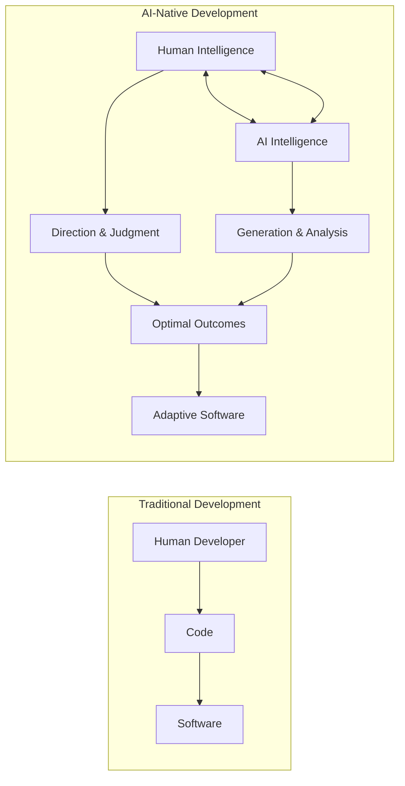
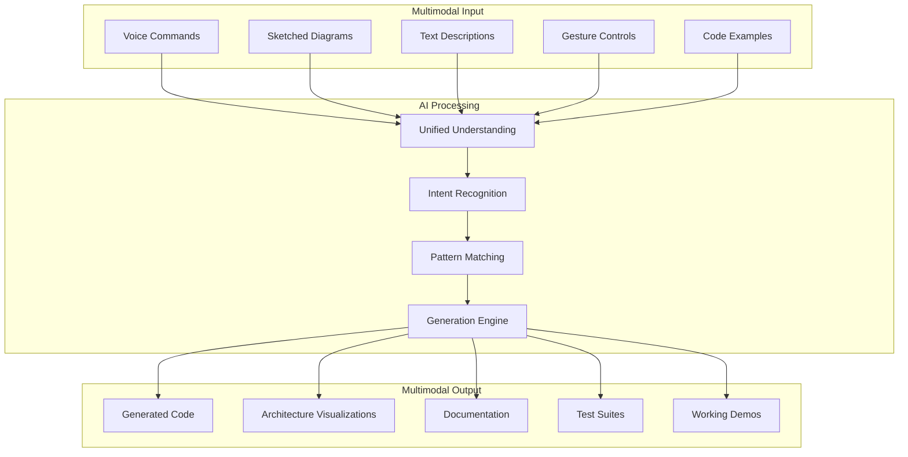

# Part 10: The Path Forward

## Standing at the Threshold

We stand at a unique moment in the history of software development. The tools and practices described throughout this playbook represent not just incremental improvements but a fundamental shift in how humans and machines collaborate to create software. The path forward isn't predetermined—it's being written by every team that adopts these practices, every developer who learns to work with AI, and every organization that transforms its approach to software creation.

The journey from traditional development to AI-native practices is neither simple nor guaranteed. It requires courage to challenge established practices, wisdom to navigate new complexities, and persistence to push through the inevitable setbacks. But for those who embrace this transformation, the rewards are substantial: dramatic productivity gains, improved software quality, and most importantly, the ability to tackle problems previously beyond reach.

This final chapter synthesizes the insights from our journey, examines emerging trends that will shape the near future, and provides a practical framework for organizations ready to embark on their own transformation. It's both a conclusion and a beginning—the end of this playbook but the start of your journey into AI-native development.

## Synthesis: The Core Transformation

After exploring foundations, systems thinking, enterprise adoption, team patterns, development practices, antipatterns, governance, architecture, and education, clear themes emerge. These aren't just tactical improvements—they represent a fundamental reimagining of software development.

### From Individual to Collaborative Intelligence

The most profound shift is from individual human intelligence to collaborative human-AI intelligence. This isn't about replacement—it's about augmentation and partnership. The best outcomes emerge when human creativity, judgment, and wisdom combine with AI's speed, consistency, and broad knowledge.



A senior architect who completed the transformation reflected: "I used to think of myself as a craftsman, carefully shaping each piece of code. Now I'm more like a conductor, orchestrating multiple intelligences—human and artificial—to create symphonies of functionality. The individual craft hasn't disappeared; it's been elevated to a higher level of abstraction."

### From Static to Adaptive Systems

Traditional development created static systems that changed only when humans changed them. AI-native development creates adaptive systems that learn and improve through use. This shift fundamentally alters how we think about software architecture, maintenance, and evolution.

Consider the progression:
- **Static Systems**: Change through manual updates
- **Automated Systems**: Change through predefined rules
- **Intelligent Systems**: Change through pattern recognition
- **Adaptive Systems**: Change through continuous learning

Each level builds on the previous, creating systems that are increasingly responsive to their environment and usage patterns. The implications ripple through every aspect of software development, from initial design to long-term maintenance.

### From Scarcity to Abundance Mindset

Perhaps the most subtle but important shift is from scarcity to abundance thinking. Traditional development operated under severe constraints: developer time was precious, code generation was slow, and experimentation was expensive. AI removes many of these constraints, requiring a fundamental mindset shift.

```python
# Traditional Scarcity Mindset
class ScarcityDevelopment:
    def approach_problem(self, problem):
        # Careful planning due to high cost of changes
        detailed_plan = self.spend_weeks_planning(problem)
        
        # Single attempt due to resource constraints
        single_solution = self.implement_carefully(detailed_plan)
        
        # Limited testing due to time constraints
        basic_tests = self.test_critical_paths_only(single_solution)
        
        return self.hope_it_works(single_solution)

# AI-Native Abundance Mindset
class AbundanceDevelopment:
    def approach_problem(self, problem):
        # Rapid experimentation due to low cost
        multiple_approaches = self.generate_variations(problem)
        
        # Parallel exploration of possibilities
        results = self.try_all_promising_approaches(multiple_approaches)
        
        # Comprehensive testing because it's cheap
        thorough_tests = self.test_everything_automatically(results)
        
        # Data-driven selection of best approach
        return self.select_optimal_solution(results, thorough_tests)
```

This abundance mindset doesn't mean being wasteful—it means being experimental, iterative, and data-driven in ways that were previously impossible.

## The State of Play: Where We Are Now

Understanding where we are helps us navigate where we're going. The current state of AI-native development reveals both tremendous progress and significant challenges.

### Adoption Patterns

Organizations fall into distinct categories based on their AI adoption maturity:

**Pioneers (5-10%)**
These organizations have fully embraced AI-native practices. They've moved beyond experimentation to systematic transformation. Their developers fluently collaborate with AI, their architectures support rapid evolution, and their governance enables rather than constrains. They're seeing 5-10x productivity improvements and tackling previously impossible problems.

**Early Adopters (15-20%)**
These organizations have committed to transformation and are actively implementing the practices described in this playbook. They're past the pilot phase, working through challenges like skill development and architectural evolution. They're seeing substantial benefits but still encountering friction in some areas.

**Experimenters (30-40%)**
The largest group is actively experimenting with AI tools but hasn't yet committed to full transformation. They're using GitHub Copilot or ChatGPT for specific tasks but haven't changed their fundamental practices. They see modest productivity gains but miss the transformative potential.

**Observers (25-30%)**
These organizations are watching and waiting. They're aware of AI's potential but concerned about risks, costs, or disruption. They're gathering information and waiting for clearer signals before committing to change.

**Skeptics (5-10%)**
A small but vocal group remains deeply skeptical of AI in development. They focus on the risks and limitations while dismissing the benefits as hype. Their resistance often stems from valid concerns about job security, quality, or past disappointments with technology promises.

### Success Patterns

Analyzing successful transformations reveals consistent patterns:

```yaml
success_patterns:
  leadership:
    - executive_sponsorship: "Active, not passive"
    - middle_management_buy_in: "Critical for execution"
    - technical_leadership: "Must lead by example"
  
  approach:
    - start_small: "Pilot with willing teams"
    - measure_everything: "Data drives decisions"
    - iterate_rapidly: "Learn and adjust quickly"
    - celebrate_wins: "Build momentum through success"
  
  investment:
    - tools_and_infrastructure: "Necessary but not sufficient"
    - skill_development: "Largest investment need"
    - time_for_learning: "Can't transform at full sprint"
    - cultural_change: "Requires sustained effort"
  
  outcomes:
    - productivity: "3-10x improvement typical"
    - quality: "Fewer bugs, better architecture"
    - satisfaction: "Developers happier when supported"
    - innovation: "Tackling previously impossible problems"
```

### Challenge Patterns

Common challenges also emerge consistently:

**Technical Challenges**
- Integrating AI tools into existing workflows
- Managing token costs at scale
- Ensuring security and compliance
- Maintaining code quality with rapid generation

**Human Challenges**
- Overcoming fear and resistance
- Preventing skill atrophy
- Managing the pace of change
- Maintaining team cohesion

**Organizational Challenges**
- Adapting governance for AI speed
- Measuring real value, not vanity metrics
- Coordinating across teams
- Managing cultural transformation

Understanding these patterns helps organizations prepare for their own journey, anticipating challenges and learning from others' successes.

## Emerging Trends: The Next 18 Months

The pace of change in AI capabilities continues to accelerate. Several trends will significantly impact how we develop software in the near future.

### Autonomous Development Agents

The evolution from AI assistants to autonomous agents represents a quantum leap in capability. Where current tools respond to prompts, emerging agents will take initiative, pursuing goals independently while maintaining human oversight.

```python
# Current State: Responsive AI
class CurrentAI:
    def assist_developer(self, request):
        response = self.generate_response(request)
        return response  # Waits for next request

# Emerging: Autonomous Agents
class AutonomousAgent:
    def pursue_goal(self, objective):
        plan = self.create_plan(objective)
        
        while not self.objective_complete(objective):
            next_action = self.determine_next_action(plan)
            
            if self.requires_human_approval(next_action):
                approval = self.request_human_approval(next_action)
                if not approval:
                    plan = self.revise_plan(plan, approval.feedback)
                    continue
            
            result = self.execute_action(next_action)
            self.learn_from_result(result)
            plan = self.update_plan(plan, result)
        
        return self.summarize_achievement(objective)
```

These agents will handle entire features or subsystems, working for hours or days to achieve objectives. They'll debug their own code, optimize performance, and even collaborate with other agents. Human developers will shift from writing code to directing agents and reviewing results.

### Multimodal Development Interfaces

The future of development interfaces is multimodal, combining text, voice, diagrams, and even gestures. Developers will sketch architectures on whiteboards that AI instantly translates to code. They'll describe features verbally while AI generates implementations in real-time.



This isn't science fiction—early versions exist in labs today. Within 18 months, multimodal interfaces will move from research to production, fundamentally changing how we interact with development tools.

### Specialized Model Ecosystems

The trend toward specialized models will accelerate. Instead of using general-purpose models for everything, developers will orchestrate ecosystems of specialized models, each optimized for specific tasks:

- **Architecture Models**: Trained on successful system designs
- **Security Models**: Focused on vulnerability detection and prevention
- **Performance Models**: Optimized for optimization and efficiency
- **Testing Models**: Specialized in comprehensive test generation
- **Documentation Models**: Expert at creating clear, accurate documentation
- **Refactoring Models**: Masters of code improvement and cleanup

These specialized models will work together, coordinated by orchestration layers that route tasks to the most appropriate model. The result will be higher quality outputs with lower token costs.

### Organizational AI Memory

Organizations will develop persistent AI memory systems that capture and preserve institutional knowledge. These systems will remember every decision, every pattern, and every lesson learned, making them available to all developers.

```yaml
organizational_memory:
  components:
    decision_history:
      - architectural_choices
      - technology_selections
      - pattern_evolution
      - failed_experiments
    
    pattern_library:
      - successful_patterns
      - antipatterns_to_avoid
      - domain_specific_knowledge
      - optimization_techniques
    
    relationship_map:
      - component_dependencies
      - team_responsibilities
      - historical_context
      - evolution_trajectory
  
  capabilities:
    - instant_onboarding: "New developers productive in days"
    - decision_support: "AI understands all past decisions"
    - pattern_recognition: "Identifies what works in this org"
    - predictive_guidance: "Anticipates likely issues"
```

This organizational memory will transform how knowledge is preserved and transmitted. The tribal knowledge that typically takes months to absorb will be instantly accessible to both humans and AI.

### Quantum-AI Hybrid Systems

While still emerging, quantum computing will begin to influence AI-native development. Quantum computers won't replace classical systems but will handle specific problems that are intractable today:

- Complex optimization problems
- Cryptographic challenges
- Machine learning training
- Simulation and modeling

Developers won't need to understand quantum mechanics, just as they don't need to understand transistor physics today. AI will abstract quantum capabilities, making them accessible through familiar interfaces.

## Strategic Implications

These trends have profound implications for individuals, organizations, and the industry as a whole.

### For Individual Developers

The role of developers is evolving from code writers to system designers and AI orchestrators. Success requires new skills and mindsets:

**Essential Skills for the AI Era:**
- **AI Collaboration**: Fluency in working with AI partners
- **Systems Thinking**: Understanding complex interactions
- **Pattern Recognition**: Identifying what works and why
- **Critical Evaluation**: Assessing AI-generated solutions
- **Continuous Learning**: Adapting to rapid change

**Career Strategies:**
- Specialize in human skills AI can't replicate
- Become expert at directing AI systems
- Focus on architecture and system design
- Develop domain expertise AI lacks
- Build strong communication and leadership skills

A developer who successfully navigated this transition shared: "I was terrified AI would replace me. Instead, it amplified me. I solve bigger problems, deliver more value, and enjoy my work more. The key was embracing AI as a partner, not viewing it as a threat."

### For Organizations

Organizations face critical strategic decisions about AI adoption. The gap between AI-native organizations and traditional ones will widen rapidly, creating winner-take-all dynamics in many markets.

**Strategic Imperatives:**
1. **Commit Fully**: Half-hearted adoption yields minimal benefits
2. **Invest in People**: Technology alone isn't enough
3. **Transform Culture**: Practices must evolve with tools
4. **Measure Value**: Focus on outcomes, not activity
5. **Build Moats**: Create operational advantages competitors can't easily copy

**Competitive Dynamics:**

Organizations will increasingly compete on their ability to leverage AI effectively. This creates new forms of competitive advantage:

```python
class CompetitiveAdvantage:
    def __init__(self):
        self.traditional_moats = [
            "brand",
            "scale",
            "capital",
            "proprietary_technology"
        ]
        
        self.ai_native_moats = [
            "ai_fluency",           # Organization-wide AI skills
            "adaptive_architecture", # Systems that improve automatically
            "data_flywheel",        # Learning from every interaction
            "innovation_velocity",   # Speed of trying new ideas
            "operational_excellence" # Efficiency competitors can't match
        ]
    
    def build_sustainable_advantage(self):
        # Traditional moats remain important but insufficient
        foundation = self.maintain_traditional_moats()
        
        # AI-native moats become the differentiator
        differentiation = self.build_ai_native_moats()
        
        # Combination creates defensible position
        return self.integrate(foundation, differentiation)
```

### For the Industry

The software industry itself is transforming. Traditional boundaries between roles are blurring. New specializations are emerging. The pace of change continues to accelerate.

**Industry Transformations:**
- **Role Evolution**: Developers, testers, and operations merge into unified roles
- **Quality Standards**: Higher expectations as AI makes excellence achievable
- **Development Speed**: Features delivered in hours, not months
- **Problem Scope**: Tackling previously impossible challenges
- **Democratization**: More people able to create software

**New Opportunities:**
- AI tool development and specialization
- AI-native architecture consulting
- Skill transformation and education
- Governance and compliance for AI
- Integration and orchestration platforms

## Practical Next Steps

For organizations ready to begin or accelerate their journey, here's a practical roadmap:

### Month 1-2: Foundation Building

**Week 1-2: Assessment**
```yaml
assessment_checklist:
  current_state:
    - Document existing practices
    - Inventory current tools
    - Assess team skills
    - Identify eager early adopters
  
  readiness:
    - Leadership alignment
    - Budget availability
    - Cultural openness
    - Technical infrastructure
  
  gaps:
    - Skill gaps
    - Tool gaps
    - Process gaps
    - Cultural gaps
```

**Week 3-4: Pilot Planning**
Select a small, willing team for initial pilot. Choose a project that's:
- Important but not critical
- Complex enough to show AI value
- Simple enough to complete quickly
- Visible enough to build momentum

**Week 5-8: Initial Implementation**
- Deploy basic AI tools (Claude Code, Continue, GitHub Copilot)
- Provide initial training
- Establish measurement baseline
- Begin daily AI usage
- Track metrics and feedback

### Month 3-4: Expansion

**Scaling Success:**
- Share pilot team learnings
- Expand to 2-3 additional teams
- Establish community of practice
- Create internal documentation
- Develop organization-specific patterns

**Addressing Challenges:**
- Identify and address resistance
- Solve technical integration issues
- Refine governance approaches
- Optimize token usage
- Build support systems

### Month 5-6: Acceleration

**Broader Rollout:**
- Expand to 25-50% of teams
- Implement advanced practices
- Deploy architectural changes
- Establish centers of excellence
- Create comprehensive training

**Cultural Transformation:**
- Celebrate successes publicly
- Share failure learnings
- Adjust incentive structures
- Update job descriptions
- Evolve performance metrics

### Month 7-12: Maturation

**Full Transformation:**
- Extend to entire organization
- Implement advanced architectures
- Deploy autonomous agents
- Establish living documentation
- Create self-improving systems

**Continuous Improvement:**
- Regular capability assessments
- Ongoing skill development
- Tool and practice evolution
- Competitive benchmarking
- Strategic planning updates

## Common Pitfalls to Avoid

Learning from others' mistakes accelerates success:

```python
class TransformationPitfalls:
    def __init__(self):
        self.common_mistakes = [
            {
                "pitfall": "Technology-first thinking",
                "symptom": "Buying tools before changing practices",
                "solution": "Focus on practices and culture first"
            },
            {
                "pitfall": "Big bang transformation",
                "symptom": "Trying to change everything at once",
                "solution": "Incremental, iterative approach"
            },
            {
                "pitfall": "Ignoring resistors",
                "symptom": "Pushing past objections without addressing",
                "solution": "Listen, understand, and address concerns"
            },
            {
                "pitfall": "Metric gaming",
                "symptom": "Optimizing for measures, not outcomes",
                "solution": "Focus on value delivery"
            },
            {
                "pitfall": "Skill atrophy",
                "symptom": "Developers losing core competencies",
                "solution": "Maintain fundamental skills"
            }
        ]
    
    def avoid_pitfall(self, pitfall):
        # Recognize early warning signs
        if self.detect_symptoms(pitfall):
            # Take corrective action immediately
            return self.implement_solution(pitfall)
```

## Success Metrics That Matter

Measuring the right things ensures sustainable transformation:

```yaml
meaningful_metrics:
  business_impact:
    - time_to_market: "Features delivered faster"
    - customer_satisfaction: "Better products"
    - revenue_impact: "New capabilities enable growth"
    - cost_efficiency: "More value per dollar"
  
  engineering_excellence:
    - code_quality: "Fewer bugs, better architecture"
    - system_reliability: "Higher uptime, faster recovery"
    - technical_debt: "Reduced and managed"
    - innovation_rate: "New ideas tried and validated"
  
  human_factors:
    - developer_satisfaction: "Enjoying work more"
    - skill_growth: "Continuously learning"
    - team_cohesion: "Working together effectively"
    - work_life_balance: "Sustainable pace"
  
  organizational_health:
    - knowledge_sharing: "Information flows freely"
    - adaptation_speed: "Quick response to change"
    - competitive_position: "Leading, not following"
    - cultural_vitality: "Energy and excitement"
```

## The Long View: 5-10 Years Out

While specific predictions are difficult, certain trajectories seem clear:

### Development Democratization

The barriers to creating software will continue to fall. Today's AI tools are just the beginning. Future systems will enable anyone with ideas to create sophisticated software. This doesn't eliminate the need for professional developers—it expands what's possible and who can participate.

### Human-AI Symbiosis

The distinction between human and AI contributions will blur to irrelevance. Future developers won't think about whether they or AI wrote specific code—they'll think about whether the system achieves its goals. The partnership will be so natural that separating contributions becomes meaningless.

### Continuous Evolution Systems

Software systems will evolve continuously based on usage, feedback, and changing requirements. The concept of "versions" will fade as systems adapt in real-time. Developers will guide evolution rather than implementing changes.

### Ethical and Social Implications

As AI becomes more capable, ethical considerations become more critical:
- How do we ensure AI benefits everyone?
- What safeguards prevent misuse?
- How do we maintain human agency?
- What skills should humans preserve?

These questions don't have easy answers, but they must be addressed as we shape the future of software development.

## A Personal Reflection

Throughout this playbook, we've explored the transformation of software development through AI. This isn't just a technical evolution—it's a human one. The developers, teams, and organizations pioneering these practices are writing the next chapter of our industry's history.

The journey requires courage. Leaving familiar practices for uncharted territory is never easy. It requires faith that the destination justifies the difficulty of the journey. But for those who make this leap, the rewards are substantial: the ability to create at unprecedented speed and scale, to solve problems previously beyond reach, and to find new joy in the craft of software development.

The sceptics aren't wrong to point out risks and challenges. Every powerful technology can be misused. Every transformation creates winners and losers. But the greater risk lies in standing still while the world moves forward. Organizations that master AI-native development will have capabilities their traditional competitors can't match. Developers who embrace AI partnership will tackle challenges their peers can't approach.

## Call to Action

The future of software development is being written now, not by AI but by humans choosing how to use AI. Every developer who learns to collaborate with AI, every team that adopts new practices, every organization that transforms its culture—all are authors of this future.

The choice isn't whether AI will transform software development—that's already happening. The choice is whether to lead that transformation or follow others who do. Whether to shape the future or be shaped by it. Whether to see AI as a threat to resist or an opportunity to embrace.

For those ready to embrace this transformation:

1. **Start Today**: Don't wait for perfect conditions. Begin with small experiments and learn through practice.

2. **Bring Others**: Transformation is a team sport. Share knowledge, build communities, and lift others as you rise.

3. **Stay Human**: Remember that AI amplifies human capability—it doesn't replace human judgment, creativity, or responsibility.

4. **Think Big**: Don't limit yourself to incremental improvements. AI enables fundamental reimagining of what's possible.

5. **Build Wisely**: With great power comes great responsibility. Build systems that benefit users, respect privacy, and enhance human capability.

## Conclusion: The Journey Continues

This playbook ends, but the journey continues. The practices described here will evolve. New patterns will emerge. Challenges we can't yet imagine will arise. But the fundamental transformation—from solitary human intelligence to collaborative human-AI intelligence—will only deepen.

We stand at an inflection point. The decisions made today about how to adopt and adapt AI will ripple through the coming decades. Organizations that thoughtfully embrace AI-native practices will thrive. Those that resist will struggle to compete. Developers who learn to dance with AI will find new heights of creativity and productivity. Those who refuse will find themselves increasingly isolated.

The path forward isn't always clear, but the direction is unmistakable. Software development is becoming a partnership between human and artificial intelligence. This partnership will create software of unprecedented sophistication, solve problems previously thought impossible, and democratize the ability to turn ideas into reality.

The future belongs to those who embrace this transformation thoughtfully, who maintain human judgment while leveraging AI capability, who see partnership where others see replacement. It belongs to organizations willing to reimagine how software is created, teams eager to explore new practices, and developers excited to amplify their abilities.

The age of AI-native development has begun. The question isn't whether to participate but how to lead. The tools are available. The practices are proven. The benefits are substantial. All that remains is the choice to begin.

Welcome to the future of software development. It's time to build something amazing.

---